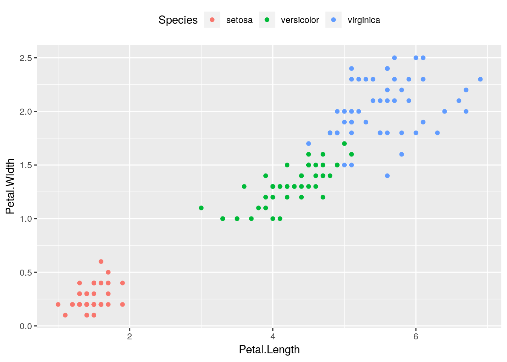

# R Functions and Workflow

> Don’t worry if it doesn’t work right.  If everything did, you’d be out of a job.
> <div align = "right"> --- (Mosher’s Law of Software Engineering) </div>


## Workflow
Now that we're data visualization pros, it's time to start building our analytic skills. While the tools used in the actual analyses are discussed in the next several chapters, there are a few tools involved in basic R usage that we need to cover before we can start in on any of those topics. This chapter should show you how to save, load, and execute your code effectively, and get you ready for the more extended analyses we'll be doing next chapter

### Scripts
So far, we've been using the command line interface in the console to type our programs. While this works, you might have noticed how annoying it can be to type longer programs in. Additionally, you're probably going to want to save your work at some point - and right now, you'd have to use Notepad or a similar program to save anything you've done.

Luckily, there's a better way. In the top left corner of R Studio, there's a menu button called "File". Click this, then click "New Project". If you click "New Directory", and then "New Project", you'll be able to create a folder where you can automatically store all of your R code and files. This will also create an R Project file, which you can load to return to where you left off the last time you closed R Studio.

Let's load the tidyverse again, now that we're in a new directory:

```r
library(tidyverse)
```

```
## Registered S3 methods overwritten by 'ggplot2':
##   method         from 
##   [.quosures     rlang
##   c.quosures     rlang
##   print.quosures rlang
```

```
## Registered S3 method overwritten by 'rvest':
##   method            from
##   read_xml.response xml2
```

```
## ── Attaching packages ─────────────────────────────────────────────────────────────────────────────────────────────── tidyverse 1.2.1 ──
```

```
## ✔ ggplot2 3.1.1       ✔ purrr   0.3.2  
## ✔ tibble  2.1.1       ✔ dplyr   0.8.0.1
## ✔ tidyr   0.8.3       ✔ stringr 1.4.0  
## ✔ readr   1.3.1       ✔ forcats 0.4.0
```

```
## ── Conflicts ────────────────────────────────────────────────────────────────────────────────────────────────── tidyverse_conflicts() ──
## ✖ dplyr::filter() masks stats::filter()
## ✖ dplyr::lag()    masks stats::lag()
```

Now that you're working in a new directory, go back into "File" and hover over "New File". There's a lot of options, but right now we care about two of them: **R Scripts** and **R Notebooks**. Open one of each.

In your new script file, type the following:


```r
ggplot(iris, aes(Petal.Length, Petal.Width)) + 
  geom_point()
```

Highlight everything and then press Cmd/Ctrl and Enter at the same time. A graph should appear in your Viewer window.

Whoops, looks like we forgot to color the points by species - add the color aesthetic to your plot.


It should already be clear what the advantage of working with R Scripts is - you can change pieces of your code quickly, without having to worry about retyping things into the console. You can also save and open your scripts (Cmd/Ctrl+S, Cmd/Ctrl+O), which makes working on big projects much easier.

Now change your code so it looks like this:

```r
a <- ggplot(iris, aes(Petal.Length, Petal.Width)) + 
  geom_point(aes(color=Species))
```

What we're doing here is _assigning_ the plot to ```a```. Now, anytime you call ```a```, the plot will appear - run your script, then call "a" from the console!


```r
a
```


Now add the following line under the first two:


```r
a + theme(legend.position = "top")
```



This will move the legend to the top of our graph, much as if we had included the ```theme()``` function in our original plot. Run your script to see the difference! 

Your program now has - for the first time in this book - two steps to it: the assignment step (where we make ```a``` a plot), and the print step (where we add our ```theme()``` and print the plot). While in an R script, there are three ways you can run the whole program:  

* Click the very top of the document and press Cmd/Ctrl+Enter once for each step
* Highlight the entire code and press Cmd/Ctrl+Enter to run it all at once
* While your cursor is anywhere in the script, press Cmd/Ctrl+Shift+Enter to run the whole program at once

That last method is usually the fastest and easiest. 

### Notebooks
While scripts are great, they do have some drawbacks. For instance, if you have to do more major and slower tasks - like loading datasets and libraries, or complicated math - you'll have to redo that step every time you want to run the whole program, which is a pain. Also, running a script pulls up the console window, which is a little bit of a headache.

For that reason, I tend to work in R Notebooks. Open your new notebook file, and you'll see a new welcome page! The welcome page has a lot of good information in it - you can delete everything after the second set of three dashes once you've read it.

Inside a notebook, you can make chunks by pressing Cmd/Ctrl+Alt+I. These chunks run as individual scripts, which you can run the exact same way by using combinations of Cmd/Ctrl, Shift, and Enter. Note, though, that your code _must be inside_ these grey chunks to run - anything in the white space outside chunks will be interpreted as plain text by R! This is a feature, not a bug - it will let you explain _why_ you wrote each piece of code, and record your thoughts at the time you were working - but is a common area for beginners to mess up. 

Using notebooks can be a little more efficient than scripts, because it offers you the ability to split your code steps into multiple pieces, which can let you iterate on an idea faster than using scripts alone.

No matter which you prefer, you should aim to have one script or notebook per task you perform - don't just have one long, continuous notebook for everything you're doing. Also, make sure you give everything a descriptive name - there's nothing worse than needing a file a month or so later and having to open every notebook you've ever made to find it!

It's also a good idea to make a new R Project, in a new folder, for each major project you start in on. These sorts of things might not matter too much to you while you're learning - but once you're doing more complicated things with R, having good habits like these are essential.

The rest of this book will assume you're working using notebooks. While all of these tasks may be done in scripts (or, if you really hate yourself, the console), I think that using notebooks makes much more sense if you're interested in using R like a professional.

## Memory, Objects, and Names
Let's go back to when we assigned a plot to `a`:


```r
a <- ggplot(iris, aes(Petal.Length, Petal.Width)) + 
  geom_point(aes(color = Species))
```

The `<-` symbol is the _assignment_ operator. We can use it to define the object `a` as all sorts of different objects:


```r
# Assign a the value 10
a <- 10
# Print out the object a
a
```

```
## [1] 10
```

```r
a <- c(1,50,200)
a
```

```
## [1]   1  50 200
```

```r
a <- "Hello, world!"
a
```

```
## [1] "Hello, world!"
```

```r
a <- geom_point(data = iris, aes(Petal.Length, Petal.Width, color = Species))
ggplot() +
  a
```


As you can see, every time we use `<-`, we completely overwrite what was there before. This is part of the power of R, as it lets us update data and functions as needed - but at the same time it can be dangerous, as it can let us overwrite things we actually need! For instance, R won't stop you from redefining functions (like `ggplot()`), operators (like `+`) or even numbers (like `1`) as you wish - which might really screw things up later!

You'll notice that ```a``` is now listed in the upper-left hand corner of R Studio, under the "Environment" tab. That's because a is now defined in memory - we can use it in any of our code, anywhere we want. In fact, you can even define ```a``` in one file and call it in another, so long as you've already run the code defining it in your current R Studio session. 

This is really cool for a lot of reasons - it lets us do more complicated things with R - but can also cause some problems. If you keep defining objects with names like `a`, it's easy to forget which variable stands for what - and so you can wind up making mistakes when using those variables later on. For instance, we just overwrote `a` 3 times in that last example - imagine if we had important data stored in there!

In order to avoid that sort of confusion, you should use descriptive names when creating objects. You should also decide on a standard way you're going to format those object names - some people prefer `snake_case_names`, others `use.periods`, and I personally prefer what's known as `CamelCase`. Different organizations and groups have different preferred styles (here's [Google's](https://google.github.io/styleguide/Rguide.xml)), but what's important right now is that you pick a style that makes sense to you. Be consistent using this style whenever you code - R won't understand you if you mess up your capitalization!

By the way - you might remember that I mentioned last unit that `=` could also be used as an assignment operator. That's true, but you should try to never do it - it makes your code much harder to understand - for instance, compare these two formats:


```r
a <- 10
a <- a + 1

b = 10
b = b+1

a == b
```

```
## [1] TRUE
```

R's telling us that these two formats do exactly the same thing - define a variable as 10, and then overwrite the variable as the original value, plus one. But the top block of code makes a bit more sense than the lower one, which at a glance looks like we're trying to test if `b` is equal to `b + 1`, which is nonsense. This is just one of the reasons it's usually better to use `<-` for assignments.


## Dataframes
Earlier in this course, we went over the different classes of vectors - character, numeric, and logical. If you're ever trying to find out what class a vector belongs to, you can call the `class()` function:


```r
SampleVector <- c(1,2,3)
class(SampleVector)
```

```
## [1] "numeric"
```

Note that we don't put object names (such as the name of our vector) in quotes. The general distinction is that if something exists in the global environment, we don't put it in quotes. If it isn't, we do. You can see what's in the current environment by looking at the "Environment" tab that I mentioned earlier - that tab is a list of all the objects you've defined so far in this session. Remember that even though your installed packages aren't in that list, you still don't put them in quotes when you call `library()`.

A matrix made of vectors is known, in R, as a `dataframe`. We've already seen some simple dataframes in the past unit built using `data.frame`:


```r
data.frame(x = c(1,2,3),
           y = c("a","b","c"),
           z = c(TRUE, TRUE, FALSE))
```

```
##   x y     z
## 1 1 a  TRUE
## 2 2 b  TRUE
## 3 3 c FALSE
```

This is an example of something known as _rectangular data_ - the sort you're likely to find in spreadsheets and many, if not most, business and scientific applications. We'll be dealing with rectangular data almost exclusively in this course - while non-rectangular data is useful in many applications, it's much harder to get started with. 


## Oddballs

Predict what will happen when you run the following code - then run it!


```r
sqrt(2)^2 == 2

1/49 * 49 == 1
```

You'd expect both of these things to be true, but R seems to think otherwise.

That's because R has to estimate the true value of things like 1/49 - it only calculates to so many digits, because it can't store an infinite number of decimal places. As such, 1/49 * 49 _isn't_ exactly equal to 1 - it's just near it. To catch these sorts of things, use ```near()``` instead of ```==```:


```r
1/49 * 49 == 1
## [1] FALSE
near(1/49 * 49, 1)
## [1] TRUE
```

## R Studio Tips and Tricks

There are a number of other functions in R Studio that might make your life as an analyst easier. Here's a quick rundown of the most common ones:

* Pressing Ctrl/Cmd + F lets you search through a script or notebook, just like in any word processor.
* Ctrl/Cmd + Enter will run whatever line of code your cursor is on in a chunk or script. Ctrl/Cmd + Shift + Enter will run the entire chunk or script. 
* Ctrl/Cmd + Alt + P will run all the chunks in a notebook above your cursor. Ctrl/Cmd + Alt + R runs all the chunks in that notebook, period.
* Ctrl/Cmd + S saves a file, just like you'd expect. Ctrl/Cmd + Shift + S saves every file you have open!
* F7 runs a spell check for the plain text in your notebook - note that if you don't run this, your notebook won't get spell checked at all.
* And if you're looking for more shortcuts, Alt + Shift + K will open a window with all the shortcuts available to you.

## R Functions and Workflow Exercises

### Do the following:
1. What class is the vector ```c(1, TRUE, 3)```? Why is it not a character vector?
2. Make and print this tibble. What do the abbreviations under each column name mean?

```r
tibble(x = c(1, 2, 3),
       y = c("A", "B", "C"),
       z = c(TRUE, FALSE, TRUE))
```
