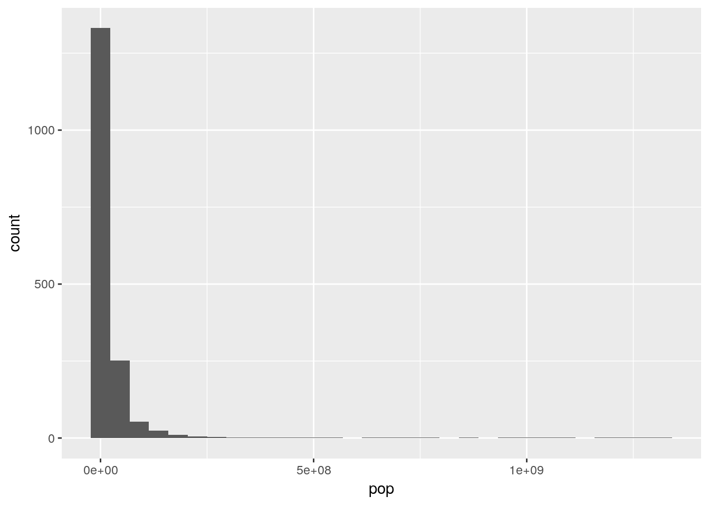
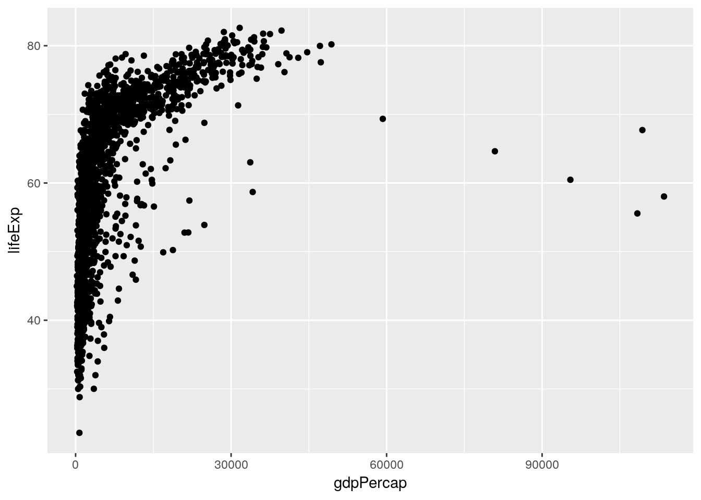
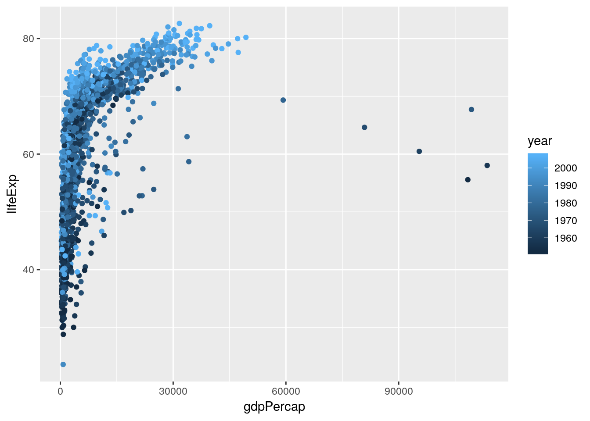
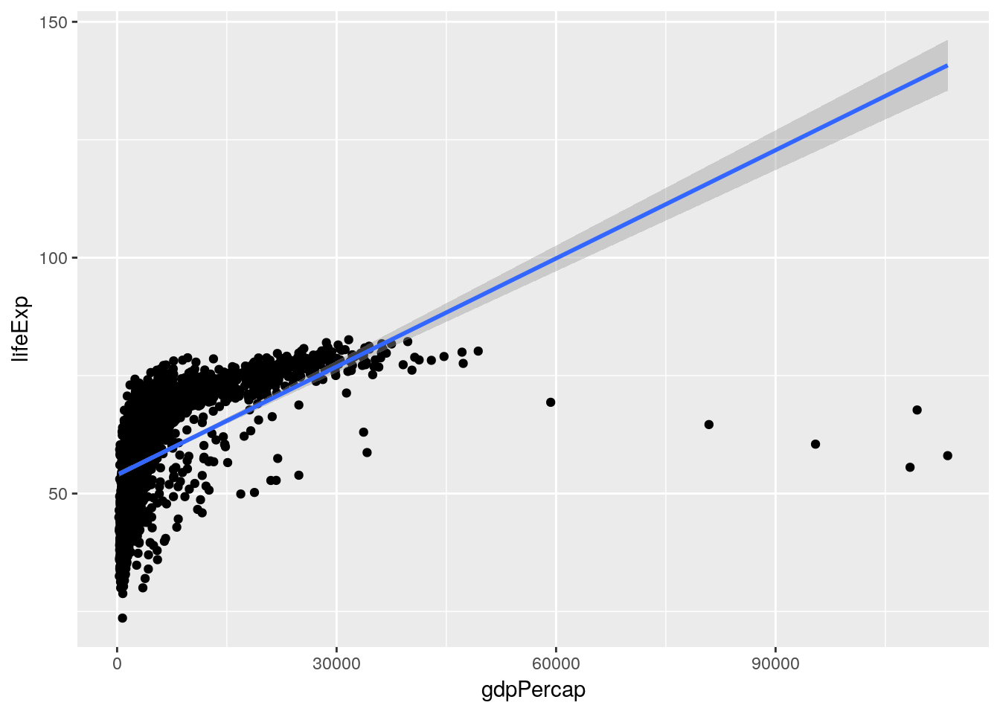

# Introduction to Data Analysis

## Exploratory Data Analysis 
So far, we've learned about how to manipulate our data and how to graph our outputs. Both of these are critically important parts of what's known as exploratory data analysis - or EDA. When you're starting with a new dataset, you won't always immediately know what trends and patterns might be there to discover. The idea at this stage isn't to find out what's causing any trends in the data, to identify any significant results you might have, or to get publishable figures and tables - the point is to understand exactly what it is that you're dealing with.

This unit gives examples of what EDA might look like with a sample dataset. But there aren't prescribed sets of steps to go through while working on EDA - you should feel free to create as many hypotheses as possible, and spend time analyzing them individually. You might find something surprising!

Speaking of surprises, I really enjoy [this quote](https://fivethirtyeight.com/features/election-update-why-our-model-thinks-beto-orourke-really-has-a-chance-in-texas/) from Nate Silver, founder and editor in chief of FiveThirtyEight:

> You ideally want to find yourself surprised by the data some of the time — just not too often. If you never come up with a result that surprises you, it generally means that you didn’t spend a lot of time actually looking at the data; instead, you just imparted your assumptions onto your analysis and engaged in a fancy form of confirmation bias. If you’re constantly surprised, on the other hand, more often than not that means your [code] is buggy or you don’t know the field well enough; a lot of the “surprises” are really just mistakes.  
> ---Nate Silver

Surprises are awesome, and are how discoveries are made in science. But at the same time, a lot of papers are retracted because their big surprise was actually just a glitch in the code. Whenever you find something you didn't expect, make sure you go back through your code and assumptions - it never hurts to double check!

For more on this topic, check out the awesome lecture notes for [Skepticism in Data Science](https://jhu-advdatasci.github.io/2018/lectures/12-being-skeptical.html) from John Hopkins University.

### gapminder
Anyway. We'll be working with data from the gapminder database, which contains statistics on global development metrics. We can get the data like we get most packages:

```
install.packages("gapminder")
```


```r
library(gapminder)
```

Let's also load the tidyverse:

```r
library(tidyverse)
```

```
## -- Attaching packages ------------------------------------------------------------------------ tidyverse 1.2.1 --
```

```
## v ggplot2 3.0.0     v purrr   0.2.4
## v tibble  1.4.2     v dplyr   0.7.4
## v tidyr   0.8.0     v stringr 1.3.0
## v readr   1.1.1     v forcats 0.3.0
```

```
## -- Conflicts --------------------------------------------------------------------------- tidyverse_conflicts() --
## x dplyr::filter() masks stats::filter()
## x dplyr::lag()    masks stats::lag()
```

The gapminder package includes four tables, of which we only care about one: ```gapminder```. We can preview the data, as usual, by typing the name of the table:


```r
gapminder
```

```
## # A tibble: 1,704 x 6
##    country     continent  year lifeExp      pop gdpPercap
##    <fct>       <fct>     <int>   <dbl>    <int>     <dbl>
##  1 Afghanistan Asia       1952    28.8  8425333      779.
##  2 Afghanistan Asia       1957    30.3  9240934      821.
##  3 Afghanistan Asia       1962    32.0 10267083      853.
##  4 Afghanistan Asia       1967    34.0 11537966      836.
##  5 Afghanistan Asia       1972    36.1 13079460      740.
##  6 Afghanistan Asia       1977    38.4 14880372      786.
##  7 Afghanistan Asia       1982    39.9 12881816      978.
##  8 Afghanistan Asia       1987    40.8 13867957      852.
##  9 Afghanistan Asia       1992    41.7 16317921      649.
## 10 Afghanistan Asia       1997    41.8 22227415      635.
## # ... with 1,694 more rows
```

### Describing Your Data
If we want to get a sense of each variable, we can use base R's ```summary()``` to find basic summary statistics for each column:


```r
summary(gapminder)
```

```
##         country        continent        year         lifeExp     
##  Afghanistan:  12   Africa  :624   Min.   :1952   Min.   :23.60  
##  Albania    :  12   Americas:300   1st Qu.:1966   1st Qu.:48.20  
##  Algeria    :  12   Asia    :396   Median :1980   Median :60.71  
##  Angola     :  12   Europe  :360   Mean   :1980   Mean   :59.47  
##  Argentina  :  12   Oceania : 24   3rd Qu.:1993   3rd Qu.:70.85  
##  Australia  :  12                  Max.   :2007   Max.   :82.60  
##  (Other)    :1632                                                
##       pop              gdpPercap       
##  Min.   :6.001e+04   Min.   :   241.2  
##  1st Qu.:2.794e+06   1st Qu.:  1202.1  
##  Median :7.024e+06   Median :  3531.8  
##  Mean   :2.960e+07   Mean   :  7215.3  
##  3rd Qu.:1.959e+07   3rd Qu.:  9325.5  
##  Max.   :1.319e+09   Max.   :113523.1  
## 
```

For the categorical variables ```country``` and ```continent```, R just returns the number of observations each category has. For the numeric variables, meanwhile, the output is a little more involved. 

We can get an even fuller sense of the data using functions from other packages. My personal favorite is the ```describe()``` function included in ```psych```:

```
install.packages("psych")
```

```r
psych::describe(gapminder)
```

```
##            vars    n        mean           sd     median     trimmed
## country*      1 1704       71.50        41.00      71.50       71.50
## continent*    2 1704        2.33         1.21       2.00        2.27
## year          3 1704     1979.50        17.27    1979.50     1979.50
## lifeExp       4 1704       59.47        12.92      60.71       59.92
## pop           5 1704 29601212.32 106157896.74 7023595.50 11399459.45
## gdpPercap     6 1704     7215.33      9857.45    3531.85     5221.44
##                   mad      min          max      range  skew kurtosis
## country*        52.63     1.00        142.0        141  0.00    -1.20
## continent*       1.48     1.00          5.0          4  0.25    -1.34
## year            22.24  1952.00       2007.0         55  0.00    -1.22
## lifeExp         16.10    23.60         82.6         59 -0.25    -1.13
## pop        7841473.62 60011.00 1318683096.0 1318623085  8.33    77.62
## gdpPercap     4007.61   241.17     113523.1     113282  3.84    27.40
##                    se
## country*         0.99
## continent*       0.03
## year             0.42
## lifeExp          0.31
## pop        2571683.45
## gdpPercap      238.80
```

(Note: ```psych::``` lets me call functions from the ```psych``` package without having to load it using ```library()```. This is useful when you aren't using the functions that often - and lets me explicitly identify which functions come from which packages, for the purposes of instruction - but becomes less useful when using the same function or package multiple times. Imagine having to type ```dplyr::``` everytime we wanted to use ```%>%```, for instance!)

This output replaces the IQR with the full range of the data, and adds a number of other important statistics to the output. For instance, we can now see the skew and kurtosis of our data, representing how close our data is to the normal distribution. Briefly, skew represents how close the median is to the mean (or how long the data's "tails" are - 0 means the median is the mean), while kurtosis represents how large the tails of the distribution are (with normally distributed data having a kurtosis of 0).

You should always analyze these values for your data - both in order to give you a sense of what you're working with, and to tell you if there were any errors during data entry. If population had a negative minimum value, for instance, you'd know to be alarmed. 

As we can see, some of our data is highly skewed, with extremely long tails. For instance, if we were to make a histogram of population:


```r
ggplot(gapminder, aes(pop)) + 
  geom_histogram()
```

```
## `stat_bin()` using `bins = 30`. Pick better value with `binwidth`.
```



This makes some intuitive sense - most countries have decently small populations, while some countries - such as China and India - contain significant portions of the world's population.

Now that we have a sense of what our data looks like, we can start attempting to identify trends in the data. You should never trust your data before visualizing it - summary statistics and other tests may not give you critical insights about trends [present in your data](https://www.autodeskresearch.com/publications/samestats).

Base R's ```pairs()``` function is useful for this purpose - it makes a matrix of scatterplots for all your variables, letting you see any correlations that exist visually. Note that we have to subset our data to make sure that we're only graphing numeric columns:


```r
pairs(gapminder[, 3:6])
```


From this, we can immediately see some trends - it looks like all our variables are increasing over time (left column), and that life expectancy goes up as GDP increases (right column, second from the top). A way to see the same thing in table form is to use ```cor()```:


```r
cor(gapminder[, 3:6])
```

```
##                 year    lifeExp         pop   gdpPercap
## year      1.00000000 0.43561122  0.08230808  0.22731807
## lifeExp   0.43561122 1.00000000  0.06495537  0.58370622
## pop       0.08230808 0.06495537  1.00000000 -0.02559958
## gdpPercap 0.22731807 0.58370622 -0.02559958  1.00000000
```

The numbers refer to how correlated the variables are: 1 means perfectly positively correlated, while -1 is perfectly negatively correlated.

If we wanted to get even fancier, we could coerce this result to a dataframe using the function ```tidy()``` from the package ```broom```. We can even visualize this data in ggplot, using ```geom_tile()```:

```
install.packages("broom")
```


```r
CorMatrix <- broom::tidy(cor(gapminder[, 3:6])) %>%
  rename(Var1 = ".rownames") %>%
  gather(Var2, Cor, -Var1)
CorMatrix
```

```
##         Var1      Var2         Cor
## 1       year      year  1.00000000
## 2    lifeExp      year  0.43561122
## 3        pop      year  0.08230808
## 4  gdpPercap      year  0.22731807
## 5       year   lifeExp  0.43561122
## 6    lifeExp   lifeExp  1.00000000
## 7        pop   lifeExp  0.06495537
## 8  gdpPercap   lifeExp  0.58370622
## 9       year       pop  0.08230808
## 10   lifeExp       pop  0.06495537
## 11       pop       pop  1.00000000
## 12 gdpPercap       pop -0.02559958
## 13      year gdpPercap  0.22731807
## 14   lifeExp gdpPercap  0.58370622
## 15       pop gdpPercap -0.02559958
## 16 gdpPercap gdpPercap  1.00000000
```

```r
ggplot(CorMatrix, aes(Var1, Var2, fill = Cor)) +
  geom_tile()
```


Note that what we did above - calling ```cor()``` inside of ```tidy()``` - applies the outside function to the output of the inside function. Functions are run from the inside out. You might remember similar formulas from algebra classes - ```f(g(x))``` is the same as ```(f * g)(x)```. 

Of course, there's no need to do all of these at once - you can do whichever method makes sense to you. Either way, we get similar results - the strongest correlation is between life expectancy and GDP. We can visualize this trend using our ggplot skills:


```r
ggplot(gapminder, aes(gdpPercap, lifeExp)) + 
  geom_jitter()
```



(See that example of nesting functions? ```ggplot(aes())```!)

Hmm, weird! While we can see the correlation, it seems like there's another factor we aren't accounting for. What happens if we color the points by the year they represent?


```r
ggplot(gapminder, aes(gdpPercap, lifeExp, color = year)) + 
  geom_jitter()
```



That looks like we're onto something. What if we facetted the data by continent?


```r
ggplot(gapminder, aes(gdpPercap, lifeExp, color = year)) + 
  geom_jitter() + 
  facet_wrap(~ continent)
```


Hmm. We can see some obvious trends - it seems like Africa has a lower average life expectancy than the other continents, for instance - but they're hard to discern from the visuals alone. For that, we're going to have to get into some actual statistic computing.

## Statistical Tests and Regressions
Now that we've identified some hypotheses about our data, we're able to use the full power of R to try and prove them. First off, we can identify if any of the correlations we saw are statistically significant. For the full dataset, this is pretty easy - we can just feed two vectors into ```cor.test()```:


```r
cor.test(gapminder$lifeExp, gapminder$gdpPercap)
```

```
## 
## 	Pearson's product-moment correlation
## 
## data:  gapminder$lifeExp and gapminder$gdpPercap
## t = 29.658, df = 1702, p-value < 2.2e-16
## alternative hypothesis: true correlation is not equal to 0
## 95 percent confidence interval:
##  0.5515065 0.6141690
## sample estimates:
##       cor 
## 0.5837062
```

(Note that most likely we'd actually use a different correlation test, as the data on life expectancy are non-normal. You can control the test used by setting the ```method``` argument - information about the correlation tests available in this function can be found [here](http://www.statisticssolutions.com/correlation-pearson-kendall-spearman/).)

Looks like a yes!

Before we rush off to publish, though, it might worth seeing if the correlations are different (or, hopefully, stronger) on each continent. Before we do that, let's see if the different continents really do have different life expectancies. In order to do this, we'll perform an ANOVA using our continents as different groups, then test for differences between the groups.

Now, ANOVA is actually just another form of a linear regression, where you're predicting the impact an independent variable has on the response variable. The unique thing about ANOVA is that the independent variables have to be categorical - if they're all numeric, you want to stick with regression, and if there's a mix, you'll use ANCOVA. 

The reason I bring this up is that running an ANOVA in R requires you to first build a linear model, using the ```aov()``` function. This function is pretty simple, taking three arguments - the response variable, all independent variables, and the data to be used. For our purposes, modeling life expectancy as a function of continent, the equation looks like this:


```r
aov(lifeExp ~ continent, data = gapminder)
```

```
## Call:
##    aov(formula = lifeExp ~ continent, data = gapminder)
## 
## Terms:
##                 continent Residuals
## Sum of Squares   139343.2  144805.2
## Deg. of Freedom         4      1699
## 
## Residual standard error: 9.231992
## Estimated effects may be unbalanced
```

Those coefficients do mean something, but we won't get into that right now. More interesting for our purposes is getting the outputs of our ANOVA, which we can do by feeding ```anova()``` our model:


```r
anova(aov(lifeExp ~ continent, data = gapminder))
```

```
## Analysis of Variance Table
## 
## Response: lifeExp
##             Df Sum Sq Mean Sq F value    Pr(>F)    
## continent    4 139343   34836  408.73 < 2.2e-16 ***
## Residuals 1699 144805      85                      
## ---
## Signif. codes:  0 '***' 0.001 '**' 0.01 '*' 0.05 '.' 0.1 ' ' 1
```

Note, by the way, that you'd usually do this by assigning the ```aov()``` to an object (as in ```a <- aov(...)```). I'm not doing this right now, as I think this section is easier to conceptually understand if I'm explicit about what we're running our ```anova()``` and other tests on.  

Looks like continent does have a significant effect on life expectancy!

By the way, there's two other, identical ways to run the same test, using ```lm()``` for ```aov()``` and ```summary()``` for ```anova()```. It really doesn't matter which you go with - they all return the same results.


```r
anova(lm(lifeExp ~ continent, data = gapminder))
summary(aov(lifeExp ~ continent, data = gapminder))
```

So now we know that there are significant differences between the continents. What we want now is to be able to tell what those differences are. Base R's ```TukeyHSD()``` function will help with that, telling us what the differences between each continent are. All we have to do is feed it our ```aov()``` object, and, optionally, tell it to sort the results by the difference with ```ordered = TRUE```


```r
TukeyHSD(aov(lifeExp ~ continent, data = gapminder), ordered = TRUE)
```

```
##   Tukey multiple comparisons of means
##     95% family-wise confidence level
##     factor levels have been ordered
## 
## Fit: aov(formula = lifeExp ~ continent, data = gapminder)
## 
## $continent
##                       diff       lwr       upr     p adj
## Asia-Africa      11.199573  9.579887 12.819259 0.0000000
## Americas-Africa  15.793407 14.022263 17.564550 0.0000000
## Europe-Africa    23.038356 21.369862 24.706850 0.0000000
## Oceania-Africa   25.460878 20.216908 30.704848 0.0000000
## Americas-Asia     4.593833  2.664235  6.523432 0.0000000
## Europe-Asia      11.838783 10.002952 13.674614 0.0000000
## Oceania-Asia     14.261305  8.961718 19.560892 0.0000000
## Europe-Americas   7.244949  5.274203  9.215696 0.0000000
## Oceania-Americas  9.667472  4.319650 15.015293 0.0000086
## Oceania-Europe    2.422522 -2.892185  7.737230 0.7250559
```

So as we can see, Africa has a significantly lower life expectancy than every other continent, followed by Asia, and then the Americas. Oceania and Europe, meanwhile, have about equal life expectancies.

If you remember the ```tidy()``` function from ```broom``` that we used earlier, you probably won't be surprised to learn it can make this sort of output tidier, too:


```r
broom::tidy(TukeyHSD(aov(lifeExp ~ continent, data = gapminder), ordered = TRUE))
```

```
##         term       comparison  estimate  conf.low conf.high  adj.p.value
## 1  continent      Asia-Africa 11.199573  9.579887 12.819259 2.727152e-12
## 2  continent  Americas-Africa 15.793407 14.022263 17.564550 2.727152e-12
## 3  continent    Europe-Africa 23.038356 21.369862 24.706850 2.727152e-12
## 4  continent   Oceania-Africa 25.460878 20.216908 30.704848 2.727152e-12
## 5  continent    Americas-Asia  4.593833  2.664235  6.523432 1.047859e-09
## 6  continent      Europe-Asia 11.838783 10.002952 13.674614 2.727152e-12
## 7  continent     Oceania-Asia 14.261305  8.961718 19.560892 5.862422e-12
## 8  continent  Europe-Americas  7.244949  5.274203  9.215696 2.775336e-12
## 9  continent Oceania-Americas  9.667472  4.319650 15.015293 8.648670e-06
## 10 continent   Oceania-Europe  2.422522 -2.892185  7.737230 7.250559e-01
```

This will make your life a lot better when you're trying to export data.

## Functional Programming
So, it's probably worth finding the correlation between life expectancy and GDP for each continent. We could filter our data five times - one for each continent - but that breaks our rule: if we have to do it more than twice, there's probably a better way.

Now, fair warning, what we're about to do is probably the hardest topic we've gone over yet. Understanding it will make a lot of common tasks much easier, but don't worry if you don't understand it on the first go-through.

First off, let's load broom explicitly now - the only thing we'll be using it for is the ```tidy()``` function.


```r
library(broom)
```

The tidyverse includes a package - ```purrr``` - useful for working with lists. As we saw last unit, a list is a type of object which can include multiple types of data. These include the numerics, characters, and logicals we're comfortable with - but can also include name-value pairs (like ```z = 0```, from the last unit) and, weirdly enough, entire dataframes.

For instance, let's see what happens when we use the ```nest()``` function that ```purrr``` provides:


```r
gapminder %>%
  nest()
```

```
## # A tibble: 1 x 1
##   data                
##   <list>              
## 1 <tibble [1,704 x 6]>
```

All of our data is now stored in a single cell, as a tibble!

We can exclude columns from being nested with ```-``` if we want, splitting the data into as many subsets as there are levels of that variable:


```r
gapminder %>%
  nest(-continent)
```

```
## # A tibble: 5 x 2
##   continent data              
##   <fct>     <list>            
## 1 Asia      <tibble [396 x 5]>
## 2 Europe    <tibble [360 x 5]>
## 3 Africa    <tibble [624 x 5]>
## 4 Americas  <tibble [300 x 5]>
## 5 Oceania   <tibble [24 x 5]>
```

And when we do this, we can subset the list in the exact same way we would a normal vector:


```r
Nested <- gapminder %>%
  nest(-continent)

Nested[1, 2]
```

```
## # A tibble: 1 x 1
##   data              
##   <list>            
## 1 <tibble [396 x 5]>
```

If we then wanted to, we can ```unnest()``` the data:


```r
Nested <- gapminder %>%
  nest(-continent)

Nested[1, 2] %>%
  unnest()
```

```
## # A tibble: 396 x 5
##    country      year lifeExp      pop gdpPercap
##    <fct>       <int>   <dbl>    <int>     <dbl>
##  1 Afghanistan  1952    28.8  8425333      779.
##  2 Afghanistan  1957    30.3  9240934      821.
##  3 Afghanistan  1962    32.0 10267083      853.
##  4 Afghanistan  1967    34.0 11537966      836.
##  5 Afghanistan  1972    36.1 13079460      740.
##  6 Afghanistan  1977    38.4 14880372      786.
##  7 Afghanistan  1982    39.9 12881816      978.
##  8 Afghanistan  1987    40.8 13867957      852.
##  9 Afghanistan  1992    41.7 16317921      649.
## 10 Afghanistan  1997    41.8 22227415      635.
## # ... with 386 more rows
```

But what's interesting is that we can also manipulate the data while it's nested. ```purrr``` provides a number of "map" functions, which will apply a function to each member of a list and return the outputs as a list. 

What this allows us to do is create additional nested lists as new columns, letting us find correlations between groups much faster. For instance, if we want to create a column ```Cor``` with the output of the correlation tests, we could do the following:


```r
gapminder %>%
  nest(-continent) %>%
  mutate(Cor = map(data, ~ cor.test(.$lifeExp, .$gdpPercap)))
```

```
## # A tibble: 5 x 3
##   continent data               Cor        
##   <fct>     <list>             <list>     
## 1 Asia      <tibble [396 x 5]> <S3: htest>
## 2 Europe    <tibble [360 x 5]> <S3: htest>
## 3 Africa    <tibble [624 x 5]> <S3: htest>
## 4 Americas  <tibble [300 x 5]> <S3: htest>
## 5 Oceania   <tibble [24 x 5]>  <S3: htest>
```

The ```~``` indicates that the next word is a _function_ that should be applied to each element of the list. ```.``` is what's referred to as a _pronoun_ - it's the short name for the data that's being applied to the function. That's why we can subset it with ```$``` - while we're inside the map function, ```.``` _is_ your data. We'll be using ```.``` repeatedly for the rest of the course.

Now, because ```cor.test()``` doesn't provide a tidy data output - it produces something human-readable, but not computer-usable - we have to tidy it up before we can extract our numbers. That's where ```tidy()``` comes in, which we use pretty similarly to ```cor.test()```:


```r
gapminder %>%
  nest(-continent) %>%
  mutate(Cor = map(data, ~ cor.test(.$lifeExp, .$gdpPercap)),
         TidyCor = map(Cor, ~ tidy(.)))
```

```
## # A tibble: 5 x 4
##   continent data               Cor         TidyCor             
##   <fct>     <list>             <list>      <list>              
## 1 Asia      <tibble [396 x 5]> <S3: htest> <data.frame [1 x 8]>
## 2 Europe    <tibble [360 x 5]> <S3: htest> <data.frame [1 x 8]>
## 3 Africa    <tibble [624 x 5]> <S3: htest> <data.frame [1 x 8]>
## 4 Americas  <tibble [300 x 5]> <S3: htest> <data.frame [1 x 8]>
## 5 Oceania   <tibble [24 x 5]>  <S3: htest> <data.frame [1 x 8]>
```

That last column - made up of dataframes - is exactly what we want. We can extract it from this dataframe using ```unnest(.drop = TRUE)```, which will drop the other nested columns:


```r
gapminder %>%
  nest(-continent) %>%
  mutate(Cor = map(data, ~ cor.test(.$lifeExp, .$gdpPercap)),
         TidyCor = map(Cor, ~ tidy(.))) %>%
  unnest(TidyCor, .drop = TRUE)
```

```
## # A tibble: 5 x 9
##   continent estimate statistic  p.value parameter conf.low conf.high
##   <fct>        <dbl>     <dbl>    <dbl>     <int>    <dbl>     <dbl>
## 1 Asia         0.382      8.21 3.29e-15       394    0.295     0.463
## 2 Europe       0.781     23.6  4.05e-75       358    0.737     0.818
## 3 Africa       0.426     11.7  7.60e-29       622    0.359     0.488
## 4 Americas     0.558     11.6  5.45e-26       298    0.475     0.632
## 5 Oceania      0.956     15.4  2.99e-13        22    0.901     0.981
## # ... with 2 more variables: method <fct>, alternative <fct>
```

And tada, we have the output from five correlation tests in one step, rather than the ten it would take to do the long way.

When I was learning how to do this, I kept believing that it was a waste of my time, because learning took significantly more time than just doing it the long way. But in addition to the obvious benefits this method gives - we have less code replication, which means faster programs and less chance for typos; all of our data is in the same dataframe, rather than in five chunks; and we can compare our results immediately, rather than having to sift through paragraphs to find the same data points - this method is extremely applicable to many other areas of coding. If you ever have to build models or analyze grouped data, this is the way to make sure that your work is reproducible and your science is sound. 

So even though it might take a bit to fully internalize, keep trying these efficient paths when we use them in this reader. We'll be returning to this format repeatedly, in order to build models, analyze results, and compare groups.


### Column Names
In order to do that, of course, we have to understand what each of those column names represent. In order:

* ```estimate``` is whatever parameter is being estimated - here, the correlation coefficient.
* ```statistic``` is the test statistic used to calculate the p value - in this case, _t_.
* ```p.value``` is, well, the p-value. It's calculated for 95%, unless you changed the confidence level by setting ```cor.test(conf.level = ##)```.
* ```parameter``` is the degrees of freedom.
* ```conf.low``` and ```conf.high``` are the bounds of the confidence interval of the _estimate_ - so here, of the correlation coefficient. It's calculated for whatever confidence level you set in ```cor.test(conf.level = ##)```.
* ```method``` is the test used.
* ```alternative``` is the alternative hypothesis tested - you can change it by setting ```cor.test(alternative = "")``` to "two.sided", "lesser", or "greater".

## Modeling
Okay, time to get back to data analysis. 

If we want to see the effect of two continuous variables (say, ```gdpPercapita``` and ```year```) on ```lifeExp```, we'd use what's known as _multiple regression_. There's a lot of different flavors of multiple regression, but the simplest is what's known as general linear regression - the y = mx + b formula that you went over in high school. R makes it easy to fit a general linear model to your data (via ordinary least squares) using the ```lm()``` function, using the same arguments as we used for ```aov()```:


```r
lm(lifeExp ~ gdpPercap + year, data = gapminder)
```

```
## 
## Call:
## lm(formula = lifeExp ~ gdpPercap + year, data = gapminder)
## 
## Coefficients:
## (Intercept)    gdpPercap         year  
##  -4.184e+02    6.697e-04    2.390e-01
```

These coefficients show how much we can expect life expectancy to increase if the GDP or year increases. The intercept is what life expectancy would be if both GDP and the year were 0 - obviously, this number doesn't make a ton of sense, since we don't have any data on life expectancy in either of those situations. There's ways to correct for this, and we aren't gonna do them - more information can be found [here](https://www.theanalysisfactor.com/center-on-the-mean/).

If we want to see how well this model fits our data, we can graph it:


```r
ggplot(gapminder, aes(gdpPercap, lifeExp)) + 
  geom_jitter() +
  geom_smooth(method = "lm")
```



Hmm. Seems like a pretty bad fit.

If we want statistical estimates of how well our model fits the data, we can feed it as an argument to ```summary()```:


```r
Model <- lm(lifeExp ~ gdpPercap + year, data = gapminder)

summary(Model)
```

```
## 
## Call:
## lm(formula = lifeExp ~ gdpPercap + year, data = gapminder)
## 
## Residuals:
##     Min      1Q  Median      3Q     Max 
## -67.262  -6.954   1.219   7.759  19.553 
## 
## Coefficients:
##               Estimate Std. Error t value Pr(>|t|)    
## (Intercept) -4.184e+02  2.762e+01  -15.15   <2e-16 ***
## gdpPercap    6.697e-04  2.447e-05   27.37   <2e-16 ***
## year         2.390e-01  1.397e-02   17.11   <2e-16 ***
## ---
## Signif. codes:  0 '***' 0.001 '**' 0.01 '*' 0.05 '.' 0.1 ' ' 1
## 
## Residual standard error: 9.694 on 1701 degrees of freedom
## Multiple R-squared:  0.4375,	Adjusted R-squared:  0.4368 
## F-statistic: 661.4 on 2 and 1701 DF,  p-value: < 2.2e-16
```

As we can see, both GDP and the year are significant predictors of life expectancy, but the linear model isn't a great fit for the data - our R^2^ is 0.44. 

Perhaps we could improve the model by accounting for the interaction between GDP and the year. There are two ways to include interaction terms in models, each of which have their benefits. One is to replace the ```+``` in the model with ```*```, as follows:


```r
Model <- lm(lifeExp ~ gdpPercap * year, data = gapminder)

summary(Model)
```

```
## 
## Call:
## lm(formula = lifeExp ~ gdpPercap * year, data = gapminder)
## 
## Residuals:
##     Min      1Q  Median      3Q     Max 
## -54.234  -7.314   1.002   7.951  19.780 
## 
## Coefficients:
##                  Estimate Std. Error t value Pr(>|t|)    
## (Intercept)    -3.532e+02  3.267e+01 -10.811  < 2e-16 ***
## gdpPercap      -8.754e-03  2.547e-03  -3.437 0.000602 ***
## year            2.060e-01  1.653e-02  12.463  < 2e-16 ***
## gdpPercap:year  4.754e-06  1.285e-06   3.700 0.000222 ***
## ---
## Signif. codes:  0 '***' 0.001 '**' 0.01 '*' 0.05 '.' 0.1 ' ' 1
## 
## Residual standard error: 9.658 on 1700 degrees of freedom
## Multiple R-squared:  0.442,	Adjusted R-squared:  0.441 
## F-statistic: 448.8 on 3 and 1700 DF,  p-value: < 2.2e-16
```

The other is to specify _which_ terms you want to track the interaction of, using ```:``` as follows:


```r
Model <- lm(lifeExp ~ gdpPercap + year + gdpPercap:year, data = gapminder)

summary(Model)
```

```
## 
## Call:
## lm(formula = lifeExp ~ gdpPercap + year + gdpPercap:year, data = gapminder)
## 
## Residuals:
##     Min      1Q  Median      3Q     Max 
## -54.234  -7.314   1.002   7.951  19.780 
## 
## Coefficients:
##                  Estimate Std. Error t value Pr(>|t|)    
## (Intercept)    -3.532e+02  3.267e+01 -10.811  < 2e-16 ***
## gdpPercap      -8.754e-03  2.547e-03  -3.437 0.000602 ***
## year            2.060e-01  1.653e-02  12.463  < 2e-16 ***
## gdpPercap:year  4.754e-06  1.285e-06   3.700 0.000222 ***
## ---
## Signif. codes:  0 '***' 0.001 '**' 0.01 '*' 0.05 '.' 0.1 ' ' 1
## 
## Residual standard error: 9.658 on 1700 degrees of freedom
## Multiple R-squared:  0.442,	Adjusted R-squared:  0.441 
## F-statistic: 448.8 on 3 and 1700 DF,  p-value: < 2.2e-16
```

As you can see, these outputs are identical. Even so, I personally prefer using the second format, because it makes the interaction term a more explicit part of your model. While it doesn't matter in simple models like the one we've developed here, once you have a large number of terms, it's helpful to specify which interactions you're measuring.

## Mixed Models {-}
That R^2^ pf 0.44 is an improvement, but still not great. We could try combining continuous and categorical variables in a single model, to try and better predict life expectancy.

Doing that in R is very simple - just add the categorical variable to your model like you would a continuous. Let's do that with continents:


```r
Model <- lm(lifeExp ~ gdpPercap + year + continent + gdpPercap:year + gdpPercap:continent + year:continent + gdpPercap:year:continent, data = gapminder)

summary(Model)
```

```
## 
## Call:
## lm(formula = lifeExp ~ gdpPercap + year + continent + gdpPercap:year + 
##     gdpPercap:continent + year:continent + gdpPercap:year:continent, 
##     data = gapminder)
## 
## Residuals:
##      Min       1Q   Median       3Q      Max 
## -26.7123  -3.2453   0.1535   3.4204  17.7379 
## 
## Coefficients:
##                                    Estimate Std. Error t value Pr(>|t|)
## (Intercept)                      -4.241e+02  3.777e+01 -11.229  < 2e-16
## gdpPercap                        -2.168e-02  1.226e-02  -1.768  0.07721
## year                              2.377e-01  1.909e-02  12.457  < 2e-16
## continentAmericas                -4.065e+02  7.317e+01  -5.556 3.20e-08
## continentAsia                    -2.258e+02  5.723e+01  -3.946 8.27e-05
## continentEurope                   7.212e+01  7.849e+01   0.919  0.35830
## continentOceania                  3.047e+02  4.846e+02   0.629  0.52956
## gdpPercap:year                    1.149e-05  6.176e-06   1.860  0.06308
## gdpPercap:continentAmericas       7.174e-02  1.445e-02   4.963 7.63e-07
## gdpPercap:continentAsia           7.051e-03  1.251e-02   0.563  0.57318
## gdpPercap:continentEurope         4.049e-02  1.317e-02   3.075  0.00214
## gdpPercap:continentOceania        1.275e-02  3.527e-02   0.362  0.71768
## year:continentAmericas            2.119e-01  3.694e-02   5.736 1.15e-08
## year:continentAsia                1.196e-01  2.894e-02   4.133 3.75e-05
## year:continentEurope             -2.636e-02  3.970e-02  -0.664  0.50684
## year:continentOceania            -1.408e-01  2.461e-01  -0.572  0.56739
## gdpPercap:year:continentAmericas -3.634e-05  7.275e-06  -4.996 6.46e-07
## gdpPercap:year:continentAsia     -3.945e-06  6.305e-06  -0.626  0.53163
## gdpPercap:year:continentEurope   -2.076e-05  6.629e-06  -3.133  0.00176
## gdpPercap:year:continentOceania  -6.939e-06  1.757e-05  -0.395  0.69289
##                                     
## (Intercept)                      ***
## gdpPercap                        .  
## year                             ***
## continentAmericas                ***
## continentAsia                    ***
## continentEurope                     
## continentOceania                    
## gdpPercap:year                   .  
## gdpPercap:continentAmericas      ***
## gdpPercap:continentAsia             
## gdpPercap:continentEurope        ** 
## gdpPercap:continentOceania          
## year:continentAmericas           ***
## year:continentAsia               ***
## year:continentEurope                
## year:continentOceania               
## gdpPercap:year:continentAmericas ***
## gdpPercap:year:continentAsia        
## gdpPercap:year:continentEurope   ** 
## gdpPercap:year:continentOceania     
## ---
## Signif. codes:  0 '***' 0.001 '**' 0.01 '*' 0.05 '.' 0.1 ' ' 1
## 
## Residual standard error: 6.307 on 1684 degrees of freedom
## Multiple R-squared:  0.7643,	Adjusted R-squared:  0.7616 
## F-statistic: 287.4 on 19 and 1684 DF,  p-value: < 2.2e-16
```

Our R^2^ is now up to a respectable 0.76! It looks like these three variables - and the interactions between them - explain a lot of the variance in our data. To get a cleaner table explaining the impacts each variable has on life expectancy, we can perform an analysis of covariance, or ANCOVA. To do this, we just change out our mixed model ```lm()``` function for an ```aov()```, and then pass that ```aov()``` object to ```summary()```:


```r
Model <- aov(lifeExp ~ gdpPercap + year + continent + gdpPercap:year + gdpPercap:continent + year:continent + gdpPercap:year:continent, data = gapminder)

summary(Model)
```

```
##                            Df Sum Sq Mean Sq  F value Pr(>F)    
## gdpPercap                   1  96813   96813 2434.192 <2e-16 ***
## year                        1  27495   27495  691.316 <2e-16 ***
## continent                   4  79428   19857  499.269 <2e-16 ***
## gdpPercap:year              1     18      18    0.461  0.497    
## gdpPercap:continent         4   5420    1355   34.069 <2e-16 ***
## year:continent              4   4331    1083   27.225 <2e-16 ***
## gdpPercap:year:continent    4   3667     917   23.048 <2e-16 ***
## Residuals                1684  66976      40                    
## ---
## Signif. codes:  0 '***' 0.001 '**' 0.01 '*' 0.05 '.' 0.1 ' ' 1
```

This output means we can now say that GDP has a significant impact on life expectancy when controlling for year as a covariate - and that all the interaction terms are significant, except for GDP and year.

One way to get around having to use an ANCOVA is to develop separate regression models for each continent. We can do that in much the same way we tested for correlation on each continent:


```r
gapminder %>%
  nest(-continent) %>%
  mutate(Models = map(data, ~ lm(lifeExp ~ gdpPercap + year + gdpPercap:year, data = .)),
         TidyMods = map(Models, ~ tidy(.))) %>%
  unnest(TidyMods, .drop = TRUE)
```

```
## # A tibble: 20 x 6
##    continent term                estimate   std.error statistic  p.value
##    <fct>     <chr>                  <dbl>       <dbl>     <dbl>    <dbl>
##  1 Asia      (Intercept)    -650.         54.6           -11.9  4.38e-28
##  2 Asia      gdpPercap        -0.0146      0.00318        -4.60 5.71e- 6
##  3 Asia      year              0.357       0.0276         12.9  4.34e-32
##  4 Asia      gdpPercap:year    0.00000754  0.00000161      4.68 3.97e- 6
##  5 Europe    (Intercept)    -352.         29.8           -11.8  1.92e-27
##  6 Europe    gdpPercap         0.0188      0.00208         9.06 8.85e-18
##  7 Europe    year              0.211       0.0151         14.0  6.51e-36
##  8 Europe    gdpPercap:year   -0.00000928  0.00000104     -8.90 2.80e-17
##  9 Africa    (Intercept)    -424.         41.9           -10.1  2.09e-22
## 10 Africa    gdpPercap        -0.0217      0.0136         -1.59 1.11e- 1
## 11 Africa    year              0.238       0.0212         11.2  8.83e-27
## 12 Africa    gdpPercap:year    0.0000115   0.00000685      1.68 9.40e- 2
## 13 Americas  (Intercept)    -831.         54.3           -15.3  2.46e-39
## 14 Americas  gdpPercap         0.0501      0.00663         7.55 5.53e-13
## 15 Americas  year              0.450       0.0274         16.4  1.81e-43
## 16 Americas  gdpPercap:year   -0.0000249   0.00000333     -7.46 9.52e-13
## 17 Oceania   (Intercept)    -119.         41.3            -2.89 9.07e- 3
## 18 Oceania   gdpPercap        -0.00892     0.00283        -3.15 5.01e- 3
## 19 Oceania   year              0.0969      0.0210          4.62 1.67e- 4
## 20 Oceania   gdpPercap:year    0.00000455  0.00000141      3.23 4.19e- 3
```

Note that I deleted all the "continent" terms from the model, because we're now making a different model for each continent available. I've also used the ```.``` pronoun to represent our data here.

In this case, ```estimate``` represents the coefficient (beta) for each variable, while the statistic is the F statistic.  

## Conclusion {-}
The important takeaways from this unit are not necessarily the statistical tests used - since those will vary dependent upon your purpose - so much as the methods highlighted. Understanding how to generate hypotheses from a new dataset - and then how to drill down and analyze them each in turn - is a cross-disciplinary skill used in any new analysis project.

Later in the course, you'll be given projects which will require you to understand brand new datasets, manipulate them, perform complex analyses on them, and visualise them. EDA will give you the familiarity with your data to find these patterns, isolate them appropriately, and perform the right analyses moving forward. The entire purpose of this unit is to give you the skillset to identify what those analyses might be, by understanding how to generate hypotheses from a combination of data visualization and manipulation.  

What we haven't done is confirmatory analysis, where we start our work with a model in mind and then report how well it fit the data. Once data is used for exploratory analysis, it can't be used again for confirmatory work. There are methods to split data for confirmatory analysis, while still being able to use some data for exploration - for an overview, see [Hadley Wickham's overview here](https://r4ds.had.co.nz/model-intro.html). We'll be working with these methods in unit 10.

## Exercises

### Answer the following:
1. The output of ```psych::describe(gapminder_unfiltered)``` put stars after ```country``` and ```continent```. Why?
2. Make a histogram of a gapminder variable other than population. Describe the graph with regards to its skewdness and kurtosis. 
3. Compute an ANOVA for the impacts of continent on population. Report the results as you would in a manuscript.
4. Fit a regression model to the impacts of the current year and life expectancy on GDP. Why does this model not make sense conceptually?
5. Fit a linear model explaining life expectancy as a function of the current year for each country in the dataset (use the formula lifeExp ~ year). Then tidy the model outputs and look at the p values for each coefficient. If you don't hate yourself, you'll try the functional computing approach.

