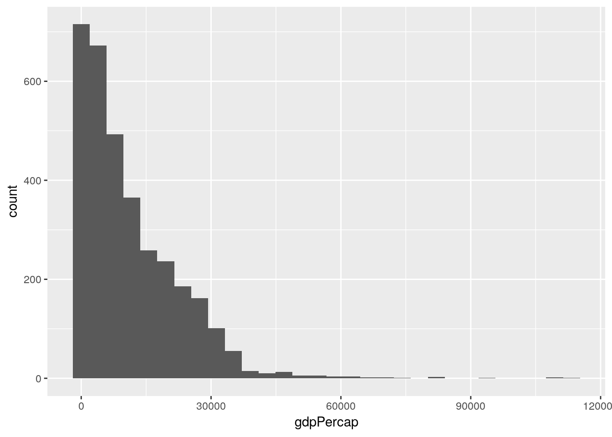
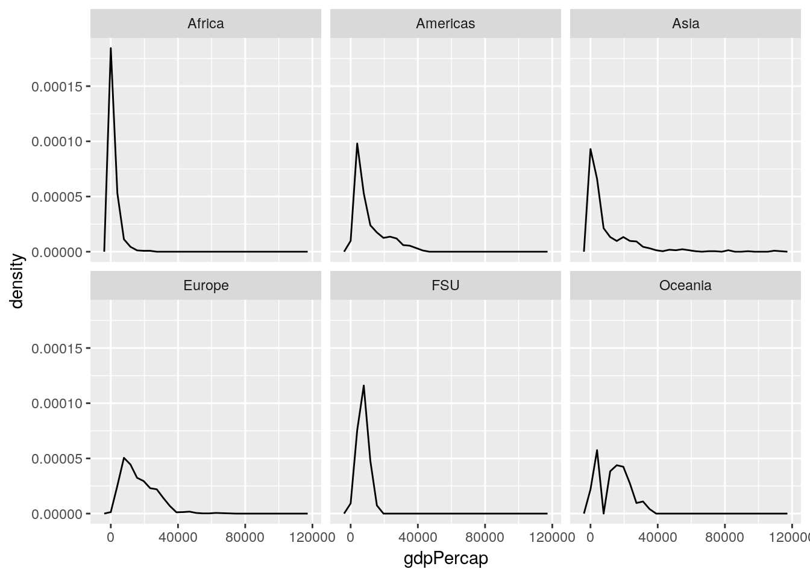
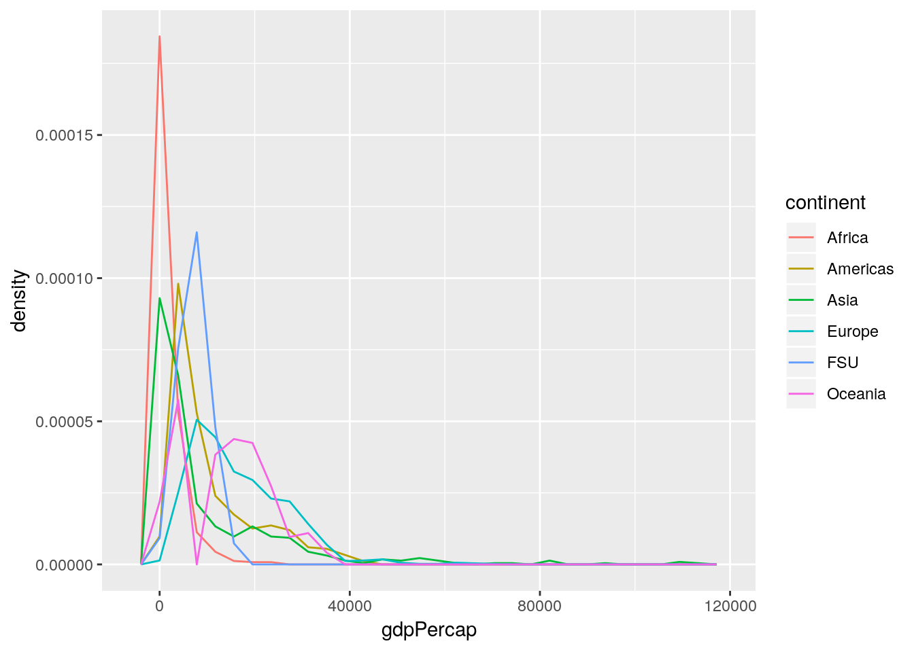
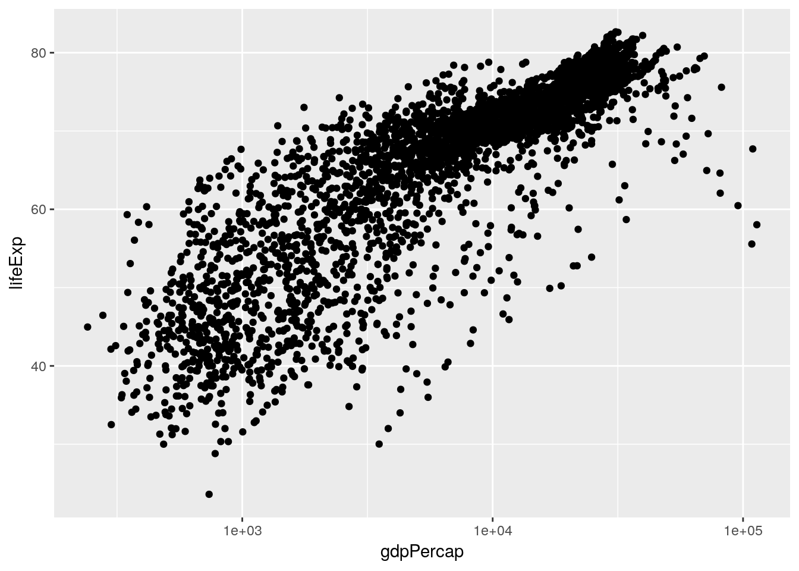

# Introduction to Data Analysis

> Far better an approximate answer to the right question, which is often vague, than an exact answer to the wrong question, which can always be made precise
> <div align="right">John W. Tukey, [*The Future of Data Analysis*](https://projecteuclid.org/download/pdf_1/euclid.aoms/1177704711) </div>

## Exploratory Data Analysis 
So far, we've learned about how to manipulate our data and how to graph our outputs. Both of these are critically important parts of what's known as exploratory data analysis - or EDA. When you're starting with a new dataset, you won't always immediately know what trends and patterns might be there to discover. The idea at this stage isn't to find out what's causing any trends in the data, to identify any significant results you might have, or to get publishable or presentable figures and tables - the point is to understand exactly what it is that you're dealing with. For more on this topic, check out [this post](https://simplystatistics.org/2019/04/17/tukey-design-thinking-and-better-questions/).

### Sidenote

EDA differs from what most people expect data analytics to be. Most people expect analytics to follow a clearcut path, going in a linear direction from deciding on a question to answering said question completely and accurately. But that really isn't the point of data analytics, and especially not EDA, as Tukey (the father of data analytics and modern statistics) says at the top of this chapter. Most people think of analytics as something you do to improve the strength of your evidence, but that's not what the discipline excels at. 

Rather, the discipline shines best when it's working on [improving the question you're asking](https://simplystatistics.org/2019/04/17/tukey-design-thinking-and-better-questions/), perhaps generating evidence for your case along the way. That's not to say you can't use analytics to try and answer a question - you can, and most people working in the field today use it in that manner. But you'll be a better analyst if you keep yourself open to new surprises, and chase them down, rather than attempting to make your analysis follow a linear path.

Speaking of surprises, I really enjoy [this quote](https://fivethirtyeight.com/features/election-update-why-our-model-thinks-beto-orourke-really-has-a-chance-in-texas/) from Nate Silver, founder and editor in chief of FiveThirtyEight:

> You ideally want to find yourself surprised by the data some of the time — just not too often. If you never come up with a result that surprises you, it generally means that you didn’t spend a lot of time actually looking at the data; instead, you just imparted your assumptions onto your analysis and engaged in a fancy form of confirmation bias. If you’re constantly surprised, on the other hand, more often than not that means your [code] is buggy or you don’t know the field well enough; a lot of the “surprises” are really just mistakes.  
> ---Nate Silver

Surprises are awesome, and are how discoveries are made. But at the same time, a lot of papers are retracted because their big surprise was actually just a glitch in the code. Whenever you find something you didn't expect, make sure you go back through your code and assumptions - it never hurts to double check!

For more on this topic, check out the awesome lecture notes for [Skepticism in Data Science](https://jhu-advdatasci.github.io/2018/lectures/12-being-skeptical.html) from John Hopkins University.

### The EDA Framework

I've found it useful, in composing my thoughts about exploratory data analysis, to fit the rough steps of EDA into a three-part framework. The first thing I do when presented with any new dataset is to **summarize** the data, to see what general shape it's in. This lets me catch outliers and typos, see if there's any values I have a question on, and start getting a sense of the scope of the dataset I'm working with. I'll then usually start to **visualize** the data, making exploratory graphs in order to get a more concrete sense of how each variable interacts with all the others, and to see if any patterns emerge from the dataset. I'll then usually start to **analyze** the patterns I'm finding, picking them apart to see if I can better understand how they work before I begin modeling them.

However, I don't believe EDA is so simple that I can say these are ordered steps - that summarizing comes before visualization, which happens before you being analyzing patterns. I believe that EDA typically involves multiple rounds of each step, where visualizations give you new ideas for summaries you'd be interested in, which perhaps give rise to patterns you want to analyze, which in turn inspire more visualizations. The point is to use your skills to play with your datasets, until you're satisfied you have enough information to proceed onto your analysis. 

## gapminder
We're going to use the `gapminder` dataset for this unit, in order to see more a more realistic application of exploratory data analysis that you might perform when working with a new dataset for the first time. In order to do this, we're going to install the `gapminder` package, then load it as usual:

```
install.package("gapminder")
```

```r
library(gapminder)
```

This package includes five data tables, all focusing on GDP and life expectancy values for a set of countries. The largest of these datasets is `gapminder_unfiltered`, which is what we'll be working with now. Let's take a look using `head()`:


```r
head(gapminder_unfiltered)
```

```
## # A tibble: 6 x 6
##   country     continent  year lifeExp      pop gdpPercap
##   <fct>       <fct>     <int>   <dbl>    <int>     <dbl>
## 1 Afghanistan Asia       1952    28.8  8425333      779.
## 2 Afghanistan Asia       1957    30.3  9240934      821.
## 3 Afghanistan Asia       1962    32.0 10267083      853.
## 4 Afghanistan Asia       1967    34.0 11537966      836.
## 5 Afghanistan Asia       1972    36.1 13079460      740.
## 6 Afghanistan Asia       1977    38.4 14880372      786.
```

So as we can see, there are six columns in this dataset, which are more or less descriptively named. If you've got questions about the dataset, or what data is stored in any of the columns, you can check this dataset out with `?gapminder_unfiltered`.

## Summarizing Data
It would now be helpful for us to get a bit broader sense of what each column contains. One of the easiest ways to do that is with `summary()`:

```r
summary(gapminder_unfiltered)
```

```
##            country        continent         year         lifeExp     
##  Czech Republic:  58   Africa  : 637   Min.   :1950   Min.   :23.60  
##  Denmark       :  58   Americas: 470   1st Qu.:1967   1st Qu.:58.33  
##  Finland       :  58   Asia    : 578   Median :1982   Median :69.61  
##  Iceland       :  58   Europe  :1302   Mean   :1980   Mean   :65.24  
##  Japan         :  58   FSU     : 139   3rd Qu.:1996   3rd Qu.:73.66  
##  Netherlands   :  58   Oceania : 187   Max.   :2007   Max.   :82.67  
##  (Other)       :2965                                                 
##       pop              gdpPercap       
##  Min.   :5.941e+04   Min.   :   241.2  
##  1st Qu.:2.680e+06   1st Qu.:  2505.3  
##  Median :7.560e+06   Median :  7825.8  
##  Mean   :3.177e+07   Mean   : 11313.8  
##  3rd Qu.:1.961e+07   3rd Qu.: 17355.8  
##  Max.   :1.319e+09   Max.   :113523.1  
## 
```

You can see that `summary()` gives us some basic summary statistics of each column - and that these views are different for numeric and text columns. We can also start seeing how these values are distributed - it seems like the values cover six continents (though I'm a little iffy on what "FSU" means, and it looks like the Americas are merged), and 57 years (from 1950 to 2007). The numeric columns, meanwhile, have simple summary statistics listed. We can dig down a little deeper into these statistics using the `describe()` function, from the `psych` package:

```
install.packages("psych")
```

```r
library(psych)
```


```r
describe(gapminder_unfiltered)
```

```
##            vars    n        mean           sd     median     trimmed
## country*      1 3313       93.30        53.42      92.00       93.47
## continent*    2 3313        3.12         1.40       3.00        3.08
## year          3 3313     1980.29        16.93    1982.00     1980.57
## lifeExp       4 3313       65.24        11.77      69.61       66.63
## pop           5 3313 31773251.41 104501904.44 7559776.00 12014676.53
## gdpPercap     6 3313    11313.82     11369.01    7825.82     9629.08
##                   mad      min          max        range  skew kurtosis
## country*        68.20     1.00 1.870000e+02 1.860000e+02 -0.01    -1.24
## continent*       1.48     1.00 6.000000e+00 5.000000e+00 -0.05    -0.74
## year            22.24  1950.00 2.007000e+03 5.700000e+01 -0.11    -1.19
## lifeExp          8.45    23.60 8.267000e+01 5.907000e+01 -0.98    -0.05
## pop        8509318.95 59412.00 1.318683e+09 1.318624e+09  7.44    63.47
## gdpPercap     9200.98   241.17 1.135231e+05 1.132820e+05  2.08     8.82
##                    se
## country*         0.93
## continent*       0.02
## year             0.29
## lifeExp          0.20
## pop        1815572.04
## gdpPercap      197.52
```

Now in addition to the values from `summary()`, we get the number of observations, each column's standard deviation, trimmed mean, median absolute deviation, range, skew, kurtosis, and standard error. 

We can also, if we wanted, check to see how many unique countries are represented in the dataset, by checking the `length()` of a vector of all the `unique()` values of the country column:


```r
length(unique(gapminder_unfiltered$country))
```

```
## [1] 187
```

If we wanted to make that a little simpler, by the way, we can use the `n_distinct()` function from `dplyr`. As a sidenote, we can use a function from a package without loading it (via `library`) by typing the package name followed by `::`, like so:


```r
dplyr::n_distinct(gapminder_unfiltered$country)
```

```
## [1] 187
```

However, it makes sense for us to load the package explicitly, since we'll be using a lot of the functions from it for the rest of this chapter.


```r
library(dplyr)
```

```
## 
## Attaching package: 'dplyr'
```

```
## The following objects are masked from 'package:stats':
## 
##     filter, lag
```

```
## The following objects are masked from 'package:base':
## 
##     intersect, setdiff, setequal, union
```

So looking at those values, I'm noticing some extreme numbers in the life expectancy and GDP columns - specifically, the minimums seem much lower than I'd expect. We can pull those rows out of the dataset using `filter()`:


```r
gapminder_unfiltered %>%
  filter(lifeExp == min(lifeExp))
```

```
## # A tibble: 1 x 6
##   country continent  year lifeExp     pop gdpPercap
##   <fct>   <fct>     <int>   <dbl>   <int>     <dbl>
## 1 Rwanda  Africa     1992    23.6 7290203      737.
```

```r
gapminder_unfiltered %>%
  filter(gdpPercap == min(gdpPercap))
```

```
## # A tibble: 1 x 6
##   country          continent  year lifeExp      pop gdpPercap
##   <fct>            <fct>     <int>   <dbl>    <int>     <dbl>
## 1 Congo, Dem. Rep. Africa     2002    45.0 55379852      241.
```

As history buffs might know, these values are both (sadly) explained by politics and history. The other oddball I want to check is what the "FSU" continent is meant to represent:


```r
gapminder_unfiltered %>%
  filter(continent == "FSU")
```

```
## # A tibble: 139 x 6
##    country continent  year lifeExp      pop gdpPercap
##    <fct>   <fct>     <int>   <dbl>    <int>     <dbl>
##  1 Armenia FSU        1992    68.7  3378331     1443.
##  2 Armenia FSU        1997    70.4  3059000     1791.
##  3 Armenia FSU        2002    71.4  3013818     2692.
##  4 Armenia FSU        2007    72.0  2971650     4943.
##  5 Belarus FSU        1973    72.7  9236465     4959.
##  6 Belarus FSU        1990    71.2 10215208     6808.
##  7 Belarus FSU        1991    70.6 10244639     6693.
##  8 Belarus FSU        1992    70.2 10306362     6014.
##  9 Belarus FSU        1993    69.0 10360516     5528.
## 10 Belarus FSU        1994    68.8 10387841     4869.
## # … with 129 more rows
```

Ahh! These countries are all **F**ormer **S**oviet **U**nion states, so are broken out from the other countries - and have a lot of incomplete data. 

The other notable values I'd like to check out are the super high *skew* and *kurtosis* values that `describe()` gave us for the GDP column. These values demonstrate that our data really doesn't follow the normal distribution (which has a value of 0 for both metrics) - but I'd like to visualize how:


```r
library(ggplot2)
```

```
## Registered S3 methods overwritten by 'ggplot2':
##   method         from 
##   [.quosures     rlang
##   c.quosures     rlang
##   print.quosures rlang
```

```
## 
## Attaching package: 'ggplot2'
```

```
## The following objects are masked from 'package:psych':
## 
##     %+%, alpha
```

```r
ggplot(gapminder_unfiltered, aes(gdpPercap)) + 
  geom_histogram()
```

```
## `stat_bin()` using `bins = 30`. Pick better value with `binwidth`.
```



So our data is less variable than we'd expect (that's the high kurtosis, implying that the mode is more common than it would be in the normal distribution), and right-skewed (meaning that our mean is higher than the median, since there are a number of high outlier values). That's not a *bad* thing, but it's worth knowing how our data is structured and wondering why, and how it might affect the other variables we can measure.

This graph could probably be made more effective if we split it up by continent. Let's use `facet_wrap()` to create six panels of the graph, one for each continent:


```r
ggplot(gapminder_unfiltered, aes(gdpPercap)) + 
  geom_histogram() + 
  facet_wrap(~ continent)
```

```
## `stat_bin()` using `bins = 30`. Pick better value with `binwidth`.
```


If we wanted to calculate our values as a relative measurement rather than an absolute count - so that we can better see the patterns in other areas, and lower the high outlier in Africa - we can provide `..density..` as the y argument in `aes`:


```r
ggplot(gapminder_unfiltered, aes(gdpPercap, ..density..)) + 
  geom_histogram() + 
  facet_wrap(~ continent)
```

```
## `stat_bin()` using `bins = 30`. Pick better value with `binwidth`.
```


Now our Y axis represents the proportion of all values that particular GDP makes up, rather than the absolute count of values in that bin.

This is already helping me understand what we're working with - most of our lowest GDP measurements come from Africa, while Europe is pretty uniformly higher, and Asia has a more skewed spread than any other region. 

### Sidenote

Often, people dislike using histograms, and instead choose to use frequency polygons - implemented in ggplot using the `geom_freqpoly()` function:

```r
ggplot(gapminder_unfiltered, aes(gdpPercap, ..density..)) + 
  geom_freqpoly() + 
  facet_wrap(~ continent)
```

```
## `stat_bin()` using `bins = 30`. Pick better value with `binwidth`.
```



This sometimes then gives rise to a thought - since these lines take up so much less space, why not just combine them all into one panel, rather than six? And so they make graphs that look like this:


```r
ggplot(gapminder_unfiltered, aes(gdpPercap, ..density.., color = continent)) + 
  geom_freqpoly() 
```

```
## `stat_bin()` using `bins = 30`. Pick better value with `binwidth`.
```



This is a Bad Graph, as I hope should be obvious. It's almost impossible to pick out any individual line, and the whole thing just looks like a jumbled mess - which has led the community to name this sort of visualization as a "spaghetti graph". In cases like this, where a graph contains more than one or two lines (with obvious separations), it makes much more sense to facet your graphs.

## Visualizing Data
Anyway. These are the first visualizations we've made to start seeing what our data looks like. It's worthwhile to make a lot of these fast graphics in order to get a handle on your datasets, so you can see what angles might be useful for your analysis. One of the most useful is `pairs`, which will show you scatterplots between each of your variables. Let's try running it on the gapminder data now:


```r
pairs(gapminder_unfiltered)
```


To interpret this graph, understand that each text box ("country", "continent" and so on) represents that variable - in any given column, that text box is on the X axis, while for any given row the text box represents the Y axis.  

Even knowing that, the graph is still a little hard to understand - the boxes are small, and the "country" and "continent" graphs don't make a ton of sense. To get rid of those (and hopefully fix both problems at once), we could use `select()` from last chapter and make a new dataset:


```r
gp <- select(gapminder_unfiltered, 3:6)
pairs(gp)
```


But an even cleaner method is to skip the new dataset altogether, and just use `select_if()`. This function lets us only select columns that return `TRUE` when passed to a function, and works like this:


```r
head(select_if(gapminder_unfiltered, is.numeric))
```

```
## # A tibble: 6 x 4
##    year lifeExp      pop gdpPercap
##   <int>   <dbl>    <int>     <dbl>
## 1  1952    28.8  8425333      779.
## 2  1957    30.3  9240934      821.
## 3  1962    32.0 10267083      853.
## 4  1967    34.0 11537966      836.
## 5  1972    36.1 13079460      740.
## 6  1977    38.4 14880372      786.
```

Note how instead of column names we provided the name of a function, `is.numeric()`. We also didn't put parentheses after the `is.numeric` function - we just pass it the name. That lets us easily and cleanly select all the numeric columns, making sure we didn't skip any. We can then make the graph in a single line of code like this:


```r
pairs(select_if(gapminder_unfiltered, is.numeric))
```


This is a bit easier to read! It looks like life expectancy generally increases over time and with higher GDP, and that population and GDP both also increase over time. If we want a more numeric version of these graphs, we can calculate the actual correlation coefficients by swapping `cor()` in for `pairs()`:


```r
cor(select_if(gapminder_unfiltered, is.numeric))
```

```
##                 year      lifeExp          pop   gdpPercap
## year      1.00000000  0.383616006  0.013368315  0.31440915
## lifeExp   0.38361601  1.000000000 -0.006116394  0.63376069
## pop       0.01336832 -0.006116394  1.000000000 -0.04595259
## gdpPercap 0.31440915  0.633760687 -0.045952593  1.00000000
```

These numbers range from -1 to 1, with higher absolute values representing higher correlations. So we can see that our visual judgements are pretty well supported by the numbers - especially that there's a strong relationship between GDP and life expectancy!

## Analyzing Patterns
Now we're moving into the next piece of EDA - exploring the patterns that we pick up on. This isn't something you need to save until you're done summarizing and visualizing your data - rather, it's a process that you should follow every time you find something that seems interesting in the data. A lot of these paths may be dead ends, but the ones that are worth following will often wind up shaping your analysis, providing insights into your dataset that you hadn't been expecting when you started.

I'd be interested in looking a little more into how GDP and life expectancy interact. Let's make a scatter plot for just those two variables:


```r
ggplot(gapminder_unfiltered, aes(gdpPercap, lifeExp)) + 
  geom_point()
```


This is already an interesting pattern, in and of itself - it seems like higher GDP results in higher life expectancy, but only to a point. This sort of shape - where there's an obvious and single curve to the data - always makes me think that log-transforming the data might make the relationship more linear:


```r
ggplot(gapminder_unfiltered, aes(gdpPercap, lifeExp)) + 
  geom_point() + 
  scale_x_log10()
```



And in this case it does, very dramatically. Now, I don't particularly like log-transformed graphs, as I discussed in chapter 2. However, it will be important for us to know that our data has this relationship when we go to perform our analyses. That, however, is a matter for the next chapter.

I've started to wonder now how other variables play into this pattern. For instance, I know that people lived less long back in 1950 than they do today, and I know that life expectancy in some areas of the world is significantly lower than others. Luckily enough, we have the ability now to add both these factors to our visualization - here, I've split the graph into facets by continent, while recoloring the points by the year.


```r
ggplot(gapminder_unfiltered, aes(gdpPercap, lifeExp, color = year)) + 
  geom_point() + 
  facet_wrap(~ continent)
```


Splitting the graph into panels by continent was very effective, I think - Africa has notably lower life expectancy and GDP than other countries do, while Europe seems to always be higher than average. I don't know that coloring the points by year has quite the same effect, probably due to there being too many points on this graph - my guess is that we'll see that impact more while we're modeling the data in our next chapter. 

I'm feeling very comfortable with how we've progressed in this chapter - we've moved from downloading a brand new dataset to more thoroughly exploring it, and have picked up on a pattern that we're going to subject to a more thorough analysis. We could totally keep using our EDA skills in order to investigate patterns further - for instance, it might be interesting to examine what factors impact population over time, or see how rates of population change dependent upon life expectancy and GDP! However, the skeleton here demonstrating the steps of EDA should be enough to give you ideas of how to apply this framework to your own analyses moving forward. Instead, we're going to continue on with the `gapminder` package in our next unit, as we begin making models to actually analyze this pattern we've found.

## Exercises

1. The output of `psych::describe(gapminder_unfiltered)` put stars after `country` and `continent`. Why?
2. Make a histogram of a gapminder variable other than GDP. Describe the graph with regards to its skewdness and kurtosis. 
3. Answer the question: how does population seem to be impacted by the other variables in the dataset? Use the techniques we've demonstrated here to find out.
4. Just like `select()` has a cousin in `select_if()`, all the other main `dplyr` functions (`mutate()`, `filter()`, `group_by()`, and `summarise()`, among others) also have an `_if()` variant. Use `mutate_if()` to multiply all the numeric columns by 2.
