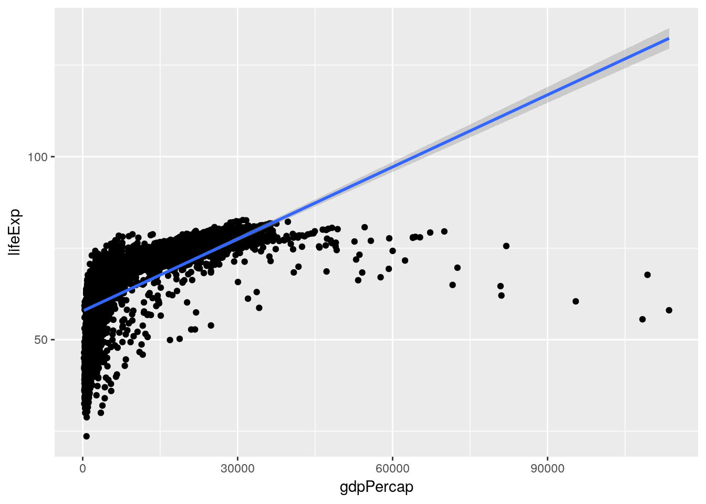
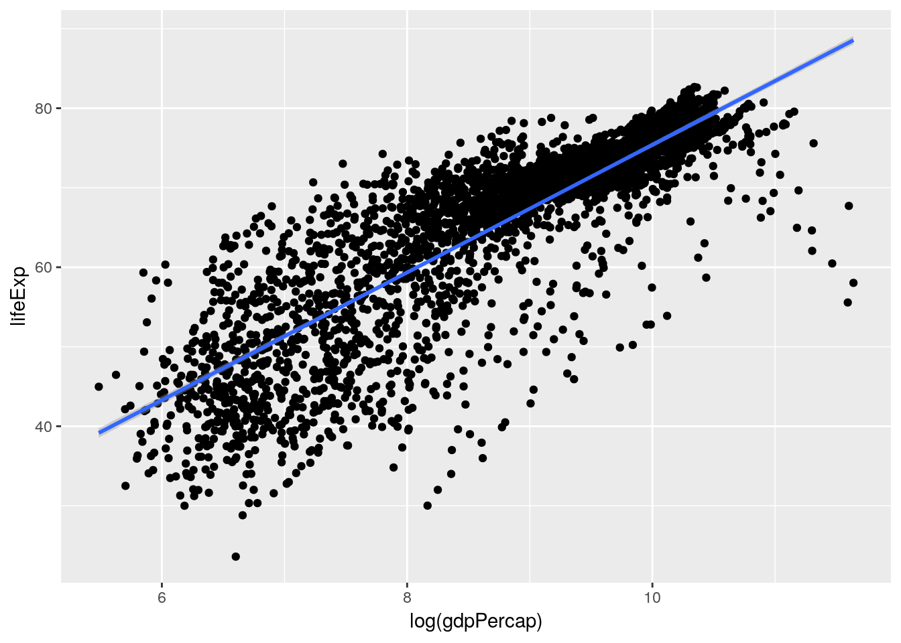
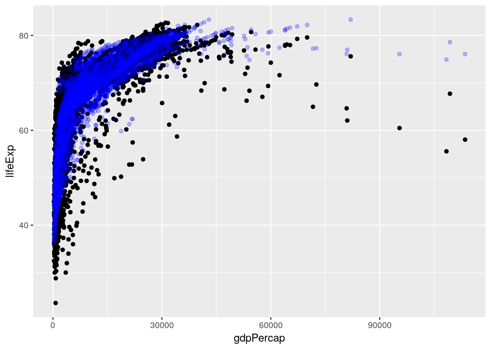
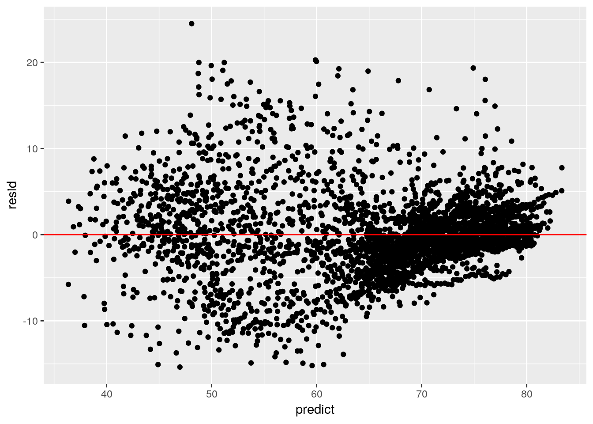
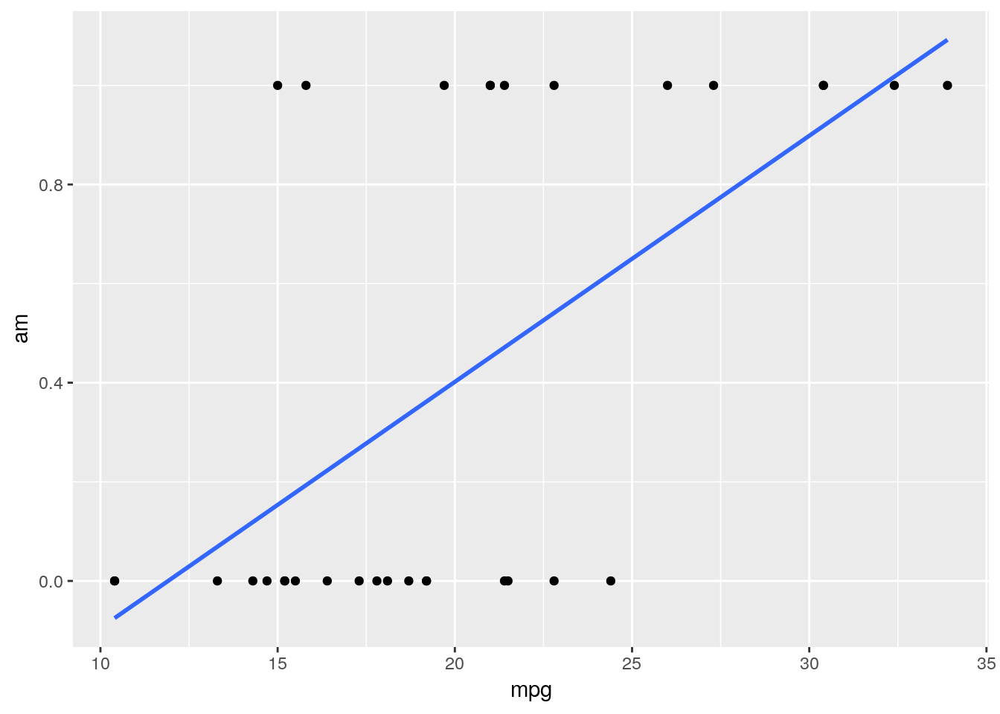
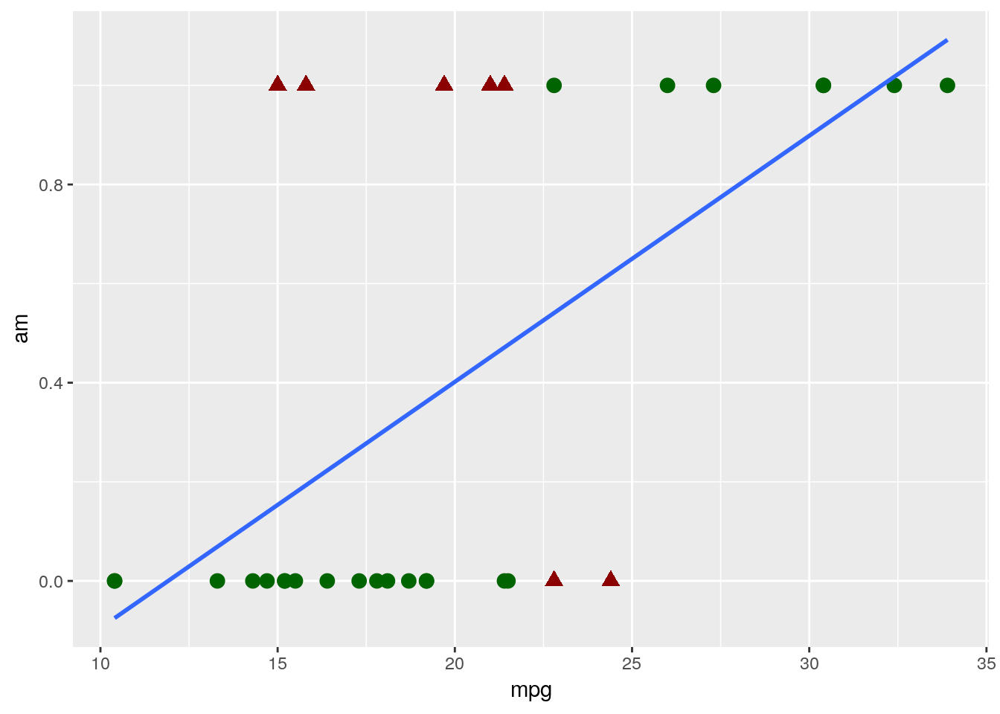
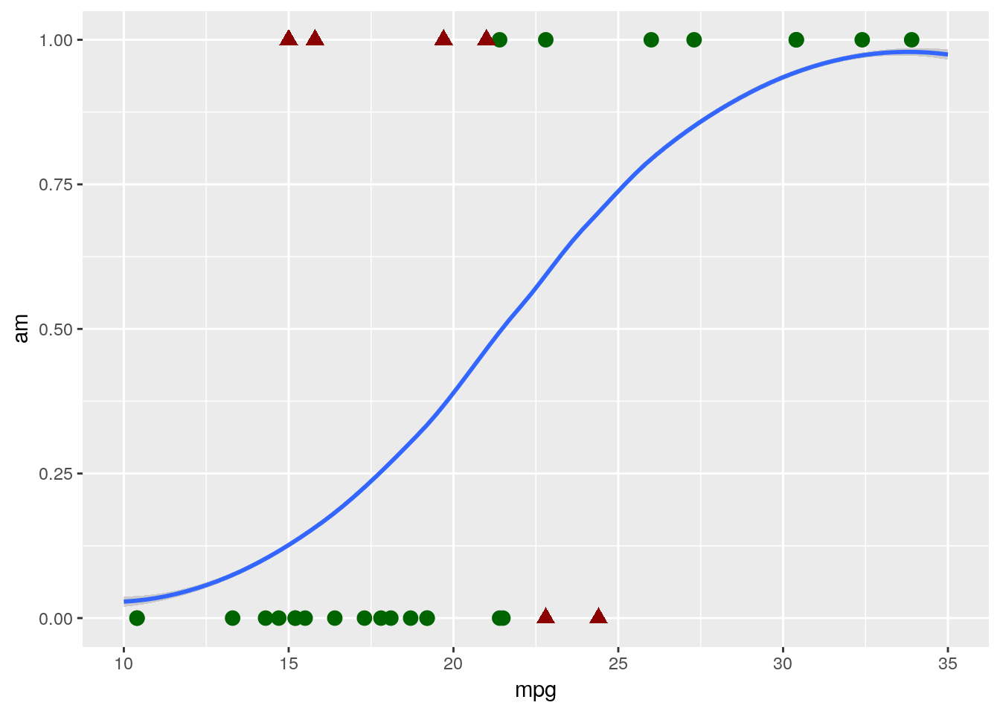

# Modeling Data

> "For such a model there is no need to ask the question “Is the model true?”. If “truth” is to be the “whole truth” the answer must be “No”. The only question of interest is “Is the model illuminating and useful?"
> <div align = "right" --- George Box </div>

## Why Model?
We've now learned how to wrangle our data and begin exploring it in R, which are both crucial steps of the process. However, when people think about data analytics, they're usually picturing a tool that will help them answer questions they have, providing information they can use to make decisions. The skills we've built so far will help you find questions in your data and begin exploring patterns, but this chapter will help you find answers.

And so comes the penultimate step in our data analysis framework, making a model. Models are summaries of relationships within our data, letting us see more clearly how changes in certain variables impact the others. We can then use that information to predict future outcomes, or to help us understand our dataset. 

Now, we'll be using our gapminder dataset throughout this chapter, which means there is one thing we can't do with our models - we can't use them to confirm a hypothesis. Hypothesis testing is much more prevalent in scientific fields than in business applications, and requires you to have started your analysis with a stated hypothesis and a plan of how you'll test it. We didn't do that - instead, we looked for how our variables interacted, and took the main pattern that we'll be analyzing - how life expectancy interacts with GDP - straight from our exploratory analysis. As such, we can't claim that our data *proves* anything, just that it shows our values are correlated.

Instead, our analysis is entirely *exploratory* - which isn't a bad thing! Often times, exploratory analysis is necessary to justify further confirmatory studies. I've always liked a quote from Brian McGill on the matter:

> If exploratory statistics weren’t treated like the crazy uncle nobody wants to talk about and everybody is embarrassed to admit being related to, science would be much better off. 
> <div align = "right"> --- [Brian McGill](https://dynamicecology.wordpress.com/2013/10/16/in-praise-of-exploratory-statistics/) </div>

But we're getting off topic now. Suffice it to say that we'll be building models that demonstrate how our variables are related, and using those models to generate predictions. The goal isn't to teach you much about how these models work "under the hood" - for that, I'd suggest looking at other resources, perhaps starting with [this paper](https://pdfs.semanticscholar.org/7a07/5776db74495a03ca38750513f331b80f687e.pdf). Instead, we'll go over how to build and use these models in R, with more of an emphasis on "how" than "why".

## Linear Models

Our first and simplest model is the linear model. Thinking back to last chapter, we made a graph that showed the relationship between GDP and life expectancy:

```r
library(gapminder)
library(tidyverse)
```

```
## Registered S3 methods overwritten by 'ggplot2':
##   method         from 
##   [.quosures     rlang
##   c.quosures     rlang
##   print.quosures rlang
```

```
## Registered S3 method overwritten by 'rvest':
##   method            from
##   read_xml.response xml2
```

```
## ── Attaching packages ─────────────────────────────────────── tidyverse 1.2.1 ──
```

```
## ✔ ggplot2 3.1.1       ✔ purrr   0.3.2  
## ✔ tibble  2.1.1       ✔ dplyr   0.8.0.1
## ✔ tidyr   0.8.3       ✔ stringr 1.4.0  
## ✔ readr   1.3.1       ✔ forcats 0.4.0
```

```
## ── Conflicts ────────────────────────────────────────── tidyverse_conflicts() ──
## ✖ dplyr::filter() masks stats::filter()
## ✖ dplyr::lag()    masks stats::lag()
```

```r
ggplot(gapminder_unfiltered, aes(gdpPercap, lifeExp)) +
  geom_point()
```


A linear model tries to summarize this relationship in a single straight line (sometimes known as a *line of best fit*), which in this case would look something like the following:


```r
ggplot(gapminder_unfiltered, aes(gdpPercap, lifeExp)) +
  geom_point() + 
  geom_smooth(method = "lm")
```



(You might remember `geom_smooth()` from chapter 2 - it adds a trendline to our graph. By specifying `method = "lm"`, we told it to graph the line we'd get from a *linear model*.)

This model claims that for every possible GDP level present in our dataset, there's a set life expectancy. Those values are the ones traced by the line - so countries with a GDP of 0 should expect life expectancies around 60, for instance.

This is a good moment to revisit the quote that opened this chapter, from legendary statistician George Box. His full quote has gotten a bit mangled over the years, to the point that most people know it more simply as:

> All models are wrong; some models are useful.

For instance, it's obvious that our linear model here is wrong for the great majority of countries - the richest countries in our dataset ought to be living well into their 130s, according to the line. However, it is useful to an extent - it shows us that our variables are positively correlated, and gives us an idea of how to move forward. It is not so useful, however, that we should spend too much time picking values out from along the line.

Of course, it would be much easier for us to just calculate the number from a formula, rather than finding the point on the graph! To see the actual model formula, we can use the `lm()` function. This function creates a linear model and requires two main arguments:

* A formula, of the format Y ~ X (Where Y is your response variable, X your predictor variables, and you read the "~" as "as a function of")
* A dataset

The usage looks like this:

```r
lm(lifeExp ~ gdpPercap, data = gapminder_unfiltered)
```

```
## 
## Call:
## lm(formula = lifeExp ~ gdpPercap, data = gapminder_unfiltered)
## 
## Coefficients:
## (Intercept)    gdpPercap  
##   5.782e+01    6.562e-04
```

So what we can tell here is that for every 1 increase in GDP, we can expect to see a 0.0006562 year increase in life expectancy. That's not particularly large - but then, a single dollar increase of GDP isn't very much, either! To understand our model better, we can call the `summary()` function on the model:


```r
summary(lm(lifeExp ~ gdpPercap, data = gapminder_unfiltered))
```

```
## 
## Call:
## lm(formula = lifeExp ~ gdpPercap, data = gapminder_unfiltered)
## 
## Residuals:
##     Min      1Q  Median      3Q     Max 
## -74.282  -3.902   3.282   6.161  16.003 
## 
## Coefficients:
##              Estimate Std. Error t value Pr(>|t|)    
## (Intercept) 5.782e+01  2.232e-01  258.97   <2e-16 ***
## gdpPercap   6.563e-04  1.392e-05   47.14   <2e-16 ***
## ---
## Signif. codes:  0 '***' 0.001 '**' 0.01 '*' 0.05 '.' 0.1 ' ' 1
## 
## Residual standard error: 9.108 on 3311 degrees of freedom
## Multiple R-squared:  0.4017,	Adjusted R-squared:  0.4015 
## F-statistic:  2223 on 1 and 3311 DF,  p-value: < 2.2e-16
```

Here we get a little more information on how well our model fits the data. We can see p-values for our overall model and for each variable (check out Chapter 14 for more information on these), as well as our model R^2^. The R^2^ value represents how much of the variance in your dataset can be explained by your model - basically, how good a fit your model is to the data. Generally, we use the adjusted R^2^, which compensates for how many variables you're using in your model - otherwise, adding another variable *always* increases your multiple R^2^. 

But you might recall that we saw a much more normal linear relationship between our variables when we log-transformed GDP:

```r
ggplot(gapminder_unfiltered, aes(log(gdpPercap), lifeExp)) +
  geom_point() + 
  geom_smooth(method = "lm")
```



So that would make me guess that our model would also be improved by log-transforming the GDP term in our model - just look at how much better that line fits on the second graph. Let's try it now:


```r
summary(lm(lifeExp ~ log(gdpPercap), data = gapminder_unfiltered))
```

```
## 
## Call:
## lm(formula = lifeExp ~ log(gdpPercap), data = gapminder_unfiltered)
## 
## Residuals:
##     Min      1Q  Median      3Q     Max 
## -32.622  -2.154   0.826   3.380  17.884 
## 
## Coefficients:
##                Estimate Std. Error t value Pr(>|t|)    
## (Intercept)    -4.87455    0.77505  -6.289 3.61e-10 ***
## log(gdpPercap)  8.02711    0.08785  91.374  < 2e-16 ***
## ---
## Signif. codes:  0 '***' 0.001 '**' 0.01 '*' 0.05 '.' 0.1 ' ' 1
## 
## Residual standard error: 6.274 on 3311 degrees of freedom
## Multiple R-squared:  0.716,	Adjusted R-squared:  0.716 
## F-statistic:  8349 on 1 and 3311 DF,  p-value: < 2.2e-16
```

Note that I didn't print out the model statement this time - `summary()` provides us all the information `lm()` does, so we can just call it instead.

We can see that our R^2^ value shot up - we're now at 0.716, instead of 0.402! So log-transforming our data seems to help our model fit the data better. 

We also, last chapter, realized that the continent a country was on and the year of an observation were probably relevant to the analysis. We can add those to our model using `+`:


```r
summary(lm(lifeExp ~ log(gdpPercap) + continent + year, data = gapminder_unfiltered))
```

```
## 
## Call:
## lm(formula = lifeExp ~ log(gdpPercap) + continent + year, data = gapminder_unfiltered)
## 
## Residuals:
##      Min       1Q   Median       3Q      Max 
## -24.3094  -2.2425   0.2411   2.7085  15.4838 
## 
## Coefficients:
##                     Estimate Std. Error t value Pr(>|t|)    
## (Intercept)       -3.144e+02  1.085e+01  -28.97   <2e-16 ***
## log(gdpPercap)     5.015e+00  1.040e-01   48.21   <2e-16 ***
## continentAmericas  9.459e+00  3.521e-01   26.86   <2e-16 ***
## continentAsia      8.084e+00  3.078e-01   26.26   <2e-16 ***
## continentEurope    1.227e+01  3.393e-01   36.15   <2e-16 ***
## continentFSU       9.903e+00  4.943e-01   20.04   <2e-16 ***
## continentOceania   1.040e+01  4.645e-01   22.39   <2e-16 ***
## year               1.653e-01  5.611e-03   29.46   <2e-16 ***
## ---
## Signif. codes:  0 '***' 0.001 '**' 0.01 '*' 0.05 '.' 0.1 ' ' 1
## 
## Residual standard error: 5.029 on 3305 degrees of freedom
## Multiple R-squared:  0.8179,	Adjusted R-squared:  0.8175 
## F-statistic:  2120 on 7 and 3305 DF,  p-value: < 2.2e-16
```

This also got our R^2^ up, all the way to 0.818! However, you might notice that our summary output is getting much longer - we now have a row for each of the continents in our dataset (minus Africa, for reasons that are outside of this text - the short explanation is that Africa is what all other continents are being compared to; so being in Europe gives you, on average, 12.27 more years of life than being in Africa, for instance). If we wanted a bit more legible output, we could instead use an ANOVA test - which deals with categorical variables (like continent) as a single unit, rather than as each of the possible levels:  


```r
anova(aov(lifeExp ~ log(gdpPercap) + continent + year, data = gapminder_unfiltered))
```

```
## Analysis of Variance Table
## 
## Response: lifeExp
##                  Df Sum Sq Mean Sq  F value    Pr(>F)    
## log(gdpPercap)    1 328670  328670 12994.28 < 2.2e-16 ***
## continent         5  24795    4959   196.06 < 2.2e-16 ***
## year              1  21950   21950   867.82 < 2.2e-16 ***
## Residuals      3305  83595      25                       
## ---
## Signif. codes:  0 '***' 0.001 '**' 0.01 '*' 0.05 '.' 0.1 ' ' 1
```

However, ANOVA isn't particularly useful for most purposes, as it just reports *if* a variable has an impact on your response, rather than *how* it does so (more on that [here](https://dynamicecology.wordpress.com/2012/11/27/ecologists-need-to-do-a-better-job-of-prediction-part-i-the-insidious-evils-of-anova/) or [here](https://dynamicecology.wordpress.com/2014/10/02/interpreting-anova-interactions-and-model-selection/)), so we won't go into depth with it. Suffice it to say that ANOVA is a special type of linear regression, sometimes used in science, that isn't particularly useful for most other applications.

Anyway. The last thing I want to mention is that the model assumes each predictor variable is independent from each other, and they don't vary with one another. However, we can be pretty sure that isn't true for GDP and continent - we can generally assume that most countries in Oceania have a higher GDP per capita than most countries in Africa, for instance. As such, we should include an *interaction* term between those two variables - which we can do by replacing the `+` between those terms in our model statement with `*`.


```r
summary(lm(lifeExp ~ log(gdpPercap) * continent + year, data = gapminder_unfiltered))
```

```
## 
## Call:
## lm(formula = lifeExp ~ log(gdpPercap) * continent + year, data = gapminder_unfiltered)
## 
## Residuals:
##      Min       1Q   Median       3Q      Max 
## -24.4999  -2.1933   0.4236   2.3497  15.3682 
## 
## Coefficients:
##                                    Estimate Std. Error t value Pr(>|t|)
## (Intercept)                      -3.441e+02  1.124e+01 -30.604  < 2e-16
## log(gdpPercap)                    5.013e+00  2.285e-01  21.942  < 2e-16
## continentAmericas                -4.510e+00  2.922e+00  -1.543   0.1228
## continentAsia                     5.749e+00  2.065e+00   2.784   0.0054
## continentEurope                   3.166e+01  2.663e+00  11.887  < 2e-16
## continentFSU                      5.070e+01  7.517e+00   6.745 1.80e-11
## continentOceania                 -1.465e+00  3.941e+00  -0.372   0.7100
## year                              1.803e-01  5.694e-03  31.661  < 2e-16
## log(gdpPercap):continentAmericas  1.563e+00  3.514e-01   4.447 8.99e-06
## log(gdpPercap):continentAsia      2.812e-01  2.705e-01   1.040   0.2985
## log(gdpPercap):continentEurope   -2.037e+00  3.142e-01  -6.481 1.05e-10
## log(gdpPercap):continentFSU      -4.663e+00  8.633e-01  -5.402 7.07e-08
## log(gdpPercap):continentOceania   1.283e+00  4.477e-01   2.865   0.0042
##                                     
## (Intercept)                      ***
## log(gdpPercap)                   ***
## continentAmericas                   
## continentAsia                    ** 
## continentEurope                  ***
## continentFSU                     ***
## continentOceania                    
## year                             ***
## log(gdpPercap):continentAmericas ***
## log(gdpPercap):continentAsia        
## log(gdpPercap):continentEurope   ***
## log(gdpPercap):continentFSU      ***
## log(gdpPercap):continentOceania  ** 
## ---
## Signif. codes:  0 '***' 0.001 '**' 0.01 '*' 0.05 '.' 0.1 ' ' 1
## 
## Residual standard error: 4.908 on 3300 degrees of freedom
## Multiple R-squared:  0.8268,	Adjusted R-squared:  0.8262 
## F-statistic:  1313 on 12 and 3300 DF,  p-value: < 2.2e-16
```

And as we can see, our adjusted R^2^ has gone up even further, to 0.826! 

Note, by the way, that you can also add interaction terms very explicitly to your model by adding the interaction term (written as `Term1:Term2`) to the formula with `+`. In our case, that would look like this:


```r
summary(lm(lifeExp ~ log(gdpPercap) + continent + year + (log(gdpPercap)):continent, data = gapminder_unfiltered))
```

That line of code would give us the same output as using `*` above.

## Model Predictions
We can now use our model to generate predictions! To do so, we first want to assign our model to an object, to make our code a little easier to understand:

```r
gapMod <- lm(lifeExp ~ log(gdpPercap) + continent + year + (log(gdpPercap)):continent, data = gapminder_unfiltered)
```

We'll now clone our dataset into a new dataframe, which is also where we're going to store predictions. We could skip this step and just add the columns to the gapminder dataset, but I don't like changing our base dataframe, just in case something goes wrong - I usually prefer to edit copied dataframes. 

```r
gapPred <- gapminder_unfiltered
```

We're now ready to make our predictions, which we'll store in a column called "predict". We can use the `predict()` function to do this, which (with linear models) requires two arguements: first, what model you're using to make your predictions, and second, what data you're using to make these predictions. The code to do this looks something like this:

```r
gapPred <- gapPred %>%
  mutate(predict = predict(gapMod, newdata = gapPred))
```
(This, by the way, is also how you'd use your models to generate forecasts, when you don't actually know the true value you're predicting. We're working with complete datasets in this unit to demonstrate how to assess the results of your predictions, but there's no real difference between this application and the forecasting techniques professionals use these sorts of models for.)

We can preview our predictions by peaking at the dataframe - remember, we're comparing the `lifeExp` and `predict` columns:

```r
head(gapPred)
```

```
## # A tibble: 6 x 7
##   country     continent  year lifeExp      pop gdpPercap predict
##   <fct>       <fct>     <int>   <dbl>    <int>     <dbl>   <dbl>
## 1 Afghanistan Asia       1952    28.8  8425333      779.    48.8
## 2 Afghanistan Asia       1957    30.3  9240934      821.    50.0
## 3 Afghanistan Asia       1962    32.0 10267083      853.    51.1
## 4 Afghanistan Asia       1967    34.0 11537966      836.    51.9
## 5 Afghanistan Asia       1972    36.1 13079460      740.    52.1
## 6 Afghanistan Asia       1977    38.4 14880372      786.    53.3
```

That doesn't give me a ton of confidence - but remember, we're only looking at 6 out of more than 3,300 predictions! We could attempt plotting the predictions over the real values:

```r
ggplot(gapPred, aes(gdpPercap)) + 
  geom_point(aes(y = lifeExp)) + 
  geom_point(aes(y = predict), color = "blue", alpha = 0.25)
```


(Remember, `alpha = 0.25` made the blue points 75% transparent - or, well, 25% opaque.)

But while I can tell that our predictions seem to generally fit the right pattern, I have no way of telling how well any individual prediction performed - it's possible all our highest points represent the lowest values, for instance. A better way is to calculate the *residuals* for your model by subtracting the real values (our life expectancy) from the predictions. This number shows how good any given prediction is, and is actually what R^2^ is based on - a higher R^2^ means a model has generally lower residuals. We'll then plot those residuals against our predictions, to see how well we did:


```r
gapPred %>%
  mutate(resid = predict-lifeExp) %>%
  ggplot(aes(predict, resid)) + 
  geom_point() + 
  annotate("segment", x = -Inf, xend = Inf, y = 0, yend = 0, color = "red")
```


(See what I did there, by using `ggplot()` with the pipe? Note that you still have to use `+` to add things to your plots.)

So it looks like our model does an *okay* job predicting life expectancy - most of the predictions are within five years, though some are pretty dramatically off. The plot also exhibits heteroscedasticity and nonlinearity, neither of which I'm going to get into here - check out [this post](http://docs.statwing.com/interpreting-residual-plots-to-improve-your-regression/) for more information. The short version is that we could certainly improve our model, by getting into a little more advanced statistics - but the model we've built does an okay job, and could probably be used to generate predictions. 

(By the way, you can get a very quick version of this plot - alongside a few other useful model plots - using `plot(YourModel)` - so in this case, `plot(gapMod)`).

## Classification

These linear models we've been building have been good for predicting numeric values - the number of years a person might live, or (in other situations) how many customers will click a link or how many frogs will be in a pond. That's because we've been building *regression* models, which are useful for these sorts of tasks. However, we often want to predict events or categories, not just a numeric value - we want to know what species a flower might be, whether or not someone will click a link we email them, or if a tree will die this year. 

For these tasks, we need to use a *classification* model. To walk through how these work, let's start using a new dataset included in base R - `mtcars`:


```r
head(mtcars)
```

```
##                    mpg cyl disp  hp drat    wt  qsec vs am gear carb
## Mazda RX4         21.0   6  160 110 3.90 2.620 16.46  0  1    4    4
## Mazda RX4 Wag     21.0   6  160 110 3.90 2.875 17.02  0  1    4    4
## Datsun 710        22.8   4  108  93 3.85 2.320 18.61  1  1    4    1
## Hornet 4 Drive    21.4   6  258 110 3.08 3.215 19.44  1  0    3    1
## Hornet Sportabout 18.7   8  360 175 3.15 3.440 17.02  0  0    3    2
## Valiant           18.1   6  225 105 2.76 3.460 20.22  1  0    3    1
```

To understand what each of these column abbreviations mean, try typing `?mtcars` into the console. What we want to do is predict if cars have either automatic or manual transmissions, which is coded in the `am` column - 0 means a car is an automatic, while 1 represents a manual - based on the MPG and horsepower of the car. If we went through the same steps as we did for the linear model, we'd then go ahead and make a quick graph to see how well a linear model fits our data:


```r
ggplot(mtcars, aes(mpg, am)) + 
  geom_point() + 
  geom_smooth(method = "lm", se = F)
```



Judging based on our past models, this doesn't look great! Our model isn't particularly close to any points.

That's a natural occurance when trying to classify data, however. Our model isn't actually showing us what value a point has - instead, it's showing us the *probability* that a data point belongs to the 1 group (in this example, if a car has a manual transmission). You can then decide how certain you want to be before assigning the data point to that 1 group - usually, if the model gives a 50% or more probability to being a 1, we assign it to that group. We can visualize what the results of this process would look like for our dataset with our very simple model only using MPG - the red triangles are misclassified, while the green circles were accurately guessed by the model:


So our model got it about 78% right - not bad, for a single variable model! This is a fully acceptable use of a linear model for classification - it's simple and mostly does the job. If you've ever worked with economics research, you've probably seen linear models used this way before.

## Logistic Models
However, there are a few statistics-based reasons that we don't want to use that simple straight line for classification problems. If your data has heavy tails - that is, if there are points that are going to have something like 5% or 95% chances of belonging in the 1 group, the linear formula begins to break down somewhat. It also performs badly when your predictors are, well, non-linear - that is, when both high and low values of a predictor make being a 0 more likely, with middle values tending to be 1s. 

Instead, we want to use a logistic model, which will give us a line that looks more like this:


```
## `geom_smooth()` using method = 'loess' and formula 'y ~ x'
```



That curvy line works exactly the same way our linear model did - points with higher than 50% probability of being "1"s are assigned a 1, and so on. And you can see that it classified our data slightly better, hitting 81% accuracy with exactly the same model formula as the linear had. 

Not everyone is in agreement here - for instance, [here](https://statisticalhorizons.com/linear-vs-logistic) is a professor arguing that the simplicity of linear models make them the best choice for the majority of data sets. However, I think the two models are in practice as easy to implement and understand, and the logistic model is usually a better classifier. As such, I usually rely on logistic models to classify my datasets.

Making these models is a pretty similar process to making linear models. We'll use the `glm()` function, rather than `lm()`, as the logistic model is one of the family of algorithms known as a *generalized linear model*. We'll still need to supply the formula and data arguments, just like with `lm()`. The main difference with `glm()` is that we also need to specify the argument `family`. In this case, we want to specify that `family = binomial`, which will calculate the logistic model for us.

With all that in mind, we can build our model with the following line of code:

```r
glm(am ~ mpg, data = mtcars, family = binomial)
```

```
## 
## Call:  glm(formula = am ~ mpg, family = binomial, data = mtcars)
## 
## Coefficients:
## (Intercept)          mpg  
##      -6.604        0.307  
## 
## Degrees of Freedom: 31 Total (i.e. Null);  30 Residual
## Null Deviance:	    43.23 
## Residual Deviance: 29.68 	AIC: 33.68
```

And we can see the model summary just like we did with `lm()`:

```r
logmod <- glm(am ~ mpg, data = mtcars, family = binomial)
summary(logmod)
```

```
## 
## Call:
## glm(formula = am ~ mpg, family = binomial, data = mtcars)
## 
## Deviance Residuals: 
##     Min       1Q   Median       3Q      Max  
## -1.5701  -0.7531  -0.4245   0.5866   2.0617  
## 
## Coefficients:
##             Estimate Std. Error z value Pr(>|z|)   
## (Intercept)  -6.6035     2.3514  -2.808  0.00498 **
## mpg           0.3070     0.1148   2.673  0.00751 **
## ---
## Signif. codes:  0 '***' 0.001 '**' 0.01 '*' 0.05 '.' 0.1 ' ' 1
## 
## (Dispersion parameter for binomial family taken to be 1)
## 
##     Null deviance: 43.230  on 31  degrees of freedom
## Residual deviance: 29.675  on 30  degrees of freedom
## AIC: 33.675
## 
## Number of Fisher Scoring iterations: 5
```

(Go ahead and save the model in `logmod`, like I just did - we'll use that in a second).

We could go ahead and drill down our model even further, adding other variables and changing the formula just like we did with linear models earlier:

```r
summary(glm(am ~ hp + wt, data = mtcars, family="binomial"))
```

```
## 
## Call:
## glm(formula = am ~ hp + wt, family = "binomial", data = mtcars)
## 
## Deviance Residuals: 
##     Min       1Q   Median       3Q      Max  
## -2.2537  -0.1568  -0.0168   0.1543   1.3449  
## 
## Coefficients:
##             Estimate Std. Error z value Pr(>|z|)   
## (Intercept) 18.86630    7.44356   2.535  0.01126 * 
## hp           0.03626    0.01773   2.044  0.04091 * 
## wt          -8.08348    3.06868  -2.634  0.00843 **
## ---
## Signif. codes:  0 '***' 0.001 '**' 0.01 '*' 0.05 '.' 0.1 ' ' 1
## 
## (Dispersion parameter for binomial family taken to be 1)
## 
##     Null deviance: 43.230  on 31  degrees of freedom
## Residual deviance: 10.059  on 29  degrees of freedom
## AIC: 16.059
## 
## Number of Fisher Scoring iterations: 8
```

In fact, logistic models made with the `glm()` function work pretty much the same as linear models made with `lm()`. There are only two big differences that I want to highlight, as far as use cases are concerned.

The first of these is when using the model to make predictions. For instance, let's take that model I just made above and assign it to `mtmod`:

```r
mtmod <- glm(am ~ hp + wt, data = mtcars, family="binomial")
```

Remember earlier, how we could generate predictions from our models using `predict(model, data)`? Let's look at what happens if we did something similar here:

```r
head(predict(mtmod, mtcars))
```

```
##         Mazda RX4     Mazda RX4 Wag        Datsun 710    Hornet 4 Drive 
##         1.6757093        -0.3855769         3.4844067        -3.1339584 
## Hornet Sportabout           Valiant 
##        -2.5961266        -5.2956878
```

That doesn't look right at all! By this interpretation, the Valiant has a -530% chance of having a manual transmission - a number which shouldn't be possible, as probabilities don't go below 0.

The explanation for why this happens, but it boils down to R trying to use our model to make predictions like it's a linear model, not a logistic one. To fix this, we just have to specify `type = "response"` in our `predict()` call:

```r
head(predict(mtmod, mtcars, type = "response"))
```

```
##         Mazda RX4     Mazda RX4 Wag        Datsun 710    Hornet 4 Drive 
##       0.842335537       0.404782533       0.970240822       0.041728035 
## Hornet Sportabout           Valiant 
##       0.069388122       0.004988159
```

And voila, we generate probabilities. 

## Evaluating and Comparing Models
The second thing you might have noticed in our logistic models section is that I didn't mention R^2^ even once. That's because R^2^ doesn't really work for logistic models - we don't really have a good equivalent of a "residual" to use to calculate it from. 

If we're deadset on comparing our models using R^2^, we can choose from one of several pseudo-R^2^ provided by the `pR2` function from the `pscl` package:

```
install.packages("pscl")
```

```r
pscl::pR2(mtmod)
```

```
##         llh     llhNull          G2    McFadden        r2ML        r2CU 
##  -5.0295552 -21.6148666  33.1706228   0.7673104   0.6453351   0.8708970
```

If you're going to do this, I reccomend using the McFadden R^2^, or the r^2^CU (which stands for Cragg and Uhler, by the way). However, whichever pseudo-R^2^ you use, make sure you stay consistent - the different pseudo-R^2^ cannot be compared to one another. None of these can be compared to the R^2^ you'll get off a linear model, either - they're a completely different metric.

These pseudo-R^2^ aren't quite the most common method used to compare models, however. Much more commonly used is the Akaike Information Criterion, also called AIC. You may have noticed that AIC prints at the bottom of the `summary()` printouts for logistic models:


```r
summary(logmod)
```

```
## 
## Call:
## glm(formula = am ~ mpg, family = binomial, data = mtcars)
## 
## Deviance Residuals: 
##     Min       1Q   Median       3Q      Max  
## -1.5701  -0.7531  -0.4245   0.5866   2.0617  
## 
## Coefficients:
##             Estimate Std. Error z value Pr(>|z|)   
## (Intercept)  -6.6035     2.3514  -2.808  0.00498 **
## mpg           0.3070     0.1148   2.673  0.00751 **
## ---
## Signif. codes:  0 '***' 0.001 '**' 0.01 '*' 0.05 '.' 0.1 ' ' 1
## 
## (Dispersion parameter for binomial family taken to be 1)
## 
##     Null deviance: 43.230  on 31  degrees of freedom
## Residual deviance: 29.675  on 30  degrees of freedom
## AIC: 33.675
## 
## Number of Fisher Scoring iterations: 5
```

And if we want, we can get just the AIC by selecting it with `$`:

```r
summary(mtmod)$aic
```

```
## [1] 16.05911
```

It's important to understand what exactly AIC can be used for, as it's frequently misapplied in both academia and industry. AIC can be used effectively in three ways:

* **Model selection**, where you compare _every combination of scientifically justifiable variables possible_ OR
* **Variable analysis** where you either compare your response variable against each predictor variable _independently_ OR
* **Variable analysis** where you standardize your predictor variables, put them into a model, and compare their coefficients

For all of these, AIC can only be used to compare models of the same type (so logistic to logistic is fine, logistic to linear isn't), created on the same datasets, created using the same function. Otherwise, your comparisons will be meaningless and misleading - not adjectives you want associated with your work!

When comparing models, keep in mind that AIC is an (almost) arbitrary number that gets larger as your dataset gets larger - what's important is not how large an AIC is overall, but how much larger (or smaller) it is than the AIC of your other models. That difference in AIC values is also known as $\Delta$AIC. Your best model is going to be the one with the lowest AIC value - to compare models, subtract the smaller AIC value from the larger and then reference the chart below:


```r
library(knitr)
library(kableExtra)
```

```
## 
## Attaching package: 'kableExtra'
```

```
## The following object is masked from 'package:dplyr':
## 
##     group_rows
```

```r
tibble("If the difference in AIC is:" = c("0-2", "2-4", "4+"),
       "The model with lowest AIC is:" = c("Identical to the other one", "Maybe better", "Definitely better")) %>%
  kable() %>%
  kable_styling("striped")
```

<table class="table table-striped" style="margin-left: auto; margin-right: auto;">
 <thead>
  <tr>
   <th style="text-align:left;"> If the difference in AIC is: </th>
   <th style="text-align:left;"> The model with lowest AIC is: </th>
  </tr>
 </thead>
<tbody>
  <tr>
   <td style="text-align:left;"> 0-2 </td>
   <td style="text-align:left;"> Identical to the other one </td>
  </tr>
  <tr>
   <td style="text-align:left;"> 2-4 </td>
   <td style="text-align:left;"> Maybe better </td>
  </tr>
  <tr>
   <td style="text-align:left;"> 4+ </td>
   <td style="text-align:left;"> Definitely better </td>
  </tr>
</tbody>
</table>

For our example here, we can just quickly subtract the AIC values for both of our models:

```r
summary(logmod)$aic - summary(mtmod)$aic
```

```
## [1] 17.61606
```

As the $\Delta$AIC between these models is 17.6, we can very confidently say that our `mtmod` object is the better of these two models.

### Confusion Matrices

However, as I mentioned earlier, AIC can't really be used to compare models created by different functions. That can be a challenge when we want to compare, for instance, a linear and logistic classifier. Luckily enough, there are other ways we can go about solving this issue.

Let's go ahead and create a linear version of our `mtmod` function, to start off with:

```r
linmod <- lm(am ~ hp + wt, data = mtcars)
```

We'll now make a clone of `mtcars` called `mtcarspred`, and create two columns for our predictions - `lin` for the linear model, and `log` for the logistic. Note that for both of these I'm wrapping the `predict()` function in `round(, 0)` - this will automatically change the probabilities we're getting from `predict()` into our 0/1 classification system.

```r
mtcarspred <- mtcars
mtcarspred$lin <- round(predict(linmod, mtcarspred), 0)
mtcarspred$log <- round(predict(mtmod, mtcarspred, type = "response"), 0)
```

We're now going to make what's known as a *confusion matrix* for each of these predictions. This matrix will show us exactly how our model predictions differ from one another, and let us get a good sense of how accurate each model is. To make it, first we have to install the `caret` package:

```
install.packages("caret")
```

And now we can use the `confusionMatrix()` function to create our matrices. To do this, we pass the function factored versions of our prediction and true value columns - in that order, or else we'll mess up a few of the calculations.

```r
caret::confusionMatrix(factor(mtcarspred$lin), factor(mtcarspred$am))
```

```
## Confusion Matrix and Statistics
## 
##           Reference
## Prediction  0  1
##          0 17  1
##          1  2 12
##                                           
##                Accuracy : 0.9062          
##                  95% CI : (0.7498, 0.9802)
##     No Information Rate : 0.5938          
##     P-Value [Acc > NIR] : 0.000105        
##                                           
##                   Kappa : 0.808           
##                                           
##  Mcnemar's Test P-Value : 1.000000        
##                                           
##             Sensitivity : 0.8947          
##             Specificity : 0.9231          
##          Pos Pred Value : 0.9444          
##          Neg Pred Value : 0.8571          
##              Prevalence : 0.5938          
##          Detection Rate : 0.5312          
##    Detection Prevalence : 0.5625          
##       Balanced Accuracy : 0.9089          
##                                           
##        'Positive' Class : 0               
## 
```


```r
caret::confusionMatrix(factor(mtcarspred$log), factor(mtcarspred$am))
```

```
## Confusion Matrix and Statistics
## 
##           Reference
## Prediction  0  1
##          0 18  1
##          1  1 12
##                                           
##                Accuracy : 0.9375          
##                  95% CI : (0.7919, 0.9923)
##     No Information Rate : 0.5938          
##     P-Value [Acc > NIR] : 1.452e-05       
##                                           
##                   Kappa : 0.8704          
##                                           
##  Mcnemar's Test P-Value : 1               
##                                           
##             Sensitivity : 0.9474          
##             Specificity : 0.9231          
##          Pos Pred Value : 0.9474          
##          Neg Pred Value : 0.9231          
##              Prevalence : 0.5938          
##          Detection Rate : 0.5625          
##    Detection Prevalence : 0.5938          
##       Balanced Accuracy : 0.9352          
##                                           
##        'Positive' Class : 0               
## 
```

As we can see, that function gives us a lot to work with. One of the most interesting to us is the matrix up top, which compares your predicted values to the actual ones. This, in combination with the Accuracy metric right below it, give us a sense for how our model performs, and exactly what it messes up on. There may be cases where you choose your model based more on this matrix than the actual accuracy - for instance, if a healthcare diagnostic model is slightly less accurate but generates fewer false negatives, erring on the side of caution might actually help save people's lives. 

For our example, however, it's enough to just look at the accuracy metric. And once again, our logistic model outperforms the linear formula - a result that becomes even more common once you're working with larger and larger datasets. 

## Conclusion
We've now covered the two most common forms of models, and seen applications of modeling for both regression and classification. We've gone over how to select your best model, and how to use that best model to predict both values already in your dataset and values you don't know yet. But even still, we've barely even scratched the surface of modeling - this is the sort of thing people get very expensive degrees in. Hopefully this chapter has helped you learn a bit more about models, and how to make them in R. Our next chapter returns to working with ggplot2 and similar packages, in order to help you share all your hard work - after all, what's the point of an analysis no one else sees?

## Exercises

1. What is the difference between regression and classification? What model types are better suited for each?
2. Find the best model formula for predicting `am` in the `mtcars` dataset. Use AIC to compare models, and feel free to transform the data.
