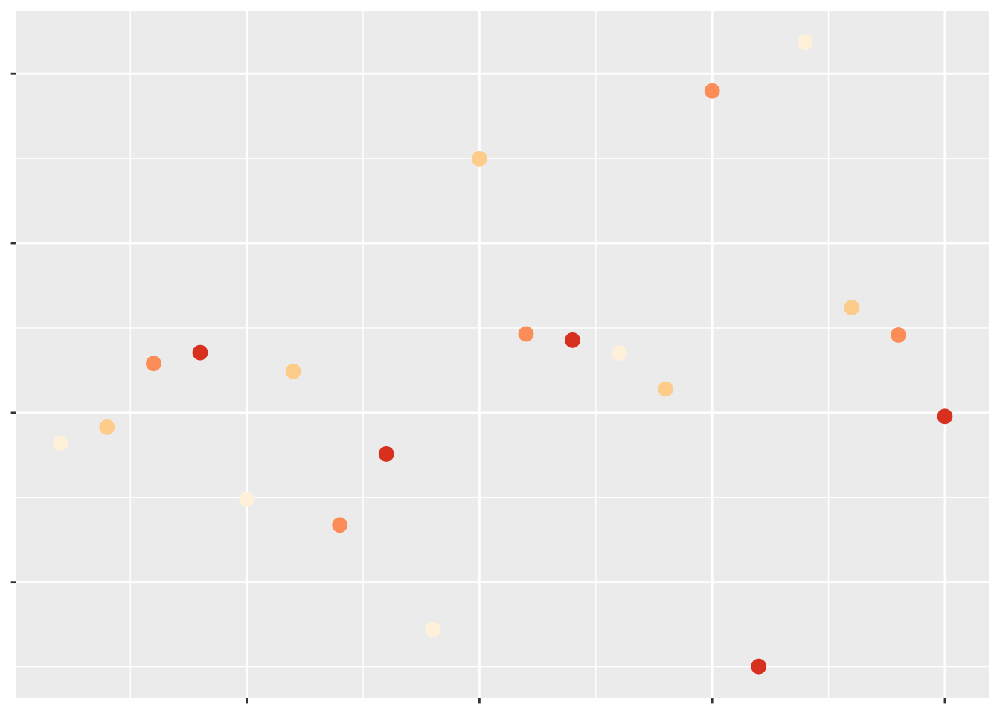
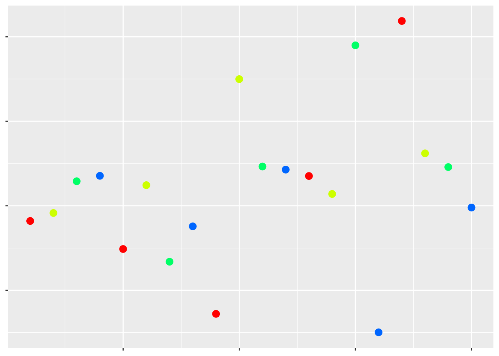
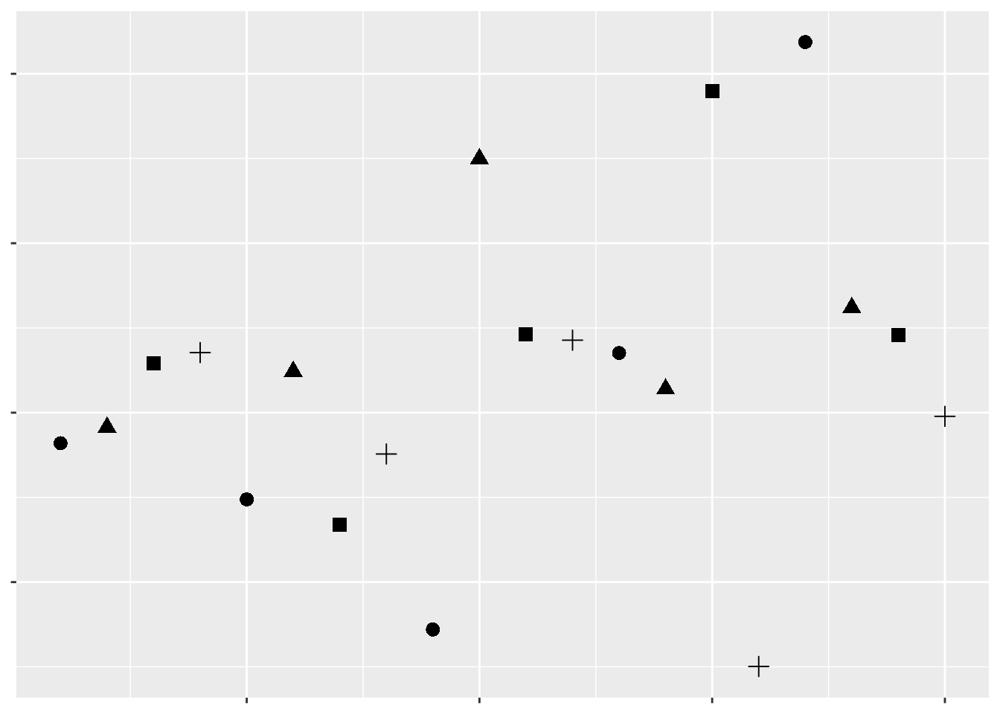
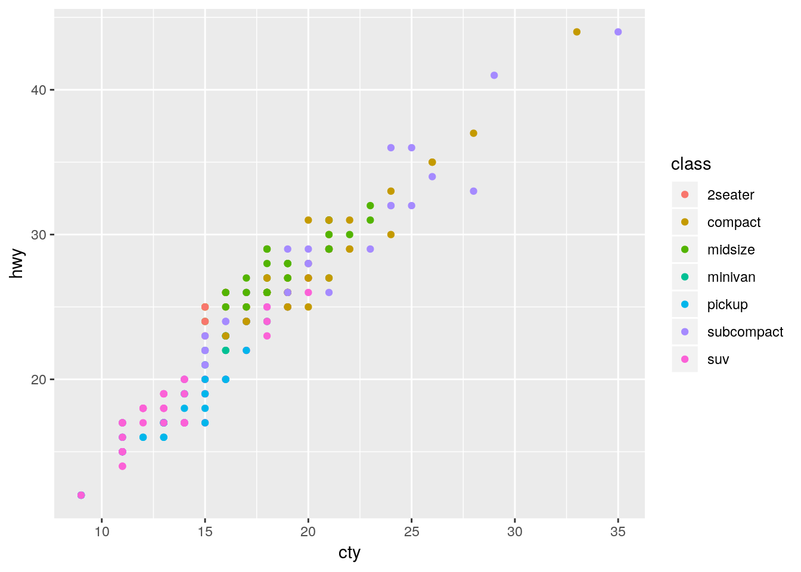
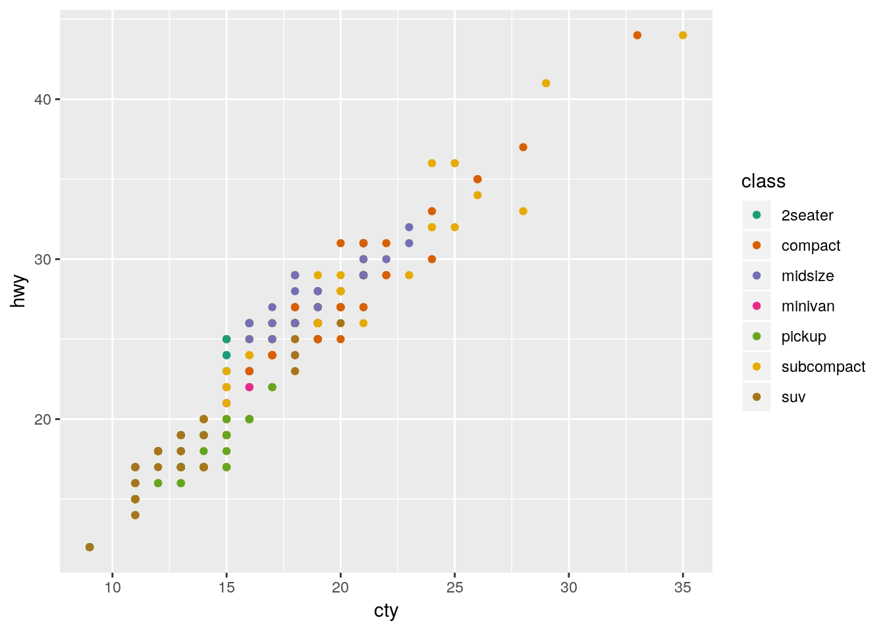
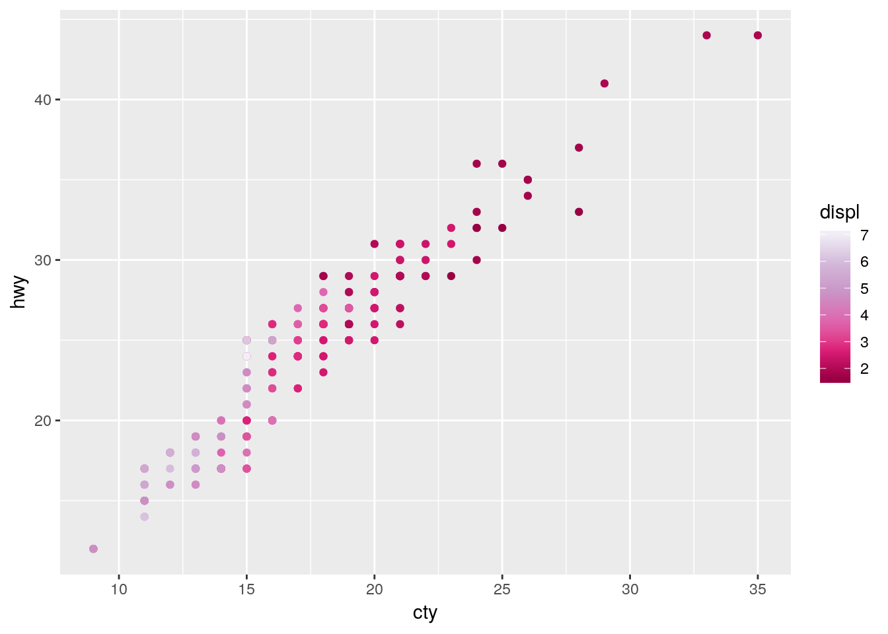

# Achieving Graphical Excellence
## Introduction
This unit is primarily designed to get you thinking about what exactly is possible with graphs made in R. We aren't going to cover every possible tweak you can make to a graphic, since that's almost impossible. We won't showcase every extension and theme you could make use of, because that's probably truly impossible. But by expanding our understanding about what exactly is possible with these graphics, we can begin to understand how to make the best visualizations with our own data possible. This unit is a bit easier and a bit less involved than the past few - don't worry, we'll be back to the hard stuff come unit 9.

So far, we've used graphs repeatedly to help communicate and understand our data. While the fast graphics we've been using are more than sufficient for our own analyses, making graphics for publication or presentation requires a little more finesse. That's where this unit comes in - we'll be briefly touching on many of the options you have control over to make your graphics look exactly as you want them to. Before we get started, let's load the tidyverse:


```r
library(tidyverse)
```

```
## ── Attaching packages ──────────────────────────────────────────────────────────────────────────────────────── tidyverse 1.2.1 ──
```

```
## ✔ ggplot2 3.1.0     ✔ purrr   0.2.5
## ✔ tibble  1.4.2     ✔ dplyr   0.7.8
## ✔ tidyr   0.8.2     ✔ stringr 1.3.1
## ✔ readr   1.1.1     ✔ forcats 0.3.0
```

```
## ── Conflicts ─────────────────────────────────────────────────────────────────────────────────────────── tidyverse_conflicts() ──
## ✖ dplyr::filter() masks stats::filter()
## ✖ dplyr::lag()    masks stats::lag()
```


## Getting Started
Look at this scatterplot:


Hopefully we can already tell that this isn't a great graph. The complete lack of text means we have no idea what data are being visualized, or what the takeaway message is supposed to be. Remember, graphs are for storytelling and demonstrating your point, not necessarily for giving exact values - you should include tables in your document if the exact values are important.

Even so, we can tell just from this scatterplot which points have larger values than others - they're the ones further up and to the right. That's because we've been trained to see _position_ as an ordered aesthetic in graphs.

Position isn't the only way to communicate which values are larger than others. For instance, if we want to show the level of a third variable, we can use color:



Which of these have a larger value of that third variable?

Most people would assume the darker colors have the larger values, due to their higher contrast with the background. If we make the contrast less obvious, it becomes much harder to tell what the color is supposed to convey:


But at the same time, even contrast isn't quite enough for us to automatically interpret a color in a graph. For instance, the rainbow colors have different amounts of contrast against a white background, but when plotted:



Which values are higher now?

Humans make connections between different colors based on their _luminance_ and _chroma_. We won't go wading too far into what those terms mean; but it's important to understand that the actual _colors_ you use to compare values matter less than the differences in their shade and intensity. 

Moving away from color, we can also use other aesthetics to communicate a third variable. For instance:


Which values are larger?

We have one last aesthetic that we can use to show our third variable - the shape of the points:



Which values are larger?

As we can see, some aesthetics communicate quantitative data very well, while others should only be used for qualitative purposes. We already knew this - we touched on it in our first unit. But getting a sense of what representations are appropriate for our data - and what sorts of things we're able to do with it - is the first step towards creating worthwhile graphics for whatever business or research purpose you have.

For the rest of this unit, we'll be working through all the various controls that ggplot (and other R packages) give us over our data visualizations. While you'll still likely have to google some solutions for your own particular problems, this unit should give you a good idea of what's possible with R graphics.

Many of these solutions will make use of ggplot extensions, documented [at this website](http://www.ggplot2-exts.org/).

## Themes
Take, for example, the basic graph:

```r
ggplot(mpg, aes(cty, hwy)) + 
  geom_point(aes(color = class))
```



This graph works fine - it's not particularly attractive, but we can understand what's going on decently well. 

However, if we wanted to further control each element of our graph, we're more than able to do so using ```theme()```, alongside a few other functions. Below is a demonstration of some of the most commonly used theme elements - but there's a whole world of possibilities beyond what we'll get into here. This is a situation where Google is your best friend - googling "how do I ____ ggplot" almost always gets the right answer to your question.

Generally speaking, arguments inside of ```theme()``` all follow a general pattern. First, you specify what plot element exactly you want to tweak - usually named ```plot.XX.XX``` or so on. Then, you specify what type of object it is - ```element_rect()``` for rectangular elements, ```element_line()``` for lines on the plot, ```element_text()``` for, well, text, and ```element_blank()``` for anything you want to not be included at all.

I've explained what each action below does in comments (using ```##```). You can choose different specifications for almost everything I demonstrated - these are just examples to give you an understanding of what you're capable of controlling.


```r
## Create the ggplot object
ggplot(mpg, aes(cty, hwy)) +
  scale_color_discrete(
## Change the default name for the legend
    name = "Vehicle Class",
## Change the default name for each legend object
## anything you don't include will become NA                       
    labels = c("Two Seater",
               "Compact",
               "Midsize",
               "Minivan",
               "Pickup",
               "Subcompact",
               "SUV")) + 
  theme(
## Remove the margins around the plot - useful when embedding the plot in another document
## Numbers are the top/right/bottom/left margin
## Change "in" to use a different unit
        plot.margin = unit(c(0,0,0,0), "in"),
## Change the background of the larger plot itself
        plot.background = element_rect(fill = "beige"),
## Replace the grey background with a white one         
        panel.background = element_rect(fill = "white"),
## Add an x axis line        
        axis.line.x.bottom = element_line(color = "black"),
## Add a y axis line        
        axis.line.y.left = element_line(color = "black"),
## Make the text size 10        
        text = element_text(size = 10),
## Make the axis text size 10 and black
        axis.text = element_text(size = 10, color = "black"),
## Replace that ugly grey box with a white background
        legend.key = element_rect(fill = "white"),
## Recolor the legend box's background
        legend.background = element_rect(fill = "grey"),
## Move the legend to the top of the graph
        legend.position = "top",
## Add gridlines to the graph along the axis major breaks
## Use panel.grid for both major and minor lines
## Or panel.grid.minor to just do minor lines
## This is our last argument in theme()
        panel.grid.major = element_line(color = "grey90")) + 
## Override the other aesthetics for the color legend
## In this case, make the points larger in the legend than the graph
    guides(color = guide_legend(override.aes = list(size = 3))) + 
## Change the x and y axis labels
    labs(x = "City Miles per Gallon",
       y = "Highway Miles per Gallon") + 
## Create a larger red point behind each compact car to highlight their location
  geom_point(data = filter(mpg, class == "compact"), size = 3, color = "red") +
## Plot the data on top of the theme and highlights
  geom_point(aes(color = class)) + 
## Control the x axis
## Expand = how far past the limits to draw the graph
## Limits = where to end the axis
## Breaks = where to draw tick marks and grid lines
  scale_x_continuous(
    expand = c(0,0),
    limits = c(0,41),
    breaks = c(0, 5, 10, 15, 20, 25, 30, 35, 40))
```


You can also save your basic preferences into a function of their own, and then add that to your graphs. This makes preparing multiple graphs for publications or presentations much easier - you save a ton of code replication this way.


```r
theme_publishable <-  theme(
        plot.background = element_rect(fill = "white"),
        panel.background = element_rect(fill = "white"),
        axis.line.x.bottom = element_line(color = "black"),
        axis.line.y.left = element_line(color = "black"),
        text = element_text(size = 10),
        axis.text = element_text(size = 10, color = "black"),
        legend.key = element_rect(fill = "white"),
        legend.background = element_rect(fill = "white"),
        panel.grid.major = element_line(color = "grey90"))

ggplot(mpg, aes(cty, hwy)) +
  geom_point(data = filter(mpg, class == "compact"), size = 3, color = "red") +
  geom_point(aes(color = class)) + 
  scale_color_discrete(
    name = "Vehicle Class",
    labels = c("Two Seater",
               "Compact",
               "Midsize",
               "Minivan",
               "Pickup",
               "Subcompact",
               "SUV")) + 
  labs(x = "City Miles per Gallon",
       y = "Highway Miles per Gallon") + 
  guides(color = guide_legend(override.aes = list(size = 3))) + 
  scale_x_continuous(
    expand = c(0,0),
    limits = c(0,41),
    breaks = c(0, 5, 10, 15, 20, 25, 30, 35, 40)) +
  theme_publishable
```


(As a sidenote, I usually have pretty similar themes for printed and presented graphics. The biggest difference comes in text sizes - for presentations, the text argument becomes size 24, while the axis text becomes size 20.)

If this is all a little intimidating, don't worry - a lot of people have developed packages with handcrafted themes in them for you to use. For instance, in addition to the ```cowplot``` package we've been using, there's ```ggthemes```, which includes a number of palettes and themes - I'm only demonstrating one below:

```
install.packages("ggthemes")
```


```r
ggplot(mpg, aes(cty, hwy)) +
  geom_point(aes(color = class)) + 
  labs(x = "City Miles per Gallon",
       y = "Highway Miles per Gallon") + 
  guides(color = guide_legend(override.aes = list(size = 3))) + 
  scale_x_continuous(
    expand = c(0,0),
    limits = c(0,41),
    breaks = c(0, 5, 10, 15, 20, 25, 30, 35, 40)) +
  ggthemes::theme_pander() 
```


## Colors
As we showed above, the colors you use in a graph can really help - or hinder! - communicating your data. Luckily, there's plenty of aids in R to help you use color effectively. Just remember that more color isn't always better - for instance, look at this graph:


It's colorful, sure, but the colors don't add any information to the graph - if anything, they confuse the message. You should be sparing in your use of color - as the old saying goes:

> Everything should be made as simple as possible - but no simpler.


### Viridis
One of the most popular color scale packages is the ```viridis``` color scale, designed to provide colorblind-friendly color scales for your graphics. More information on the available palettes may be found [here.](https://cran.r-project.org/web/packages/viridis/vignettes/intro-to-viridis.html)

To use the palettes, just load ```viridis``` and add ```scale_color_viridis``` to your graph, specifying which palette you want with ```option = ```.

```
install.packages("viridis")
```

```r
ggplot(mpg, aes(cty, hwy)) +
  geom_point(aes(color = displ)) + 
  viridis::scale_color_viridis(option = "C")
```


In order to apply the viridis palette to a discrete scale, just specify ```discrete = TRUE```:

```r
ggplot(mpg, aes(cty, hwy)) +
  geom_point(aes(color = class)) + 
  viridis::scale_color_viridis(discrete = TRUE)
```


### Color Brewer
If you want a few more options for color scales, the RColorBrewer package offers plenty of choices. Originally designed to help make attractive maps, the Color Brewer paettes offer palettes designed to be printer and colorblind friendly. You can see the full list of palettes at [the interactive Color Brewer website.](http://colorbrewer2.org/)

To use the package with discrete values, just type in ```scale_color_brewer()``` or ```scale_fill_brewer()``` and specify your ```palette```:
```
install.packages("RColorBrewer")
```

```r
ggplot(mpg, aes(cty, hwy)) +
  geom_point(aes(color = class)) + 
  scale_color_brewer(palette = "Dark2")
```



If you want to use the Brewer scales with continuous values, just use ```scale_color_distiller()```:

```r
ggplot(mpg, aes(cty, hwy)) +
  geom_point(aes(color = displ)) + 
  scale_color_distiller(palette = "PuRd")
```



### Other Packages
Plenty of other packages include color scales for you to use. For instance, the ```ggthemes``` package we used earlier has a number of color scales to choose from:


```r
ggplot(mpg, aes(cty, hwy)) +
  geom_point(aes(color = class)) + 
  ggthemes::scale_color_pander()
```


Similarly, ```ggsci``` has a lot of journal-specific and academic color scales for use:
```
install.packages("ggsci")
```

```r
ggplot(mpg, aes(cty, hwy)) +
  geom_point(aes(color = class)) + 
  ggsci::scale_color_lancet()
```


### Making Your Own
Of course, you aren't restricted to the scales put together by others! If you want, you can use any of the many options in ggplot to put together scales of your own. In particular, ```scale_color_manual()``` lets you specify colors for each level you want colored, while ```scale_color_gradient()``` lets you create a gradient by specifying the low and high value colors. Both of these functions have fill versions, as well.

```r
ggplot(mpg, aes(cty, hwy)) +
  geom_point(aes(color = displ)) + 
  scale_color_gradient(low = "orange", high = "purple")
```


If you're looking to specify your own colors by hand, I find sites like [ColorSupply](http://colorsupplyyy.com/) to be extremely helpful.


## Labels
It can be very useful to label your data, in order to make it obvious exactly what each point represents. ggplot includes two geoms specifically designed for this purpose - ```geom_text()```, which will be on the left below, and ```geom_label()```, on the right. Each needs the aesthetic ```label = ``` in order to work properly: 


```r
a <- ggplot(mpg, aes(cty, hwy)) +
  geom_text(aes(label = model))

b <- ggplot(mpg, aes(cty, hwy)) +
  geom_label(aes(label = model))

cowplot::plot_grid(a, b, nrow = 1)
```


As we can see, that's a bit of a mess! Trying to label all of our points just winds up with the labels all overlapping. One method to fix this is to only label the particularly impressive points, like so:


```r
a <- ggplot(mpg, aes(cty, hwy)) +
  geom_point() + 
  geom_text(data = filter(mpg, hwy > 40), aes(label = model))

b <- ggplot(mpg, aes(cty, hwy)) +
  geom_point() + 
  geom_label(data = filter(mpg, hwy > 40), aes(label = model))

cowplot::plot_grid(a, b, nrow = 1)
```


If we want our labels to be even cleaner, we can make use of the ```ggrepel``` package:

```
install.packages("ggrepel")
```

```r
a <- ggplot(mpg, aes(cty, hwy)) +
  geom_point() + 
  ggrepel::geom_text_repel(data = filter(mpg, hwy > 40), aes(label = model))

b <- ggplot(mpg, aes(cty, hwy)) +
  geom_point() + 
  ggrepel::geom_label_repel(data = filter(mpg, hwy > 40), aes(label = model))

cowplot::plot_grid(a, b, nrow = 1)
```


## Animation
Animated plots are both very cool and also very often ineffective - for instance, here's a really interesting [paper on silencing](http://visionlab.harvard.edu/silencing/), or how motion distracts us from what we should actually be paying attention to.

That said, the ```gganimate``` package still makes it pretty easy to create animated visuals. We won't go too far into the specifics - you can feel free to explore animated graphs at your own leisure - but here's an example [straight from the ```gganimate``` documentation](https://github.com/thomasp85/gganimate), using our old friend the ```gapminder``` data:


```r
library(gapminder)
library(gganimate)

ggplot(gapminder, aes(gdpPercap, lifeExp, size = pop, colour = country)) +
  geom_point(alpha = 0.7, show.legend = FALSE) +
  scale_colour_manual(values = country_colors) +
  scale_size(range = c(2, 12)) +
  scale_x_log10() +
  facet_wrap(~continent) +
  # Here comes the gganimate specific bits
  labs(title = 'Year: {frame_time}', x = 'GDP per capita', y = 'life expectancy') +
  transition_time(year) +
  ease_aes('linear')
```

<!-- -->


## Specialized Visualizations
We're going to spend some time now working our way through a number of less-commonly used visualizations, using a variety of other packages.

### Stacked Area Plots
If you want to show how the distribution of several groups change over time, one method is to use what's known as a stacked area chart. While very visually appealing, this chart design has a lot of the drawbacks of stacked bar plots - it can be hard to see how exactly values change (for instance, compare A and C in the plot below). However, if you're working with timeseries data, the changes in your values are relatively obvious, or you care more about aesthetics than usefulness, this plot can be a good choice. Just specify a ```fill``` aesthetic for a ```geom_area()``` plot:


```r
df <- tibble(x = c(1, 2, 3, 4,
                   1, 2, 3, 4,
                   1, 2, 3, 4),
             y = c(33, 70, 50, 18,
                   33, 10, 25, 60,
                   34, 20, 25, 22),
             z = c("A","A","A","A",
                   "B","B","B","B",
                   "C","C","C","C"))

df %>%
  ggplot(aes(x, y, fill = z)) + 
  geom_area(alpha = 0.9, color = "black") +
  scale_fill_brewer(palette = "Dark2")
```


### ggridges
A similar aesthetic to the stacked area chart can be found in a ridge plot - particularly, a density ridge plot, as provided by the ```ggridges``` package:

```
install.packages("ggridges")
```


```r
ggplot(iris, aes(Sepal.Length, Species)) + 
  ggridges::geom_density_ridges(aes(fill = Species))
```

```
## Picking joint bandwidth of 0.181
```


You can get plenty of cool effects using this package - check out the vignette [here](https://cran.r-project.org/web/packages/ggridges/vignettes/introduction.html) for more information.


### Maps
It's relatively easy to make attractive maps using R and ggplot. We're going to be working with the simplest versions of maps possible - while R can do a lot of the same things as GIS softwares, that's a little more complicated than we want to get today.

As such, we'll be working with data included in two R packages, ```maps``` and ```mapdata```. You can find out more about the data in the maps package [here](https://cran.r-project.org/web/packages/maps/maps.pdf), and the mapdata package [here](https://cran.r-project.org/web/packages/mapdata/mapdata.pdf).

```
install.packages("maps")
install.packages("mapdata")
```

```r
library(maps)
```

```
## 
## Attaching package: 'maps'
```

```
## The following object is masked from 'package:purrr':
## 
##     map
```

```r
library(mapdata)
```

ggplot includes a function specifically designed to extract data from these packages, ```map_data()```. We're going to extract the ```usa``` map from the maps package and store it in ```usa```. 

```r
usa <- map_data("usa")
head(usa)
```

```
##        long      lat group order region subregion
## 1 -101.4078 29.74224     1     1   main      <NA>
## 2 -101.3906 29.74224     1     2   main      <NA>
## 3 -101.3620 29.65056     1     3   main      <NA>
## 4 -101.3505 29.63911     1     4   main      <NA>
## 5 -101.3219 29.63338     1     5   main      <NA>
## 6 -101.3047 29.64484     1     6   main      <NA>
```

Now we can plot the data like any other graph - our x axis is the longitude, while the y axis is latitude. We'll use ```geom_polygon()``` for this purpose:


```r
ggplot(usa, aes(x = long, y = lat)) + 
  geom_polygon()
```


Gah!

There's three specific things we're going to have to do to fix this map:

1. We'll need to get rid of the axes and grid - ```theme_void()``` will help with that
2. We'll need to fix the aspect ratio of the map, to make sure America looks like it should, using ```coord_fixed()```. A default value of 1.3 _usually_ works.
3. Oh, we're gonna have to get rid of that bigass triangle, too.

Our problem is that we forgot to specify our ```group``` aesthetic - ggplot drew all the points as a single line, rather than the several lines that the dataset uses to define the country's borders. By specifying ```group=group```, we can make America whole again:


```r
ggplot(usa, aes(long, lat, group=group)) + 
  geom_polygon() + 
  theme_void() + 
  coord_fixed(1.3)
```


Much better!

This is just the surface of what you can do with maps in R. For a more in-depth overview, check out [this tutorial](http://eriqande.github.io/rep-res-web/lectures/making-maps-with-R.html).


#### Philosophical Tangent
If you already know how to use a GIS program, you might be wondering what the point of mapping with R is. There's a few benefits to this system, but here's what I think are the top four:

* R is free and works; most GIS systems are only one of those (if even)
* R works with a ton of data formats and allows you insane levels of control over every detail of your map
* R will port anywhere you need, and makes interactive maps and web-enabled systems a breeze
* Most importantly, any maps - and any map analyses - you use R for are _reproducible_. GIS systems are largely unknowable black boxes - if you don't report each step you take, or even if you don't fully understand the steps you took (or all the settings you set and so on), it's impossible for anyone to verify your work without repeating your entire methodology. With R, people - be it an advisor, a reviewer, or a peer trying to solve their own problem - can load your code and see exactly how you got to where you are.


### Circular Charts
Pie charts are much maligned, but do have some benefits over bar plots - for instance, if you're trying to represent proportional data, [pie charts perform better than stacked or dodged column charts.](http://www.psych.utoronto.ca/users/spence/Spence%202005.pdf) While ggplot doesn't include a native method for making pie charts, you could use base R's ```pie()``` function:


```r
df <- tibble(x = c(33, 33, 33),
             y = c("A", "B", "C"))

pie(df$x, df$y)
```


If you want to get even more involved with circular plots, check out the ```circlize``` package, documented [here.](https://jokergoo.github.io/circlize_book/book/)


## Rearranging Groups
Say you have a boxplot:


```r
ggplot(iris, aes(Species, Sepal.Length)) + 
  geom_boxplot()
```


And you want to rearrange the order the boxes go in.

The easiest way to do this is to ```factor()``` whatever discrete variable you're grouping your data by, which will create a ranked order for your variable. You can then specify which ```levels``` you want each factor to go in:


```r
iris$Species <- factor(iris$Species, levels = c("setosa", "virginica", "versicolor"))

ggplot(iris, aes(Species, Sepal.Length)) + 
  geom_boxplot()
```


Note that factors sometimes don't play nicely with data analysis tools - to unfactor a variable, run it through ```as.character()``` or ```as.numeric()```, depending on which you need:


```r
iris$Species <- as.character(iris$Species)
```


## Further Reading
For further reading on graphical excellence, consider the following sources:

* A study on [which graphs are most easily understood](https://www.jstor.org/stable/2288400?seq=1#metadata_info_tab_contents), alongside a more recent [update to the study](http://vis.stanford.edu/files/2010-MTurk-CHI.pdf)
* Hadley Wickham's [ggplot2 article](https://www.jstatsoft.org/article/view/v035b01)
* [A Few Practical Rules for the Use of Colors in Graphs](http://www.perceptualedge.com/articles/visual_business_intelligence/rules_for_using_color.pdf)
* [Edward Tufte's Rules for Graphical Excellence](http://sphweb.bumc.bu.edu/otlt/MPH-Modules/BS/DataPresentation/DataPresentation3.html)
