# Welcome to IDEAR {-}

> There are only two kinds of programming languages: those people always bitch about and those nobody uses.  
> ---Bjarne Stroustrup  

This document contains course notes for a class I'm expecting to never be taught. Much of this course outline draws from Hadley Wickham's 2012 [stat405](http://stat405.had.co.nz/) class, as well as his wonderful textbooks [R for Data Science](http://r4ds.had.co.nz/index.html) (with Garrett Grolemund) and [Advanced R](https://adv-r.hadley.nz/index.html). I've updated some elements, distilled others, and not kept much of the content, but the ideas and steering come very directly from those works.

Ignore this page for now - I haven't actually written it yet.  

<!--chapter:end:index.Rmd-->

# Unit One: Introduction to R and Data Visualization

Welcome to the reader for a course that will never be taught! I've got a very specific idea of how R should be taught, at least to those interested in using it for data science and other analytical applications. This reader represents that approach - we start off with data visualization, then exploration, and then touch on the basics of the language before getting into data analysis and transformation. 

But all that comes later. First off, we have to answer one of the most basic questions surrounding this entire book: what even is R?

## What is R?  
[R](https://en.wikipedia.org/wiki/R_(programming_language)) is a [programming language](https://en.wikipedia.org/wiki/Programming_language) used most commonly for data analysis and science. It's completely free and is adaptable to almost any project - for instance, this book, my website, and plenty of statistical softwares are all written in R.

Once you know how to code in R, learning about and implementing those different adaptations is a piece of cake. The purpose of this class is to get you up to speed with the coding!

## What is coding?  
Coding is giving very specific instructions to a very stupid machine.  
Or rather, a very _literal_ machine - if you do things out of order, or misspell something, or capitalize things you shouldn't, the computer won't do it - instead, it'll give you an error message. But if you get the syntax exactly right, the computer can do very complex tasks very quickly.

If that sounds frustrating, well... it sometimes is! But getting good at coding is mostly learning to be okay with being frustrated - and learning what to do when your code is being frustrated.


## Conventions of the course (and this reader)  
We'll go over standard code styles a bit later in the course - there is a Right Way**^tm^** to code, but we won't worry about that for a few more weeks. But so you can understand a few basics, here's a few styles we'll use in the text:

If text is ```preformatted```, it means it's something from R - a function, some data, or anything else that you'd use in your code. Blocks of code will be represented as follows:


```r
print("Hello, World!")
```

This format both makes it obvious that this is code - not text - and lets you copy and paste it into your R session to see the results for yourself. Code outputs, meanwhile, will mostly be shown like this:


```
## [1] "Hello, World!"
```

Where text is commented out (that is, has a # in front, so R won't parse it), so it won't do anything if you put it in your session.

Generally speaking, you should try and type out each block of code in this reader into R. It's critical that you start getting the muscle memory of typing in R down - that you understand what needs to be capitalized, what needs to be quoted, and what you're most likely to typo. You can copy and paste straight from this book, but you'll be setting your own learning back.

There are some exceptions to these general rules, but this is enough to get us started. With the introductions out of the way, we can start getting you set up to coding R.

## Things You'll Need  
There are several pieces of software integral to this course reader, namely:

* R [download it here](https://cloud.r-project.org/)
* RStudio [download it here](https://www.rstudio.com/products/rstudio/download/#download)
  + Choose the free desktop version - you don't need the server software, and you don't need the commercial license.
* GitHub Desktop [download it here](https://desktop.github.com/)
  + You don't need this until later in the course - and if you're not actually enrolled in the course, you'll technically never need it. You'll be better off for knowing it, and it'll make your life better - but you can get away without it.
  
We'll be installing other pieces of software (in the form of R packages) throughout this reader, but each of those will be explicitly labeled when we use them. 

## Introduction to RStudio  
You'll almost never need to use R directly in this course - the form of R that you download from that first link is much harder to use than anything professionals interact with. Most practitioners use what's known as an IDE - an Interactive Development Environment. There's a lot of choices of IDEs for R, but RStudio is the best one.

Other textbooks would give you a more measured, even-handed approach to this issue. RStudio is the best one, though.

This course is assuming you're using RStudio for all the examples, questions, and assignments. As such, we're going to go over what you'll see when you open RStudio for the first time.


On the bottom right there you'll see a list of all the files available in the folder that you're working in. This window will also show you graphs when you make them, and help files when you look for them. Above it is a list of everything that's available in the current "environment" - that is, all the datasets/functions/code that you've already programmed in the session, that can be used again moving forward.

On the left - taking up the full height of the pane - is something called the "Console". This is the first place you can write R code, where you can give very specific commands to that very dumb machine. This is what we'll be using for this entire unit - whenever you're typing code from this reader into R, you should be typing it into the console.

Try it now - it's time for us to start coding! 

## Your First Program
Two things to point out, before we get started - if you type either ```(``` or ```"``` into RStudio, you'll notice that the closing mark ```)``` or ```"``` are automatically entered for you. If you type the closing mark, it won't be entered - RStudio is smart enough to prevent you from duplicating this punctuation. However, your programs won't work if you have any missing punctuation - if you're getting weird error messages, make sure you have the proper quotes and parentheses!

Secondly, if you hit "enter" while working in the console, you'll tell R to process your code and give you the output. If you want to type more than one line at a time, hold shift while pressing enter.

Okay, now let's get going.  
Type the following into the console:


```r
print("Hello, world!")
```

What happened? If you did it right, you should have gotten the following:


```
## [1] "Hello, world!"
```

It's cool, right? Congratulations, you're officially a programmer!

In addition to saying hi, you can use the R console to do math:


```r
2 + 4 / 2
```

```
## [1] 4
```

```r
6^7
```

```
## [1] 279936
```

```r
18%%7
```

```
## [1] 4
```

Note that R _generally_ follows PEMDAS - we'll go over that later.  
Also, ```%%``` is an operator (in the same way that ```+```, ```*```, ```-```, and ```/``` are all operators - mathematical symbols that represent a function) which returns the remainder - the integer (whole number) which remains after you've divided as much as you can. So while 7 fits into 18 twice (7*2 = 14), it leaves 4 "left over" afterwards.

R can also do a lot of more complicated things. By putting a list of values inside ```c()```, you create what's known as a _vector_ - a list of objects that R can interact with.


```r
c(1,2,3)
```

```
## [1] 1 2 3
```

```r
c(18, "ESF", 98)
```

```
## [1] "18"  "ESF" "98"
```

```r
c("ESF", "Acorns", "Stumpies")
```

```
## [1] "ESF"      "Acorns"   "Stumpies"
```

Look at the difference between that first and that second output - see how the numbers are in quotes the second time around? While R is capable of holding a lot of different types of data, a single vector isn't. A vector has to either be a _numeric_ or a _character_ vector - it's either numbers or symbols. This matters, because you can't do math with symbols. For instance, if we try to divide the first vector by 3:


```r
c(1,2,3) / 3
```

```
## [1] 0.3333333 0.6666667 1.0000000
```

It works just fine. Remember that dividing a vector by a scalar (a single number) divides every object in the vector by the scalar. For more information on matrix algebra, [click here](https://www.khanacademy.org/math/algebra-home/alg-matrices).

Meanwhile, if we tried to divide our second vector:

```
c(18, "ESF", 98) / 3
```

```
# Error in c(18, "ESF", 98)/3 : non-numeric argument to binary operator
```

We get our first error message of the course.

I should mention that I lied a little bit - vectors can also be a third type, _logical_. If a vector is made up of ```TRUE``` and ```FALSE``` elements - and no other elements - then the vector is considered logical.

Logical values are exactly what they sound like - they return ```TRUE``` if something is true, and ```FALSE``` if not. For instance:


```r
6 > 4
```

```
## [1] TRUE
```

```r
4 > 6
```

```
## [1] FALSE
```

Now, the reason I only lied a little is that R understands logical values as binary values - ```TRUE``` is 1 and ```FALSE``` is 0. For instance:


```r
TRUE == 1
```

```
## [1] TRUE
```

```r
FALSE == 0
```

```
## [1] TRUE
```

```r
TRUE + 2 
```

```
## [1] 3
```

```r
18^FALSE
```

```
## [1] 1
```

By the way, see how I used ```==``` to prove two things were equal? In R, ```=``` does something completely different than ```==``` (which we'll get into in section 3). For now, just know that you should always use ```==``` to check if two values are equivalent.

Still, vectors can only hold one type of data - a vector with a value of ```TRUE``` and a value of ```ESF``` will become a character vector, while ```c(TRUE, 18, 2)``` is a numeric vector.

If you need to hold more than one type of data, you need a table - or, as they're called in R, a dataframe. It is possible to make dataframes by hand in R:


```r
data.frame(x = c(1,2,3),
           y = c("a","b","c"),
           z = c(TRUE, TRUE, FALSE))
```

```
##   x y     z
## 1 1 a  TRUE
## 2 2 b  TRUE
## 3 3 c FALSE
```

However, this is rare - most of the time, your data will be far too big to make inputting it in R make any sense. Instead, you'll have to import it from a file elsewhere on your computer - but we'll get to that later. You'll see me building basic dataframes using this format throughout this book. I'll often refer to these as ```df``` - the accepted shorthand for dataframe.


## The iris Dataset
What's very cool for our purposes is that R comes preloaded with a number of different datasets. Now, if you just type in the name of the dataset, you might overwhelm R for a moment - it will print out every single row of that dataset, no matter how long it is.  
Luckily for us, the ```head``` command lets us see just the first few rows of the data. If we use the dataset ```iris``` (included in base R), for instance, we'd get the following result:


```r
head(iris)
```

```
##   Sepal.Length Sepal.Width Petal.Length Petal.Width Species
## 1          5.1         3.5          1.4         0.2  setosa
## 2          4.9         3.0          1.4         0.2  setosa
## 3          4.7         3.2          1.3         0.2  setosa
## 4          4.6         3.1          1.5         0.2  setosa
## 5          5.0         3.6          1.4         0.2  setosa
## 6          5.4         3.9          1.7         0.4  setosa
```

Note that while the default is to print six rows, you can choose how many rows to print by specifying ```n = ##``` in the ```head()``` function. You can even call the last few rows of your dataset by using the similar function ```tail()``` - for instance:


```r
tail(iris, n=3)
```

```
##     Sepal.Length Sepal.Width Petal.Length Petal.Width   Species
## 148          6.5         3.0          5.2         2.0 virginica
## 149          6.2         3.4          5.4         2.3 virginica
## 150          5.9         3.0          5.1         1.8 virginica
```

Pretty neat!

## Graphing with R
This dataset contains measurements on 150 different irises, and is the data that was used to develop the first ever linear regressions. Even if you aren't a stats nerd, this dataset lets us do some cool things. For instance, we can see that there are columns containing information on sepal length and sepal width - I wonder if they might be correlated? What would happen if we asked R to ```plot``` them for us?


```r
plot(iris$Sepal.Length, iris$Sepal.Width)
```


Luckily, as you can see, R has some basic plotting functions built right in. However, these plots are hard to use - and to understand. It seems like sepal length and width are completely unrelated!


## The Tidyverse Package
Thankfully enough, R has a ton of add-on softwares - called _packages_ - which dramatically expand R's usefulness. Let's install some of the most common ones now:

```
install.packages("tidyverse")
```

```r
library(tidyverse)
```

```
## -- Attaching packages --------------------------------------- tidyverse 1.2.1 --
```

```
## v ggplot2 3.0.0     v purrr   0.2.4
## v tibble  1.4.2     v dplyr   0.7.4
## v tidyr   0.8.0     v stringr 1.3.0
## v readr   1.1.1     v forcats 0.3.0
```

```
## -- Conflicts ------------------------------------------ tidyverse_conflicts() --
## x dplyr::filter() masks stats::filter()
## x dplyr::lag()    masks stats::lag()
```

Note the quotes around "tidyverse" when you go to install it, but **not** when it's inside of ```library()```. 

What we just did was install a package called the ```tidyverse``` (with ```install.packages```), and load it using ```library```. A "package" is just R code created by someone else - most common problems in R have already been solved by someone else, and most of those people have made their work publicly available for others to use.

The tidyverse is a pretty unique example of a package - it actually contains six packages, most of which are essential to using R like a professional. The most important one for us right now is called ```ggplot2```. Don't worry about having to load it - ```library(tidyverse)``` automatically loads this package for you.


## ggplot2
ggplot is an attempt to extend R's basic graphics abilities to make publication-quality graphics faster and easier than ever before. In fact, we can make a version of our scatterplot above, just by typing:


```r
ggplot(data = iris, aes(x = Sepal.Length, y = Sepal.Width)) + 
  geom_point()
```


There are five important steps that went into making that graph:

* First, the ```ggplot()``` call tells R that we want to create a ggplot object
* Second, the ``` data = iris``` tells ggplot that everything we do should use the iris dataset
* Third, the ```aes()``` specifies the _aesthetics_ of the graph - what goes on the X and Y axes, but also any other data we want represented in our plot
* Fourth, the ```+``` lets us add additional steps to our plot. Note that the ```+``` must **always** be at the end of a line - putting it at the start of a line will mess up your session! If you see a ```+``` in the console instead of a ```>``` after trying to plot something, this is most likely what happened - press your escape key to exit the command.
* Finally, the ```geom``` tells ggplot what sort of graph we want. A geom is just the type of plot (or, well, the geometric object which represents data) - so ```geom_boxplot()``` generates a boxplot, while ```geom_col()``` makes a column chart. ```geom_point``` generates a scatterplot, but there are plenty of other options to choose from!x

The ```ggplot()``` and ```geom_point``` calls are known as _functions_ - a type of R object that, when given certain parameters, gives a certain output. Those parameters - in this plot, our ```data = ```, ```x = ```, and ```y = ``` calls - are known as _arguments_.

Each of these steps can have different values, if we want to change our graph. For instance, if we wanted to color - and add a trendline for - each species of iris, we could do the following:


```r
ggplot(data = iris, aes(x = Sepal.Length, y = Sepal.Width, color = Species)) + 
  geom_point() + 
  geom_smooth()
```

```
## `geom_smooth()` using method = 'loess' and formula 'y ~ x'
```


```geom_smooth()``` adds a trendline to your graphs, with a shadow representing the 95% confidence interval around it. While some people refer to this as a _line graph_, it's a separate thing entirely - a line graph connects the points, like this:


```r
ggplot(data = iris, aes(x = Sepal.Length, y = Sepal.Width, color = Species)) + 
  geom_point() + 
  geom_line()
```

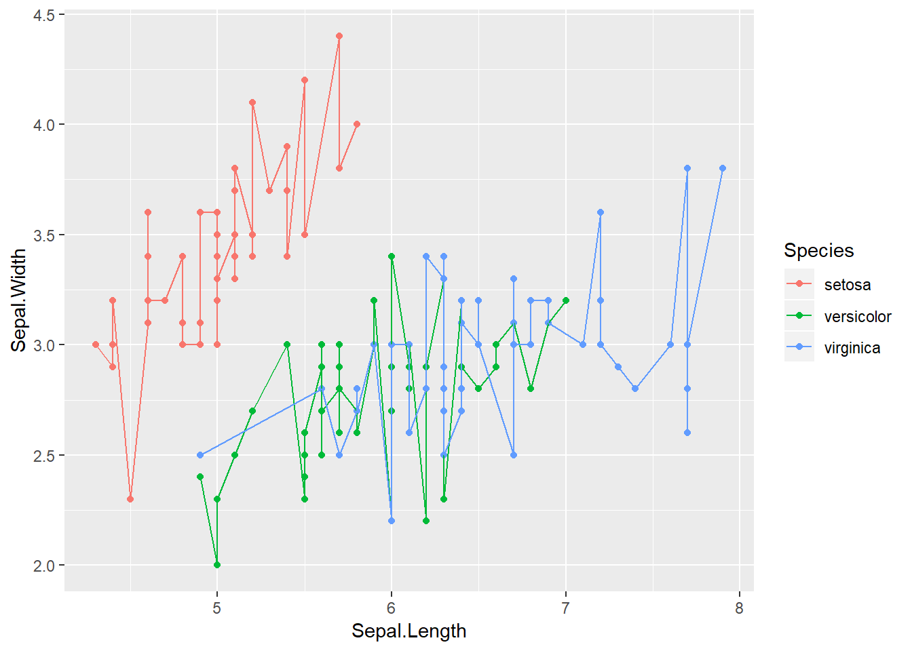

For now, we're going to stick with our pretty smoothed trendline.


```
## `geom_smooth()` using method = 'loess' and formula 'y ~ x'
```

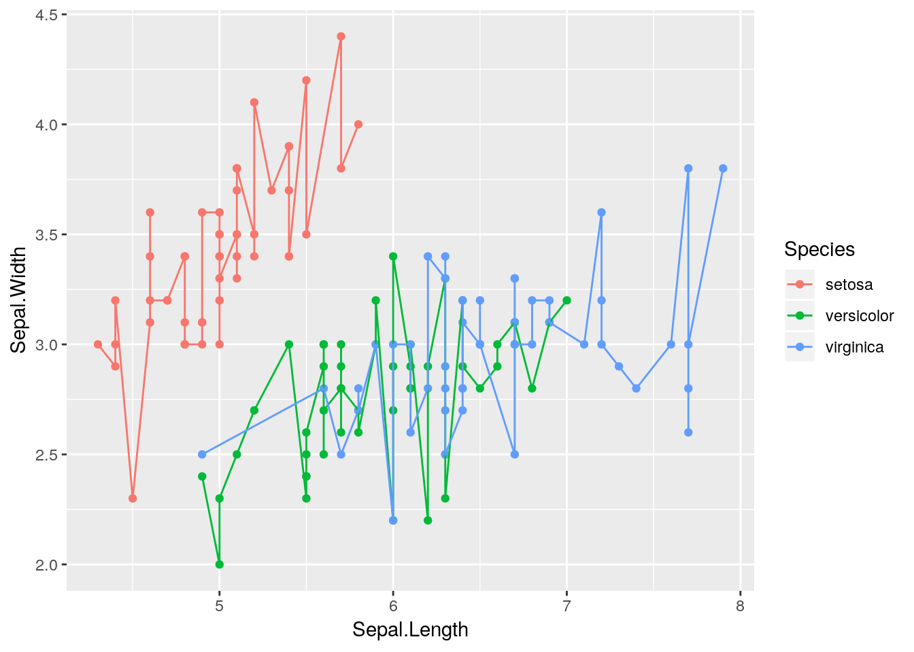

Our graph makes a lot more sense now - sepal length and width seem to be correlated, but each species is different.

If we really wanted to, we could make other aesthetics also change with ```Species```:


```r
ggplot(data = iris, aes(x = Sepal.Length, y = Sepal.Width, color = Species)) + 
  geom_point(aes(size = Species, shape = Species)) + 
  geom_smooth(aes(linetype = Species))
```

```
## Warning: Using size for a discrete variable is not advised.
```

```
## `geom_smooth()` using method = 'loess' and formula 'y ~ x'
```


But that's pretty ugly. We'll get into graph best practices a little bit further into the unit - but generally speaking, a graph should contain exactly as much as it takes to get your point across, and no more. One aesthetic per variable is usually enough.

In an important exception to that rule, it's generally well advised to use different shapes and colors at the same time. Colorblind viewers may not be able to discern the different colors you're using - so varying the shape of your points or type of your lines helps make your graphics more accessible to the reader.

If you want, you can specify shapes using ```scale_shape``` functions, such as ```scale_shape_manual()```. There are 25 shapes available for use in ggplot, each of which is named after a number - the number to the left of the shape in the figure below:


So if we wanted, we could specify shapes for each species in our dataset pretty easily! I've done so below. I'm also going to control the colors by hand - R has [a ton of colors available](http://www.stat.columbia.edu/~tzheng/files/Rcolor.pdf), and you can go crazy picking the best colors for a graph. You can also specify colors by using hex codes (e.g., ```"#FFFFFF"```), but be warned that you might not get an exact match of what you were looking for!


```r
ggplot(iris, aes(Sepal.Length, Sepal.Width, color = Species)) + 
  geom_point(aes(shape = Species), size = 3) + 
  scale_shape_manual(values = c(16, 17, 18)) + 
  scale_color_manual(values = c("purple",
                                "black",
                                "orange")) 
```

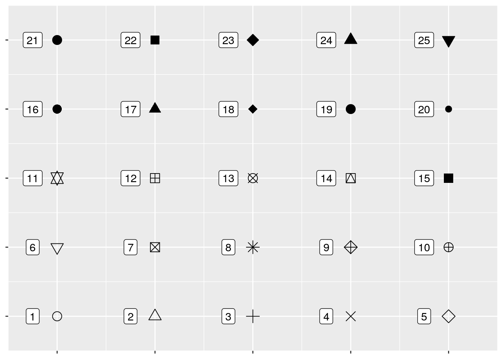

I also made the points a little bigger by specifying ```size = 3``` - note that it _isn't_ in the aesthetics function, because it doesn't care about any of the data. 

We can also vary the type of line that gets drawn when we use ```geom_smooth```. This one only has six options, each of which has both a number and a name:


```
## Warning: Removed 6 rows containing missing values (geom_path).
```

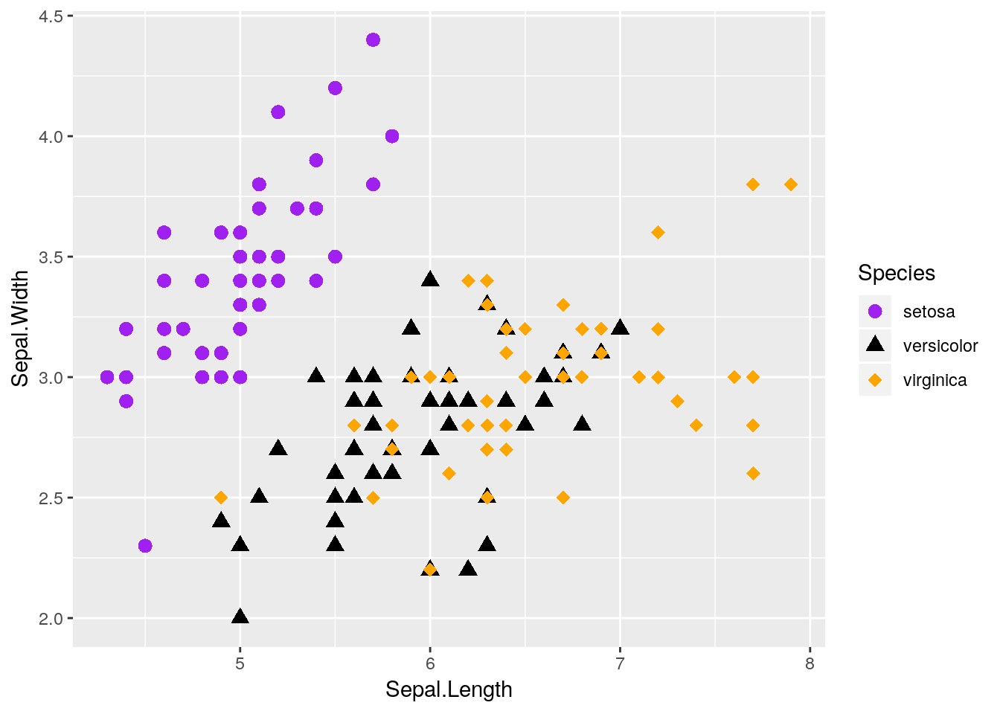

You can manually specify linetypes with ```scale_linetype``` functions, similar to what we did with shapes. You can use either the names or the numbers - just make sure that the names go inside of quotes, while the numbers don't!

I'm going to make our same graph again, manually controlling the linetypes. I'm also going to get rid of that shadow - it represents the 95% confidence interval around the line (which we'll discuss more in our statistics section), as identified via standard error. We can turn it off by setting ```se = FALSE``` in the ```geom_smooth()``` function call.


```r
ggplot(iris, aes(Sepal.Length, Sepal.Width, color = Species)) + 
  geom_smooth(aes(linetype = Species), size = 1, se = FALSE) + 
  scale_color_manual(values = c("purple",
                                "black",
                                "orange")) + 
  scale_linetype_manual(values = c("solid",
                                   "dashed",
                                   "twodash"))
```

```
## `geom_smooth()` using method = 'loess' and formula 'y ~ x'
```


We can also combine both graphs into one, more useful graphic:


```r
ggplot(iris, aes(Sepal.Length, Sepal.Width, color = Species)) + 
  geom_point(aes(shape = Species), size = 3) + 
  geom_smooth(aes(linetype = Species), size = 1, se = FALSE) + 
  scale_shape_manual(values = c(16, 17, 18)) + 
  scale_color_manual(values = c("purple",
                                "black",
                                "orange")) + 
  scale_linetype_manual(values = c("solid",
                                   "dashed",
                                   "twodash"))
```

```
## `geom_smooth()` using method = 'loess' and formula 'y ~ x'
```


Nifty!

Note, by the way, that I've put ```aes()``` calls in both the ```ggplot()``` and ```geom``` functions. Geoms _inherit_ from the ```ggplot()``` call - they'll use whatever data and aesthetics are specified inside the parenthesis. However, if you want an aesthetic to only apply to one geom, you can put it inside that ```geom()``` call. This is pretty commonly used when an aesthetic only applies to one geom - for instance, our ```geom_smooth()``` can't take a ```shape =```.  
You have to be careful with this power, though! Sometimes, defining geom-specific aesthetics will give you misleading or simply wrong visualizations. For instance, what would happen if we draw our lines based on the petal length of each species, rather than the sepal width?


```r
ggplot(iris, aes(Sepal.Length, Sepal.Width, color = Species)) + 
  geom_point(aes(shape = Species), size = 3) + 
  geom_smooth(aes(y = Petal.Length, linetype = Species), size = 1, se = FALSE) + 
  scale_shape_manual(values = c(16, 17, 18)) + 
  scale_color_manual(values = c("purple",
                                "black",
                                "orange")) + 
  scale_linetype_manual(values = c("solid",
                                   "dashed",
                                   "twodash"))
```

```
## `geom_smooth()` using method = 'loess' and formula 'y ~ x'
```

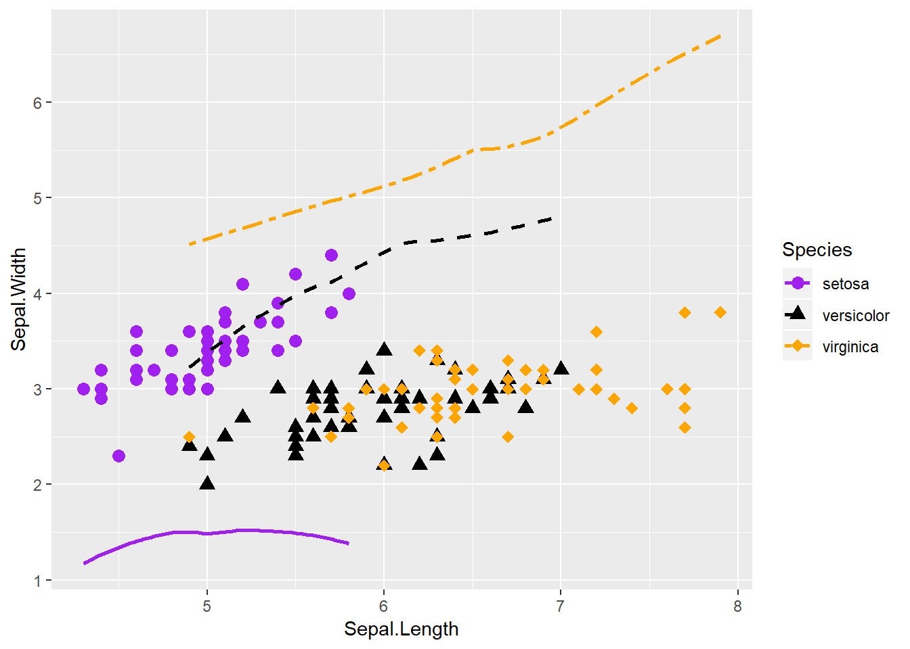

Our plot makes no sense!  
Lots of beginners are tripped up by this when they're starting - a common assumption is that ggplot will add a second y-axis to the right hand of the plot. In reality, there is _no way_ to graph two y-axes on the same ggplot graph - and [that's on purpose](https://kieranhealy.org/blog/archives/2016/01/16/two-y-axes/). It's almost always better to just have two graphs next to each other, if you need to compare the data - though the linked article contains some other interesting suggestions.

Anyway, thinking back to our other graphic:


```
## `geom_smooth()` using method = 'loess' and formula 'y ~ x'
```


This graph is nice, but I think it could be even nicer. Specifically, there's a lot of overlap between the _versicolor_ and _virginica_ species - it would be nice to see them side by side, rather than on the same plot.


## Facetting
Luckily, ggplot makes this easy for us via what's known as _facets_. By adding ```facet_wrap()``` to our plot, we're able to split the three species onto their own graphs, while keeping the axes standardized.


```r
ggplot(iris, aes(Sepal.Length, Sepal.Width)) + 
  geom_point(size = 3) + 
  geom_smooth(size = 1, se = FALSE) + 
  facet_wrap(~ Species)
```

```
## `geom_smooth()` using method = 'loess' and formula 'y ~ x'
```


That makes seeing the differences much easier! Note that I got rid of the different species aesthetics - now that the species are each on their own plot, each species having a different color and shape doesn't add any information to the visualization. 

```facet_wrap()``` is very useful, in that it will automatically wrap our plots into however many rows and columns are required. If we want to be a little more specific in how our data is arranged, however, we can use ```facet_grid()```. By specifying either ```rows = ``` or ```cols = ```, we can finely control how our data is split:


```r
ggplot(iris, aes(Sepal.Length, Sepal.Width)) + 
  geom_point(size = 3) + 
  geom_smooth(size = 1, se = FALSE) + 
  facet_grid(rows = vars(Species))
```

```
## `geom_smooth()` using method = 'loess' and formula 'y ~ x'
```


Heck, if we have two groups we want to compare, we can use both ```rows = ``` and ```cols = ``` at the same time! Unfortunately, ```iris``` doesn't have two grouping variables in it - so I'm going to make another one (```color```):


```r
iris2  <- iris
iris2$color <- rep(c("purple","red","black"), 50)
head(iris2)
```

```
##   Sepal.Length Sepal.Width Petal.Length Petal.Width Species  color
## 1          5.1         3.5          1.4         0.2  setosa purple
## 2          4.9         3.0          1.4         0.2  setosa    red
## 3          4.7         3.2          1.3         0.2  setosa  black
## 4          4.6         3.1          1.5         0.2  setosa purple
## 5          5.0         3.6          1.4         0.2  setosa    red
## 6          5.4         3.9          1.7         0.4  setosa  black
```

As you can see, I've told R to ```rep```licate the vector of ```purple, red, black``` 50 times - so about a third of each species will be in each color. Using that as our column grouping gives us:


```r
ggplot(iris2, aes(Sepal.Length, Sepal.Width)) + 
  geom_point(size = 3) + 
  geom_smooth(size = 1, se = FALSE) + 
  facet_grid(rows = vars(Species), cols = vars(color))
```

```
## `geom_smooth()` using method = 'loess' and formula 'y ~ x'
```

```
## Warning in simpleLoess(y, x, w, span, degree = degree, parametric =
## parametric, : pseudoinverse used at 5.2
```

```
## Warning in simpleLoess(y, x, w, span, degree = degree, parametric =
## parametric, : neighborhood radius 0.2
```

```
## Warning in simpleLoess(y, x, w, span, degree = degree, parametric =
## parametric, : reciprocal condition number 0
```


## diamonds
For this next exercise, we're going to be using the ```diamonds``` dataset, which contains data about 54,000 different diamond sales. It looks like this:


```r
head(diamonds)
```

```
## # A tibble: 6 x 10
##   carat cut       color clarity depth table price     x     y     z
##   <dbl> <ord>     <ord> <ord>   <dbl> <dbl> <int> <dbl> <dbl> <dbl>
## 1 0.230 Ideal     E     SI2      61.5   55.   326  3.95  3.98  2.43
## 2 0.210 Premium   E     SI1      59.8   61.   326  3.89  3.84  2.31
## 3 0.230 Good      E     VS1      56.9   65.   327  4.05  4.07  2.31
## 4 0.290 Premium   I     VS2      62.4   58.   334  4.20  4.23  2.63
## 5 0.310 Good      J     SI2      63.3   58.   335  4.34  4.35  2.75
## 6 0.240 Very Good J     VVS2     62.8   57.   336  3.94  3.96  2.48
```

We can plot the price of each diamond against its weight (or carat) pretty easily, using ```geom_point()``` like before:


```r
ggplot(diamonds, aes(carat, price)) + 
  geom_point()
```


Note that I've stopped explicitly writing ```data = ```, ```x = ```, and ```y = ```. Without that specification, R assumes that you're providing arguments to the function in the order the function normally expects them - which, for ```ggplot()```, is in the form ```ggplot(data, aes(x,y))```. Most code you'll find in the wild is written in this more compact format.

Anyway, back to the graph. It's a bit of a mess! It's hard to discern a pattern when all 54,000 points are plotted in the same area. We can make things a bit better by making the points transparent, by giving them a low ```alpha = ``` value:


```r
ggplot(diamonds, aes(carat, price)) + 
  geom_point(alpha = 0.05)
```


This is somewhat better! We can see that there's a correlation between price and carat - but it's hard to tell exactly what the trend looks like. Plus, there's a good amount of empty space on the graph, which we could probably make better use of.

We can consider transforming our axes to solve all these problems. For instance, if we plotted both our axes on log<sub>10</sub> scales, we'd get the following graph:


```r
ggplot(diamonds, aes(carat, price)) + 
  geom_point(alpha = 0.05) + 
  scale_x_log10() + 
  scale_y_log10()
```


So we can see that, by log-transforming our variables, we get a linear transformation.

Now, I'm personally not a fan of log graphs - [and you shouldn't be, either](https://www.researchgate.net/publication/326450797_Logarithmic_scales_in_ecological_data_presentation_may_cause_misinterpretation). But you'll sometimes have data that can't be properly explained without logarithims - or advisors who won't listen to reason. As such, it's worth knowing how to make R plot things exactly as you want it to.

You can perform plenty of other axes transformations by specifying the ```trans``` argument inside of your scale function. For instance, if we wanted to use a natural log instead, we could type:


```r
ggplot(diamonds, aes(carat, price)) + 
  geom_point(alpha = 0.05) + 
  scale_y_continuous(trans = "log") + 
  scale_x_continuous(trans = "log")
```


To learn more about transformations, you can read the documentation by typing ```?scale_x_continuous()``` into the console.

## Other Popular Geoms
One of the most popular chart types is the simple bar chart. It's easy enough to make this in ggplot, using ```geom_bar()```:


```r
ggplot(diamonds, aes(x = cut)) + 
  geom_bar()
```


Where did ```count``` come from? We only specified an x variable!

The short answer is that ggplot calculated it by itself! To data scientists, a _bar_ chart is exactly what's shown here - a graph showing the frequency of each level of a single categorical variable. As such, ggplot only needs an x aesthetic to make a bar plot - it will calculate the count of each level of the variable and use that as its y. 

If we wanted to communicate more information with this chart, we could think about what number of each cut type is made up of each clarity level. One way to do that is to map the ```fill``` of the barplot to the ```clarity``` variable:


```r
ggplot(diamonds, aes(cut, fill = clarity)) + 
  geom_bar()
```

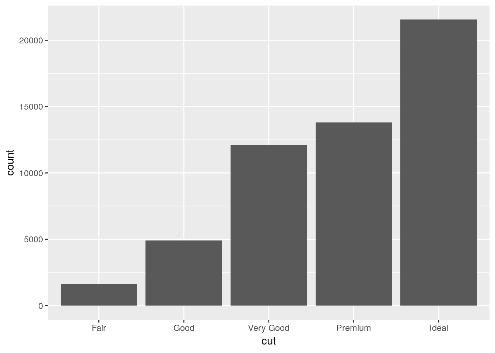

Note that we use ```fill``` in this case, as we're defining the color for the inside of the polygon, not the lines themselves. If we used ```color``` instead, we'd get something like this:


```r
ggplot(diamonds, aes(cut, color = clarity)) + 
  geom_bar()
```


Where only the borders of each polygon are colored.

Now, ggplot's default behavior when given a color or fill aesthetic is to make a _stacked bar chart_, as shown above. Stacked bar charts [are awful](https://eagereyes.org/techniques/stacked-bars-are-the-worst). It's really hard to compare values between bars, because the lower limits aren't standardized. The one exception is if you're only comparing two values and all bars sum to the same amount, like so:


```r
# Make a table of x and y values, which are split into two groups by z. Each x has a y value for each level of z.
df <- data.frame(x = c(1, 1, 2, 2, 3, 3), y = c(40, 60, 30, 70, 20, 80), z = c("A","B","A","B", "A", "B"))
df
```

```
##   x  y z
## 1 1 40 A
## 2 1 60 B
## 3 2 30 A
## 4 2 70 B
## 5 3 20 A
## 6 3 80 B
```

```r
ggplot(df, aes(x, y, fill = z)) + 
  geom_col()
```


Note that I'm using ```geom_col()```, which makes _column charts_. This lets us define y as values other than the simple count - useful if we're trying to graph the average value for each group, for instance.

This simple stacked bar chart works well enough - it lets you compare the values of both A and B, since the groups share a border at either the top or bottom edge of the plot. For most purposes, though, a somewhat better option is the dodged bar chart:


```r
ggplot(diamonds, aes(cut, fill = clarity)) + 
  geom_bar(position = "dodge")
```


Dodged bar plots are better than stacked bars when comparing more than one value for each item on the x axis of a chart. However, with enough series, dodged bar charts can also be decently confusing - try comparing the I1 values between Premium and Fair on this chart, for instance. 

If you have to have this much information in a single graphic, ```geom_jitter``` can help. It generates a scatterplot, much like ```geom_point()```, but "jitters" the points by adding statistical noise - making it easy to compare counts between all combinations of the two variables.


```r
ggplot(diamonds, aes(cut, clarity)) + 
  geom_jitter(alpha = 0.05)
```


You can use ```geom_jitter``` to make regular scatterplots, as well - for instance, we can see more of the points in our original ```iris``` scatterplot by adding a little bit of noise to the plot:


```r
ggplot(iris, aes(Sepal.Length, Sepal.Width, color = Species)) + 
  geom_jitter() + 
  scale_color_manual(values = c("purple",
                                "black",
                                "orange"))
```

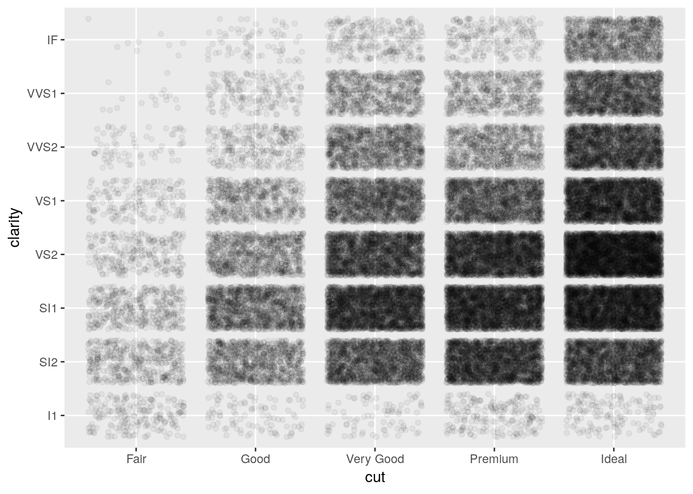

The last main plot type we'll go over is the boxplot. This is mostly used to show the distribution of data - it draws a plot with a line at the data's median, box borders at the 25% and 75% values, and lines reaching to the 5% and 95% values.


```r
ggplot(diamonds, aes(cut, price)) + 
  geom_boxplot()
```

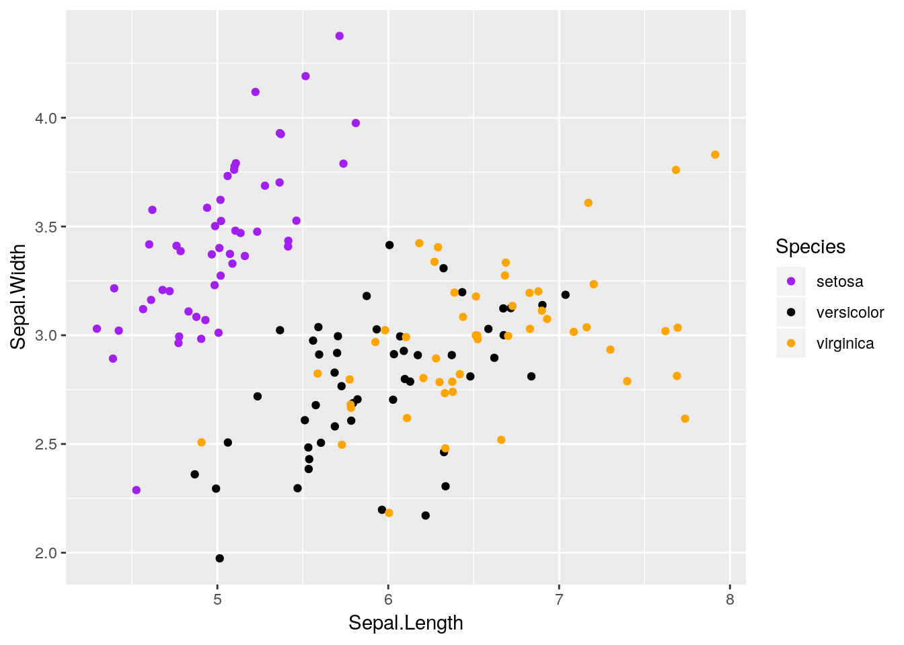

There are a lot of other things you can do with ggplot that we won't go over here - you can find cheatsheets on the package [here](https://www.rstudio.com/resources/cheatsheets/), and read more documentation [here](https://ggplot2.tidyverse.org/).

Note that you can't make pie charts with ggplot. [This is because pie charts suck](http://info.slis.indiana.edu/~katy/S637-S11/cleveland84.pdf).

## Designing Good Graphics
Graphics, at their essence, exist to communicate data and make arguments. In order to do that, a graphic has to be both visually clean and easily understood, while at the same time containing exactly enough information to get a point across - and nothing more. Learning how to make graphics like this is a skill unto itself, and one of the primary focuses of this course. After all, it doesn't matter how smart you are and how perfect your analysis is if you aren't able to tell anyone about it afterwards!

The hard part about teaching graphic design is that it's as much an art as a science - there is no one right way to make compelling graphics. What I'm going to teach in this section is as much my opinion as it is the correct way to do things - other textbooks and other people have their own preferred methods, none of which are inherently better or worse. 

For instance, ggplot comes with a number of preinstalled themes which you can add to any given plot. For a complete list, [click here](https://ggplot2.tidyverse.org/reference/ggtheme.html). We'll just demo a few of the most common ones, using our old ```iris``` scatterplot:


```r
ggplot(iris, aes(Sepal.Length, Sepal.Width, color = Species)) + 
  geom_point() + 
  scale_color_manual(values = c("purple",
                                "black",
                                "orange")) +
  theme_bw()
```


```r
ggplot(iris, aes(Sepal.Length, Sepal.Width, color = Species)) + 
  geom_point() + 
  scale_color_manual(values = c("purple",
                                "black",
                                "orange")) +
  theme_minimal()
```

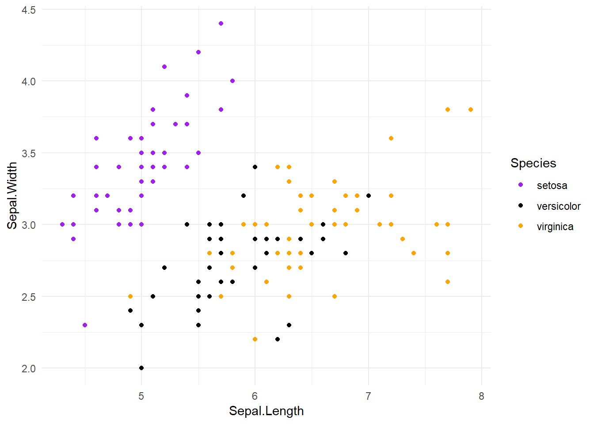

```r
ggplot(iris, aes(Sepal.Length, Sepal.Width, color = Species)) + 
  geom_point() + 
  scale_color_manual(values = c("purple",
                                "black",
                                "orange")) +
  theme_classic()
```


Plenty of other packages introduce other ggplots for you to use. My personal favorite is ```cowplot```. Written by [Claus O. Wilke](http://wilkelab.org/), it provides some really interesting new extensions to ggplot, and sets the default theme to something that generally looks better than ggplot's defaults. If we install it now:

```
install.packages("cowplot")
```

And then load it:


```r
library(cowplot)
```

```
## 
## Attaching package: 'cowplot'
```

```
## The following object is masked from 'package:ggplot2':
## 
##     ggsave
```


```r
ggplot(iris, aes(Sepal.Length, Sepal.Width, color = Species)) + 
  geom_point() + 
  scale_color_manual(values = c("purple",
                                "black",
                                "orange"))
```


This default is pretty similar to ```theme_classic()```, except with different font sizes. However, if we add ```background_grid()``` to our plot:


```r
ggplot(iris, aes(Sepal.Length, Sepal.Width, color = Species)) + 
  geom_point() + 
  scale_color_manual(values = c("purple",
                                "black",
                                "orange")) + 
  background_grid()
```

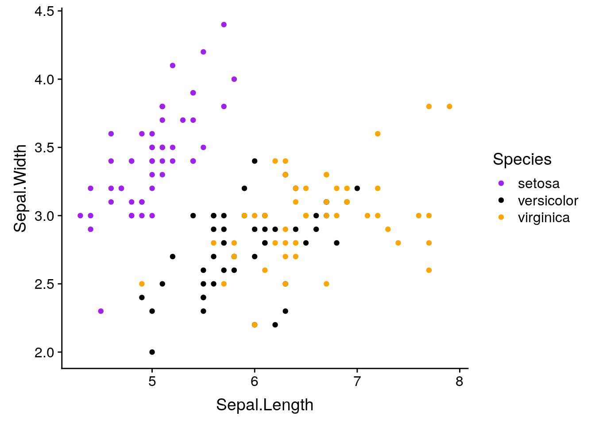

We get what I consider to be the nicest looking default option R will give you.

If we want to override the default axis names, we can control that with ```labs()```:


```r
ggplot(iris, aes(Sepal.Length, Sepal.Width, color = Species)) + 
  geom_point() + 
  scale_color_manual(values = c("purple",
                                "black",
                                "orange")) + 
  background_grid() + 
  labs(x = "Sepal Length", y = "Sepal Width")
```


With ```labs```, we can also give our graphs a title and caption. This is generally a bad idea - if you're going to include a graph in a publication, you'll want to typeset these outside of the image file - but it makes understanding these graphs a little easier.


```r
ggplot(iris, aes(Sepal.Length, Sepal.Width, color = Species)) + 
  geom_point() + 
  scale_color_manual(values = c("purple",
                                "black",
                                "orange")) + 
  background_grid() + 
  labs(x = "Sepal Length", 
       y = "Sepal Width",
       title = "Sepal Width as a Function of Sepal Length",
       subtitle = "Data from R. A. Fischer's iris dataset, 1936",
       caption = "Made in R with ggplot2")
```

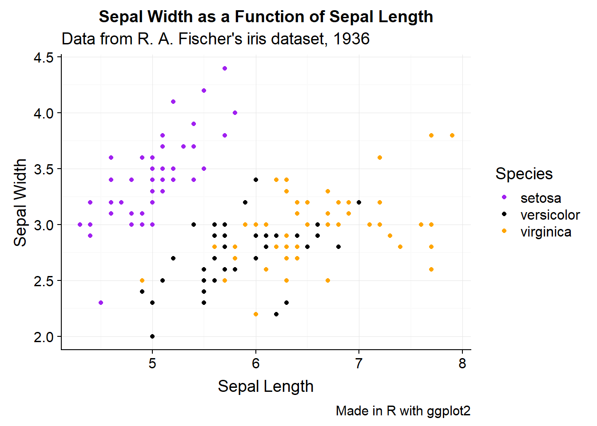

If we want to change anything about the theme (for instance, the text size or legend position), we can specify that in ```theme()```:


```r
ggplot(iris, aes(Sepal.Length, Sepal.Width, color = Species)) + 
  geom_point() + 
  scale_color_manual(values = c("purple",
                                "black",
                                "orange")) + 
  background_grid() + 
  labs(x = "Sepal Length", y = "Sepal Width") + 
  theme(text = element_text(size = 12),
        axis.text = element_text(size = 10),
        legend.position = "top")
```


And we can keep specifying what we want until we're satisfied with our graph.

ggplot will also let us focus on specific parts of the data:


```r
ggplot(iris, aes(Sepal.Length, Sepal.Width, color = Species)) + 
  geom_point() + 
  scale_color_manual(values = c("purple",
                                "black",
                                "orange")) + 
  background_grid() + 
  labs(x = "Sepal Length", y = "Sepal Width") + 
  scale_x_continuous(limits = c(5, 7)) + 
  scale_y_continuous(limits = c(2.5, 3.0))
```

```
## Warning: Removed 93 rows containing missing values (geom_point).
```


Of course, if you're graphing things such as percentages, you should be careful about where you set your axes. Say we had a dataset where every 1 increase in some variable ```x``` saw a 1% increase in ```y```, so that ```y``` increased almost 10% over the course of all ```x``` values. If you let ggplot set your axis defaults, you'd wind up with a perfect correlation:


```r
df <- data.frame(x = 1:10, 
                 y = 61:70)
ggplot(df, aes(x, y)) + 
  geom_line() + 
  background_grid()
```

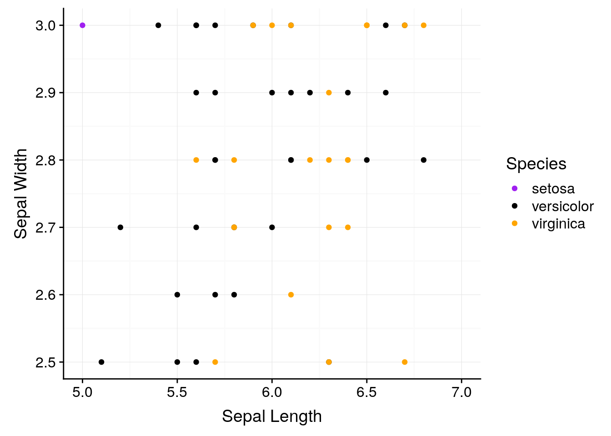

However, it's probably more truthful to graph percentages on a 0-100 scale - doing so shows us that ```x``` has a weaker impact on ```y``` than the default would have us believe:


```r
ggplot(df, aes(x, y)) + 
  geom_line() + 
  background_grid() + 
  scale_y_continuous(limits = c(0,100))
```


## Saving Your Graphics
When you're satisfied with your graph, simply call the ```ggsave()``` function to save it to whatever file you're working in. You can either add it to your workflow with ```+```, or call it after you've plotted your graph - ```ggsave()``` will save whatever image was drawn last. For more information on specific things ggsave can do, type ```?ggsave()``` into R.

## More Resources
In addition to the [ggplot documentation](https://ggplot2.tidyverse.org/), I highly reccomend the [ggplot book](https://www.amazon.com/dp/0387981403/ref=cm_sw_su_dp?tag=ggplot2-20). Additionally, almost any problem can be solved by googling - just put "ggplot" at the end of whatever your question is, and odds are you'll find the perfect solution.

<!--chapter:end:01_Introduction_to_R.Rmd-->

# R Basics and Visualizations Exercises

## Calculate the following:
1. The product of 9 * 9
2. 9 squared
3. The remainder from dividing 27 by 2
4. The remainder of 27 divided by 2, divided by 2
5. FALSE divided by TRUE. Why did you get this answer?

## Graph the following:
1. A boxplot of the iris data, with species on the x axis and sepal length on the y
2. A scatterplot of the iris data, plotting sepal length against width, where the points get bigger as sepal width increases
3. Can you change the color of the boxes in the graph you made for problem 1? Can you change the color of the lines?

## Use a new dataset:
Also included in ggplot is the ```mpg``` dataset, containing fuel economy data for 38 different models of car.

1. Use ```head()``` to examine the data. You can also type ```?mpg``` to get documentation on what each variable represents.
2. Is engine displacement (```displ```) correlated with highway miles per gallon (```hwy```)? Make a scatterplot to find out.
3. What variables could we use to group the data? Does coloring points by any of these help explain the scatterplot from problem 2?
4. What does the scatterplot look like if you make a scatterplot for ```cty``` plotted against ```hwy```? Why? What geom could we use to better represent the data?

## Looking ahead:
1. What happens if you type in ```summary(mpg)```? What do you think this output represents?
2. What happens if you type in ```mpg[1]```? How does this compare to ```mpg[[1]]```?

<!--chapter:end:02_Unit1_Exercises.Rmd-->

# Unit 2: R Functions and Workflow

## Scripts
So far, we've been using the command line interface in the console to type our programs. While this works, you might have noticed how annoying it can be to type longer programs in. Additionally, you're probably going to want to save your work at some point - and right now, you'd have to use Notepad or a similar program to save anything you've done.

Luckily, there's a better way. In the top left corner of RStudio, there's a menu button called "File". Click this, then click "New Project". If you click "New Directory", and then "New Project", you'll be able to create a folder where you can automatically store all of your R code and files. This will also create an R Project file, which you can load to return to where you left off the last time you closed RStudio.

Let's load the tidyverse again, now that we're in a new directory:

```r
library(tidyverse)
```

```
## -- Attaching packages --------------------------------------- tidyverse 1.2.1 --
```

```
## v ggplot2 3.0.0     v purrr   0.2.4
## v tibble  1.4.2     v dplyr   0.7.4
## v tidyr   0.8.0     v stringr 1.3.0
## v readr   1.1.1     v forcats 0.3.0
```

```
## -- Conflicts ------------------------------------------ tidyverse_conflicts() --
## x dplyr::filter() masks stats::filter()
## x dplyr::lag()    masks stats::lag()
```

Now that you're working in a new directory, go back into "File" and hover over "New File". There's a lot of options, but right now we care about two of them: **R Scripts** and **R Notebooks**. Open one of each.

In your new script file, type the following:


```r
ggplot(iris, aes(Petal.Length, Petal.Width)) + 
  geom_point()
```

Highlight everything and then press Cmd/Ctrl and Enter at the same time. A graph should appear in your Viewer window.

Whoops, looks like we forgot to color the points by species - add the color aesthetic to your plot.


It should already be clear what the advantage of working with R Scripts is - you can change pieces of your code quickly, without having to worry about retyping things into the console. You can also save and open your scripts (Cmd/Ctrl+S, Cmd/Ctrl+O), which makes working on big projects much easier.

Now change your code so it looks like this:

```r
a <- ggplot(iris, aes(Petal.Length, Petal.Width)) + 
  geom_point(aes(color=Species))
```

What we're doing here is _assigning_ the plot to ```a```. Now, anytime you call ```a```, the plot will appear - try it!


```r
a
```


Now add the following line under the first two:


```r
a + theme(legend.position = "top")
```


This will move the legend to the top of our graph, much as if we had included the ```theme()``` function in our original plot. Your program now has - for the first time in this course - two steps to it: the assignment step (where we make ```a``` a plot), and the print step (where we add our ```theme()``` and print the plot). While in an R script, there are three ways you can run the whole program:  
* Click the very top of the document and press Cmd/Ctrl+Enter once for each step
* Highlight the entire code and press Cmd/Ctrl+Enter to run it all at once
* While your cursor is anywhere in the script, press Cmd/Ctrl+Shift+Enter to run the whole program at once

That last method is usually the fastest and easiest. 

## Notebooks
While scripts are great, they do have some drawbacks. For instance, if you have to do more major and slower tasks - like loading datasets and libraries, or complicated math - you'll have to redo that step every time you want to run the whole program, which is a pain. Also, running a script pulls up the console window, which is a little bit of a headache.

For that reason, I tend to work in R Notebooks. Open your new notebook file, and you'll see a new welcome page! The welcome page has a lot of good information in it - you can delete everything after the second set of three dashes once you've read it.

Inside a notebook, you can make chunks by pressing Cmd/Ctrl+Alt+I. These chunks run as individual scripts, which you can run the exact same way by using combinations of Cmd/Ctrl, Shift, and Enter. Using notebooks can be a little more efficient than scripts, though, because it offers you the ability to split your code steps into multiple pieces, which can let you iterate on an idea faster than using scripts alone.

No matter which you prefer, you should aim to have one script or notebook per task you perform - don't just have one long, continous notebook for everything you're doing. Also, make sure you give everything a descriptive name - there's nothing worse than needing a file a month or so later and having to open every notebook you've ever made to find it!

It's also a good idea to make a new R Project, in a new folder, for each major project you start in on. These sorts of things might not matter too much to you while you're learning - but once you're doing more complicated things with R, having good habits like these are essential.

## Memory, Objects, and Names
Let's go back to when we assigned a plot to ```a```:


```r
a <- ggplot(iris, aes(Petal.Length, Petal.Width)) + 
  geom_point(aes(color = Species))
```

The ```<-``` symbol is the _assignment_ operator. We can use it to define the object ```a``` as all sorts of different objects:


```r
# Assign a the value 10
a <- 10
# Print out the object a
a
```

```
## [1] 10
```

```r
a <- c(1,50,200)
a
```

```
## [1]   1  50 200
```

```r
a <- "Hello, world!"
a
```

```
## [1] "Hello, world!"
```

```r
a <- geom_point(data = iris, aes(Petal.Length, Petal.Width, color = Species))
ggplot() +
  a
```


You'll notice that ```a``` is now listed in the upper-lefthand corner of RStudio, under the "Environment" tab. That's because a is now defined in memory - we can use it in any of our code, anywhere we want. In fact, you can even define ```a``` in one file and call it in another, so long as you've already run the code defining it in your current RStudio session. 

This is really cool for a lot of reasons - it lets us do more complicated things with R - but can also cause some problems. If you keep defining objects with names like ```a```, it's easy to forget which variable stands for what - and so you can wind up making mistakes when using those variables later on. In order to avoid that sort of confusion, you should use descriptive names when creating objects. You should also decide on a standard way you're going to format those object names - some people prefer ```snake_case_names```, others ```use.periods```, and I personally prefer what's known as ```CamelCase```. Different organizations and groups have different preferred styles (here's [Google's](https://google.github.io/styleguide/Rguide.xml)), but what's important right now is that you pick a style that makes sense to you. Be consistent using this style whenever you code - R won't understand you if you mess up your capitalization!


## Dataframes and Transformations
Earlier in this course, we went over the different classes of vectors - character, numeric, and logical. If you're ever trying to find out what class a vector belongs to, you can call the ```class()``` function:


```r
SampleVector <- c(1,2,3)
class(SampleVector)
```

```
## [1] "numeric"
```

Note that we don't put object names (such as the name of our vector) in quotes. The general distinction is that if something exists in the global environment, we don't put it in quotes. If it isn't, we do. You can see what's in the current environment by looking at the "Environment" tab that I mentioned earlier - that tab is a list of all the objects you've defined so far in this session. Remember that even though your installed packages aren't in that list, you still don't put them in quotes when you call ```library()```.

A martix made of vectors is known, in R, as a ```dataframe```. We've already seen some simple dataframes in the past unit built using ```data.frame```:


```r
data.frame(x = c(1,2,3),
           y = c("a","b","c"),
           z = c(TRUE, TRUE, FALSE))
```

```
##   x y     z
## 1 1 a  TRUE
## 2 2 b  TRUE
## 3 3 c FALSE
```

This is an example of something known as _rectangular data_ - the sort you're likely to find in spreadsheets and many, if not most, scientific applications. We'll be dealing with rectangular data almost exclusively in this course - while non-rectangular data is useful in many applications, it's much harder for a beginner to wrap their heads around.

In fact, we'll almost always be working with a very specific type of rectangular data known as _tidy data_. Tidy dataframes always take the same shape:


```r
data.frame("." = c("Observation 1", "Observation 2","...", "Observation n"),
           "Variable 1" = c("Value", "Value", "...", "Value"),
           "Variable 2" = c("Value", "Value", "...", "Value"),
           "Variable .." = c("Value", "Value", "...", "Value"),
           "Variable n" = c("Value", "Value", "...", "Value"))
```

```
##               . Variable.1 Variable.2 Variable... Variable.n
## 1 Observation 1      Value      Value       Value      Value
## 2 Observation 2      Value      Value       Value      Value
## 3           ...        ...        ...         ...        ...
## 4 Observation n      Value      Value       Value      Value
```

Tidy data is organized as follows:

* Each column is a single **variable**
* Each row is a single **observation**
* Each cell is a single **value**

As you might guess from the name, the ```tidyverse``` is specifically designed to work with tidy datasets. By storing all data in this format, we're able to quickly apply the same sets of tools to multiple different types of data. For instance, imagine a dataframe of seasonal temperatures, built as such:


```r
SeasonalTemps <- data.frame(Year = c(2015, 2016, 2017, 2018),
           Winter = c(40, 38, 42, 44),
           Spring = c(46, 40, 50, 48),
           Summer = c(70, 62, 81, 76),
           Fall = c(52, 46, 54, 56))
SeasonalTemps
```

```
##   Year Winter Spring Summer Fall
## 1 2015     40     46     70   52
## 2 2016     38     40     62   46
## 3 2017     42     50     81   54
## 4 2018     44     48     76   56
```

This dataframe makes some sense - it's pretty easy to understand as a human reader, and would probably be a good layout for a printed table. But the problems with this format become obvious when we, for instance, try to graph the data:


```r
ggplot(SeasonalTemps, aes(x = Year)) + 
  geom_line(aes(y = Winter), color = "purple") + 
  geom_line(aes(y = Spring), color = "green") + 
  geom_line(aes(y = Summer), color = "blue") + 
  geom_line(aes(y = Fall), color = "red")
```


What a mess! That took far too long to type - a good general rule of thumb is that if you have to repeat yourself more than twice to do something, there's a better way to do it. And, even after all our effort, our graph doesn't have a legend, and the Y axis is labeled wrong.

Luckily enough, the ```tidyverse``` contains a package designed for making our data tidier - called, helpfully enough, ```tidyr```. We already loaded this package when we called the tidyverse earlier.

tidyr provides two essential functions for "reshaping" the data - changing back and forth between the _wide_ format we used above and a _long_ format, easier used by our functions. To change our ```SeasonalTemps``` data to a long format, we can use the ```gather()``` function. This function _gathers_ values stores in multiple columns into a single variable, and makes another variable - the _key_ variable - representing what column the data was originally in.

```gather()``` takes three important arguments:

* ```data```, the dataframe to gather  
* ```key```, what to name the key column   
* ```value```, what to name the column data was merged into

Additionally, we can specify columns that we want to preserve in the new, long dataframe by putting ```-ColumnName``` at the end of the function.

What this looks like for our seasonal data is something like this:


```r
LongTemps <- gather(data = SeasonalTemps, key = Season, value = AvgTemp, -Year)
LongTemps
```

```
##    Year Season AvgTemp
## 1  2015 Winter      40
## 2  2016 Winter      38
## 3  2017 Winter      42
## 4  2018 Winter      44
## 5  2015 Spring      46
## 6  2016 Spring      40
## 7  2017 Spring      50
## 8  2018 Spring      48
## 9  2015 Summer      70
## 10 2016 Summer      62
## 11 2017 Summer      81
## 12 2018 Summer      76
## 13 2015   Fall      52
## 14 2016   Fall      46
## 15 2017   Fall      54
## 16 2018   Fall      56
```

Note that you don't have to type ```data = ```, ```key = ```, and ```value = ``` - if you don't, R assumes that you've listed the arguments in this order. 

This format makes graphing significantly easier:


```r
ggplot(LongTemps, aes(x = Year, y = AvgTemp, color = Season)) + 
  geom_line()
```


If, after all our hard work, we want to get back to our original wide format, we can undo our ```gather()``` using ```spread()```. Again, I'm giving spread a data, key, and value argument - but this time, the function is making a new column for each value of our key:


```r
WideTemps <- spread(LongTemps, Season, AvgTemp)
WideTemps
```

```
##   Year Fall Spring Summer Winter
## 1 2015   52     46     70     40
## 2 2016   46     40     62     38
## 3 2017   54     50     81     42
## 4 2018   56     48     76     44
```

This new dataframe isn't quite the same as our original - the columns are now in alphabetical order! If we wanted to rearrage them, I find the easiest way is using the ```select()``` function from ```dplyr()```, another package in the tidyverse. By giving ```select()``` an argument for data and a vector of column names, we can rearrange the order the columns appear:


```r
OrderWideTemps <- select(WideTemps, c(Year, Winter, Spring, Summer, Fall))
OrderWideTemps
```

```
##   Year Winter Spring Summer Fall
## 1 2015     40     46     70   52
## 2 2016     38     40     62   46
## 3 2017     42     50     81   54
## 4 2018     44     48     76   56
```

When doing this, though, we have to be careful we don't accidentally forget a column:


```r
select(WideTemps, c(Year, Winter, Spring, Fall))
```

```
##   Year Winter Spring Fall
## 1 2015     40     46   52
## 2 2016     38     40   46
## 3 2017     42     50   54
## 4 2018     44     48   56
```

Although, if we wanted to drop a column, we can do so by using a ```-``` sign:


```r
select(WideTemps, -Summer)
```

```
##   Year Fall Spring Winter
## 1 2015   52     46     40
## 2 2016   46     40     38
## 3 2017   54     50     42
## 4 2018   56     48     44
```

## The Pipe
At this point, we've created four dataframes - ```SeasonalTemps```, ```LongTemps```, ```WideTemps```, and ```OrderedWideTemps``` - which all contain the same data. When repeatedly making similar but different dataframes, it can be hard to keep track of which object has which data - and it can be hard to keep coming up with simple, descriptive names, too. One solution could be to keep overwriting the same object with the new data:


```r
a <- 10
a <- a*2
a <- sqrt(a)
```

But this breaks our rule - that if you have to repeat yourself more than twice, there's a better way to do it. Plus, if you make a mistake while writing over a value that had your original data in it, you have to start all over again - assuming that your data was saved anywhere else!

Luckily, the tidyverse also introduces a new operator ```%>%```, called the pipe. What the pipe does is pretty intuitive - it takes the output of whatever's on the _left_ side of the pipe, and uses it as the first input to whatever's on the _right_ side. For instance:


```r
Numbers <- c(5,10,15,20,25)

Numbers %>%
  mean()
```

```
## [1] 15
```

Since all of the tidyverse functions take ```data``` as their first argument, this lets us _chain_ together multiple functions and skip those assignment steps:


```r
LongTemps %>%
  spread(Season, AvgTemp) %>%
  select(-Summer)
```

```
##   Year Fall Spring Winter
## 1 2015   52     46     40
## 2 2016   46     40     38
## 3 2017   54     50     42
## 4 2018   56     48     44
```

This makes our code much more easy to understand than constantly using the ```<-``` operator. While marginally slower than performing repeated assignments, it's an improved way to perform multiple steps in a way that's harder to make serious mistakes doing.

Even when a function doesn't have data as its first input, you can still use a pipe by typing ```data = .``` into the function:


```r
LongTemps %>%
  spread(data = ., Season, AvgTemp) %>%
  select(-Summer)
```

```
##   Year Fall Spring Winter
## 1 2015   52     46     40
## 2 2016   46     40     38
## 3 2017   54     50     42
## 4 2018   56     48     44
```

And pipes work well with ggplot2, too:


```r
LongTemps %>%
  ggplot(aes(x = Year, y = AvgTemp, color = Season)) + 
  geom_line()
```


## Data Transformations 

### Mutate
This becomes useful when we want to transform our data itself for a graph, rather than transform the axes. For example, remember how we made our log-log graph last unit?


```r
LongTemps %>%
  ggplot(aes(x = Year, y = AvgTemp, color = Season)) + 
  geom_line() + 
  scale_y_log10()
```


This is useful, but ggplot only has a certain number of transformations built in (type ```?scale_y_continuous()``` for more info). Additionally, sometimes we'll want to transform our data for analyses - not just graphing. For this purpose, we can use ```dplyr```'s ```mutate()``` function. Mutate takes three arguments: the dataframe (which it can get from ```%>%```), the name of your new column, and what value the new column should have. Say, for example, we wanted to multiply our average temperatures by two:


```r
LongTemps %>%
  mutate(TwiceTemp = AvgTemp * 2)
```

```
##    Year Season AvgTemp TwiceTemp
## 1  2015 Winter      40        80
## 2  2016 Winter      38        76
## 3  2017 Winter      42        84
## 4  2018 Winter      44        88
## 5  2015 Spring      46        92
## 6  2016 Spring      40        80
## 7  2017 Spring      50       100
## 8  2018 Spring      48        96
## 9  2015 Summer      70       140
## 10 2016 Summer      62       124
## 11 2017 Summer      81       162
## 12 2018 Summer      76       152
## 13 2015   Fall      52       104
## 14 2016   Fall      46        92
## 15 2017   Fall      54       108
## 16 2018   Fall      56       112
```

You can make multiple columns in the same ```mutate()``` call:


```r
LongTemps %>%
  mutate(TwiceTemp = AvgTemp * 2,
         TwiceSquaredTemp = TwiceTemp^2,
         YearSeason = paste(Year, Season))
```

```
##    Year Season AvgTemp TwiceTemp TwiceSquaredTemp  YearSeason
## 1  2015 Winter      40        80             6400 2015 Winter
## 2  2016 Winter      38        76             5776 2016 Winter
## 3  2017 Winter      42        84             7056 2017 Winter
## 4  2018 Winter      44        88             7744 2018 Winter
## 5  2015 Spring      46        92             8464 2015 Spring
## 6  2016 Spring      40        80             6400 2016 Spring
## 7  2017 Spring      50       100            10000 2017 Spring
## 8  2018 Spring      48        96             9216 2018 Spring
## 9  2015 Summer      70       140            19600 2015 Summer
## 10 2016 Summer      62       124            15376 2016 Summer
## 11 2017 Summer      81       162            26244 2017 Summer
## 12 2018 Summer      76       152            23104 2018 Summer
## 13 2015   Fall      52       104            10816   2015 Fall
## 14 2016   Fall      46        92             8464   2016 Fall
## 15 2017   Fall      54       108            11664   2017 Fall
## 16 2018   Fall      56       112            12544   2018 Fall
```

Notice I used a new function, ```paste()```, for that last column. This function pastes together values into a single cell - it can use other values in a dataframe, vectors, or strings. For instance:


```r
LongTemps %>%
  mutate(YearSeason = paste("The", Season, "of", Year))
```

```
##    Year Season AvgTemp         YearSeason
## 1  2015 Winter      40 The Winter of 2015
## 2  2016 Winter      38 The Winter of 2016
## 3  2017 Winter      42 The Winter of 2017
## 4  2018 Winter      44 The Winter of 2018
## 5  2015 Spring      46 The Spring of 2015
## 6  2016 Spring      40 The Spring of 2016
## 7  2017 Spring      50 The Spring of 2017
## 8  2018 Spring      48 The Spring of 2018
## 9  2015 Summer      70 The Summer of 2015
## 10 2016 Summer      62 The Summer of 2016
## 11 2017 Summer      81 The Summer of 2017
## 12 2018 Summer      76 The Summer of 2018
## 13 2015   Fall      52   The Fall of 2015
## 14 2016   Fall      46   The Fall of 2016
## 15 2017   Fall      54   The Fall of 2017
## 16 2018   Fall      56   The Fall of 2018
```

Anyway. 

If you're transforming your data and don't want to save the old column, use ```transmute()```:


```r
LongTemps %>%
  mutate(TwiceTemp = AvgTemp * 2) %>%
  transmute(TwiceSquaredTemp = TwiceTemp^2,
         YearSeason = paste(Year, Season))
```

```
##    TwiceSquaredTemp  YearSeason
## 1              6400 2015 Winter
## 2              5776 2016 Winter
## 3              7056 2017 Winter
## 4              7744 2018 Winter
## 5              8464 2015 Spring
## 6              6400 2016 Spring
## 7             10000 2017 Spring
## 8              9216 2018 Spring
## 9             19600 2015 Summer
## 10            15376 2016 Summer
## 11            26244 2017 Summer
## 12            23104 2018 Summer
## 13            10816   2015 Fall
## 14             8464   2016 Fall
## 15            11664   2017 Fall
## 16            12544   2018 Fall
```

### Tibbles
As I mentioned earlier, data in R is stored in _dataframes_. However, you may have noticed that the dataframe outputs from tidyverse functions look pretty different (I'd even say nicer) than our raw datasets! That's because of another useful tidyverse package, ```tibble```. 

We don't need to get too far into the mechanics of this package - if you load the tidyverse, any new dataframes you make will be converted into tibbles by default. If you want to force any old dataframe into this format, use ```as.tibble()```; if you need the basic dataframe, use ```as.data.frame()```.

### Subsetting Data

Let's go back to our ```iris``` dataset. I'm going to turn it into a tibble and then view it:


```r
iris <- as.tibble(iris)
iris
```

```
## # A tibble: 150 x 5
##    Sepal.Length Sepal.Width Petal.Length Petal.Width Species
##           <dbl>       <dbl>        <dbl>       <dbl> <fct>  
##  1         5.10        3.50         1.40       0.200 setosa 
##  2         4.90        3.00         1.40       0.200 setosa 
##  3         4.70        3.20         1.30       0.200 setosa 
##  4         4.60        3.10         1.50       0.200 setosa 
##  5         5.00        3.60         1.40       0.200 setosa 
##  6         5.40        3.90         1.70       0.400 setosa 
##  7         4.60        3.40         1.40       0.300 setosa 
##  8         5.00        3.40         1.50       0.200 setosa 
##  9         4.40        2.90         1.40       0.200 setosa 
## 10         4.90        3.10         1.50       0.100 setosa 
## # ... with 140 more rows
```

If we only wanted to work with part of this dataset, R gives us a lot of options to _subset_ the data. For instance, if we only wanted the first column containing sepal length, we could type this:


```r
iris[, 1]
```

```
## # A tibble: 150 x 1
##    Sepal.Length
##           <dbl>
##  1         5.10
##  2         4.90
##  3         4.70
##  4         4.60
##  5         5.00
##  6         5.40
##  7         4.60
##  8         5.00
##  9         4.40
## 10         4.90
## # ... with 140 more rows
```

If we wanted the first row, meanwhile, we'd type this:


```r
iris[1, ]
```

```
## # A tibble: 1 x 5
##   Sepal.Length Sepal.Width Petal.Length Petal.Width Species
##          <dbl>       <dbl>        <dbl>       <dbl> <fct>  
## 1         5.10        3.50         1.40       0.200 setosa
```

If we wanted several rows, we can specify them with ```c()``` or, if they're consecutive, ```:``` - 


```r
iris[c(1,2,3,4), ]
```

```
## # A tibble: 4 x 5
##   Sepal.Length Sepal.Width Petal.Length Petal.Width Species
##          <dbl>       <dbl>        <dbl>       <dbl> <fct>  
## 1         5.10        3.50         1.40       0.200 setosa 
## 2         4.90        3.00         1.40       0.200 setosa 
## 3         4.70        3.20         1.30       0.200 setosa 
## 4         4.60        3.10         1.50       0.200 setosa
```

```r
iris[1:4, ]
```

```
## # A tibble: 4 x 5
##   Sepal.Length Sepal.Width Petal.Length Petal.Width Species
##          <dbl>       <dbl>        <dbl>       <dbl> <fct>  
## 1         5.10        3.50         1.40       0.200 setosa 
## 2         4.90        3.00         1.40       0.200 setosa 
## 3         4.70        3.20         1.30       0.200 setosa 
## 4         4.60        3.10         1.50       0.200 setosa
```


And if we wanted the value in the first row of the first column, we'd type this:


```r
iris[1,1]
```

```
## # A tibble: 1 x 1
##   Sepal.Length
##          <dbl>
## 1         5.10
```

The pattern should be clear now - inside of the braces, you type the row number, a comma, and then the column number. Notice that ```[]``` always gives us a tibble (or dataframe) back. If we wanted a vector, we could use ```[[]]```:


```r
iris[[1, 1]]
```

```
## [1] 5.1
```

If we want to use column names instead of numbers, we could use ```$``` in the place of ```[[]]``` - note that this always returns a vector, not a dataframe:


```r
iris$Sepal.Length
```

```
##   [1] 5.1 4.9 4.7 4.6 5.0 5.4 4.6 5.0 4.4 4.9 5.4 4.8 4.8 4.3 5.8 5.7 5.4
##  [18] 5.1 5.7 5.1 5.4 5.1 4.6 5.1 4.8 5.0 5.0 5.2 5.2 4.7 4.8 5.4 5.2 5.5
##  [35] 4.9 5.0 5.5 4.9 4.4 5.1 5.0 4.5 4.4 5.0 5.1 4.8 5.1 4.6 5.3 5.0 7.0
##  [52] 6.4 6.9 5.5 6.5 5.7 6.3 4.9 6.6 5.2 5.0 5.9 6.0 6.1 5.6 6.7 5.6 5.8
##  [69] 6.2 5.6 5.9 6.1 6.3 6.1 6.4 6.6 6.8 6.7 6.0 5.7 5.5 5.5 5.8 6.0 5.4
##  [86] 6.0 6.7 6.3 5.6 5.5 5.5 6.1 5.8 5.0 5.6 5.7 5.7 6.2 5.1 5.7 6.3 5.8
## [103] 7.1 6.3 6.5 7.6 4.9 7.3 6.7 7.2 6.5 6.4 6.8 5.7 5.8 6.4 6.5 7.7 7.7
## [120] 6.0 6.9 5.6 7.7 6.3 6.7 7.2 6.2 6.1 6.4 7.2 7.4 7.9 6.4 6.3 6.1 7.7
## [137] 6.3 6.4 6.0 6.9 6.7 6.9 5.8 6.8 6.7 6.7 6.3 6.5 6.2 5.9
```

The ```$``` is really helpful in using other base R functions:


```r
mean(iris$Sepal.Length)
```

```
## [1] 5.843333
```

```r
sd(iris$Sepal.Length)
```

```
## [1] 0.8280661
```

```r
cor.test(iris$Sepal.Length, iris$Sepal.Width)
```

```
## 
## 	Pearson's product-moment correlation
## 
## data:  iris$Sepal.Length and iris$Sepal.Width
## t = -1.4403, df = 148, p-value = 0.1519
## alternative hypothesis: true correlation is not equal to 0
## 95 percent confidence interval:
##  -0.27269325  0.04351158
## sample estimates:
##        cor 
## -0.1175698
```

(Note that "cor.test()" runs Pearson's correlation test for whatever vectors you feed it - more on that test later, or [here](https://bookdown.org/ndphillips/YaRrr/correlation-cor-test.html)).

And ```$``` also lets us filter our data with conditionals - getting values that are equal to something, larger or smaller than it, and so on. For instance, if we want a dataframe (so ```[]```) where the rows (```[, ]```) all have a Species value of (```===```) "setosa":


```r
iris[iris$Species == "setosa", ]
```

```
## # A tibble: 50 x 5
##    Sepal.Length Sepal.Width Petal.Length Petal.Width Species
##           <dbl>       <dbl>        <dbl>       <dbl> <fct>  
##  1         5.10        3.50         1.40       0.200 setosa 
##  2         4.90        3.00         1.40       0.200 setosa 
##  3         4.70        3.20         1.30       0.200 setosa 
##  4         4.60        3.10         1.50       0.200 setosa 
##  5         5.00        3.60         1.40       0.200 setosa 
##  6         5.40        3.90         1.70       0.400 setosa 
##  7         4.60        3.40         1.40       0.300 setosa 
##  8         5.00        3.40         1.50       0.200 setosa 
##  9         4.40        2.90         1.40       0.200 setosa 
## 10         4.90        3.10         1.50       0.100 setosa 
## # ... with 40 more rows
```

Note that the species name is in quotes, because it's a character string. We don't have to do that for numeric values:


```r
iris[iris$Sepal.Length > 7.5, ]
```

```
## # A tibble: 6 x 5
##   Sepal.Length Sepal.Width Petal.Length Petal.Width Species  
##          <dbl>       <dbl>        <dbl>       <dbl> <fct>    
## 1         7.60        3.00         6.60        2.10 virginica
## 2         7.70        3.80         6.70        2.20 virginica
## 3         7.70        2.60         6.90        2.30 virginica
## 4         7.70        2.80         6.70        2.00 virginica
## 5         7.90        3.80         6.40        2.00 virginica
## 6         7.70        3.00         6.10        2.30 virginica
```

You can use ```==```, ```>```, ```>=```, ```<```, ```<=```, and ```!=``` (not equal) to subset your data.

### Filtering with the Tidyverse
This code is hard to read as a human, and doesn't work well with other functions. For instance, imagine trying to make a scatterplot of just the setosa data - your code will become almost unparseable. 

Instead, for more involved subsets, dplyr has a useful ```filter()``` function. It takes two arguments - your dataframe and the condition it should filter based on:


```r
iris %>%
  filter(Species == "setosa")
```

```
## # A tibble: 50 x 5
##    Sepal.Length Sepal.Width Petal.Length Petal.Width Species
##           <dbl>       <dbl>        <dbl>       <dbl> <fct>  
##  1         5.10        3.50         1.40       0.200 setosa 
##  2         4.90        3.00         1.40       0.200 setosa 
##  3         4.70        3.20         1.30       0.200 setosa 
##  4         4.60        3.10         1.50       0.200 setosa 
##  5         5.00        3.60         1.40       0.200 setosa 
##  6         5.40        3.90         1.70       0.400 setosa 
##  7         4.60        3.40         1.40       0.300 setosa 
##  8         5.00        3.40         1.50       0.200 setosa 
##  9         4.40        2.90         1.40       0.200 setosa 
## 10         4.90        3.10         1.50       0.100 setosa 
## # ... with 40 more rows
```

```filter()``` can use all the same operators as the ```[]``` methods of subsetting. Additionally, you can use ```&``` ("and") and ```|``` ("or") to chain filters together:


```r
iris %>%
  filter(Species == "setosa" & Sepal.Length == 5.1 & Sepal.Width == 3.3)
```

```
## # A tibble: 1 x 5
##   Sepal.Length Sepal.Width Petal.Length Petal.Width Species
##          <dbl>       <dbl>        <dbl>       <dbl> <fct>  
## 1         5.10        3.30         1.70       0.500 setosa
```

It's important to remember that ```&``` means things which satisfy EACH condition. A common mistake is to type:


```r
iris %>%
  filter(Species == "setosa" & Species == "versicolor")
```

```
## # A tibble: 0 x 5
## # ... with 5 variables: Sepal.Length <dbl>, Sepal.Width <dbl>,
## #   Petal.Length <dbl>, Petal.Width <dbl>, Species <fct>
```

Which, because no flower is both species, returns nothing.

In this case, you can either use an ```|``` ("or") operator, or - particularly if you have several cases you want to accept - ```%in%```:


```r
iris %>%
  filter(Species %in% c("setosa",
                        "versicolor"))
```

```
## # A tibble: 100 x 5
##    Sepal.Length Sepal.Width Petal.Length Petal.Width Species
##           <dbl>       <dbl>        <dbl>       <dbl> <fct>  
##  1         5.10        3.50         1.40       0.200 setosa 
##  2         4.90        3.00         1.40       0.200 setosa 
##  3         4.70        3.20         1.30       0.200 setosa 
##  4         4.60        3.10         1.50       0.200 setosa 
##  5         5.00        3.60         1.40       0.200 setosa 
##  6         5.40        3.90         1.70       0.400 setosa 
##  7         4.60        3.40         1.40       0.300 setosa 
##  8         5.00        3.40         1.50       0.200 setosa 
##  9         4.40        2.90         1.40       0.200 setosa 
## 10         4.90        3.10         1.50       0.100 setosa 
## # ... with 90 more rows
```

So long as your species is ```%in%``` the vector ```c()``` you provide, it will show up in the output.

### Working with Groups

Say we wanted to find the mean sepal length in our dataset. That's pretty easy:


```r
mean(iris$Sepal.Length)
```

```
## [1] 5.843333
```

But we already know from our graphs that sepal length differs dramatically between species. If we wanted to find the mean for each species, we could calculate it individually for each group:


```r
setosa <- iris %>%
  filter(Species == "setosa")
virginica <- iris %>%
  filter(Species == "virginica")
versicolor <- iris %>%
  filter(Species == "versicolor")


mean(setosa$Sepal.Length)
```

```
## [1] 5.006
```

```r
mean(virginica$Sepal.Length)
```

```
## [1] 6.588
```

```r
mean(versicolor$Sepal.Length)
```

```
## [1] 5.936
```

But that code is messy, the output is without any context, and it goes against our rule - that if you have to repeat yourself more than twice, there's a better way to do it.

The better way in the tidyverse is to use _grouping_ and _summary_ functions. In the following example, we'll use ```group_by()``` to group our dataframes by the species types, and ```summarise()``` to calculate the mean for each of them (in a column called "MeanSepalLength"):


```r
iris %>%
  group_by(Species) %>%
  summarise(MeanSepalLength = mean(Sepal.Length))
```

```
## # A tibble: 3 x 2
##   Species    MeanSepalLength
##   <fct>                <dbl>
## 1 setosa                5.01
## 2 versicolor            5.94
## 3 virginica             6.59
```

This is a faster and easier to understand way to perform functions on groups of data. Note that ```summarise()``` uses the British spelling - almost all functions in R have British and American spellings built in (you can use ```color``` or ```colour``` aesthetics in ggplot, for instance), but this is an important exception. While there is a function called ```summarize()```, it's highly glitchy and its use is highly discouraged.

You can use ```group_by()``` to calculate all sorts of things - for instance, we can calculate the distance of each plant's sepal length from the group mean, as follows:


```r
iris %>%
  group_by(Species) %>%
  mutate(SLDistanceFromMean = Sepal.Length - mean(Sepal.Length))
```

```
## # A tibble: 150 x 6
## # Groups:   Species [3]
##    Sepal.Length Sepal.Width Petal.Length Petal.Width Species
##           <dbl>       <dbl>        <dbl>       <dbl> <fct>  
##  1         5.10        3.50         1.40       0.200 setosa 
##  2         4.90        3.00         1.40       0.200 setosa 
##  3         4.70        3.20         1.30       0.200 setosa 
##  4         4.60        3.10         1.50       0.200 setosa 
##  5         5.00        3.60         1.40       0.200 setosa 
##  6         5.40        3.90         1.70       0.400 setosa 
##  7         4.60        3.40         1.40       0.300 setosa 
##  8         5.00        3.40         1.50       0.200 setosa 
##  9         4.40        2.90         1.40       0.200 setosa 
## 10         4.90        3.10         1.50       0.100 setosa 
## # ... with 140 more rows, and 1 more variable: SLDistanceFromMean <dbl>
```

If you want to calculate variables for the whole dataset again, you'll have to ungroup your data - dataframes will stay grouped until you actively ungroup them with ```ungroup()```. For instance, to calculate the distance of each plant's sepal length from the overall mean:


```r
iris %>%
  select(c(Sepal.Length, Species)) %>%
  group_by(Species) %>%
  mutate(SLDistanceFromGroupMean = Sepal.Length - mean(Sepal.Length)) %>%
  ungroup() %>%
  mutate(SLDistanceFromTotalMean = Sepal.Length - mean(Sepal.Length))
```

```
## # A tibble: 150 x 4
##    Sepal.Length Species SLDistanceFromGroupMean SLDistanceFromTotalMean
##           <dbl> <fct>                     <dbl>                   <dbl>
##  1         5.10 setosa                  0.0940                   -0.743
##  2         4.90 setosa                 -0.106                    -0.943
##  3         4.70 setosa                 -0.306                    -1.14 
##  4         4.60 setosa                 -0.406                    -1.24 
##  5         5.00 setosa                 -0.00600                  -0.843
##  6         5.40 setosa                  0.394                    -0.443
##  7         4.60 setosa                 -0.406                    -1.24 
##  8         5.00 setosa                 -0.00600                  -0.843
##  9         4.40 setosa                 -0.606                    -1.44 
## 10         4.90 setosa                 -0.106                    -0.943
## # ... with 140 more rows
```

(Note that I got rid of some columns with ```select()``` to make all the columns in the tibble fit on one page.)

## Missing Values

### Explicit Missing Values
Working with data, there are often two types of missing values we have to worry about. The obvious one are _explicit_ missing values, represented in R as ```NA``` (or, sometimes, ```NaN```). Let's make a dataframe:


```r
MissingExample <- tibble(w = c(1, 2, 3),
                         x = c("A", "B", "C"),
                         y = c("do", "re", NA),
                         z = c(807, NA, 780))
MissingExample
```

```
## # A tibble: 3 x 4
##       w x     y         z
##   <dbl> <chr> <chr> <dbl>
## 1    1. A     do     807.
## 2    2. B     re      NA 
## 3    3. C     <NA>   780.
```

(I'm using ```tibble()``` in place of ```dataframe()``` here, but the outcome is almost identical.)

```NA``` values are a little tricky to work with - look what happens when we try to find the mean of ```z```:


```r
mean(MissingExample$z)
```

```
## [1] NA
```

The reason this happens is because we _don't know_ what the mean is - that NA value could be anything, so it's impossible to know what the mean is. To get around this, we can set the ```na.rm``` argument to ```TRUE```:


```r
mean(MissingExample$z, na.rm = TRUE)
```

```
## [1] 793.5
```

We can also solve the problem with filtering out the ```NA``` values. We can use ```is.na()``` to find out where certain values are, and then ask ```filter()``` to remove those rows from our dataset as follows:


```r
MissingExample %>%
  filter(!is.na(z)) %>%
  summarise(Mean = mean(z))
```

```
## # A tibble: 1 x 1
##    Mean
##   <dbl>
## 1  794.
```

```!``` means "negation" in R, or "opposite" - so we're asking ```filter()``` to return the _opposite_ of any row where ```z``` is ```NA```, or, alternatively, all the rows where it has a value.

If we wanted to drop _every_ row that has a ```NA```, we could use the following ```tidyr``` function:


```r
MissingExample %>%
  drop_na()
```

```
## # A tibble: 1 x 4
##       w x     y         z
##   <dbl> <chr> <chr> <dbl>
## 1    1. A     do     807.
```

Or, if we knew the values we wanted those ```NA``` to represent, we could use ```replace_na()```, also from ```tidyr```. We just have to specify a list of what we want those values to be:


```r
MissingExample %>%
  replace_na(list(y = "mi", z = "078"))
```

```
## # A tibble: 3 x 4
##       w x     y     z    
##   <dbl> <chr> <chr> <chr>
## 1    1. A     do    807  
## 2    2. B     re    078  
## 3    3. C     mi    780
```

Notice a difference in the ```z``` column with this example? Because I put "078" in quotes, it changed the entire column to a character vector - because quotes mean characters, and a vector can only hold one class of data.

We'll talk more about that ```list()``` function later on - that's a little too complicated for this unit.

### Implicit Missing Values
The other, harder to identify type of missing value is the _implicit_ missing value. Say we have a dataframe ```TreeData```, which lists the species that are present at two different sites:


```r
TreeData <- tibble(Site = c("A","A","A","B","B"),
                   Species = c("Red Maple", "Sugar Maple", "Black Cherry", "Red Maple", "Sugar Maple"),
                   Count = c(10,5,15,8,19))
TreeData
```

```
## # A tibble: 5 x 3
##   Site  Species      Count
##   <chr> <chr>        <dbl>
## 1 A     Red Maple      10.
## 2 A     Sugar Maple     5.
## 3 A     Black Cherry   15.
## 4 B     Red Maple       8.
## 5 B     Sugar Maple    19.
```

A lot of field data is collected like this, where each row represents something that was present at the field site. The problem with this comes when we try to calculate summary statistics for each species:


```r
TreeData %>%
  group_by(Species) %>%
  summarise(Mean = mean(Count), StandardDev = sd(Count))
```

```
## # A tibble: 3 x 3
##   Species       Mean StandardDev
##   <chr>        <dbl>       <dbl>
## 1 Black Cherry   15.      NaN   
## 2 Red Maple       9.        1.41
## 3 Sugar Maple    12.        9.90
```

Black cherry has a missing (```NaN```) standard deviation, because as far as R knows, it only has one observation to make estimates with. In reality, the fact that black cherry was missing from site B is a data point in and of itself - it's an _implicit_ value of 0.

To fix that, we can use the ```complete()``` command from ```tidyr```. This function takes column names as arguments, and returns a dataframe with every combination of the values in those columns. We can also specify what to replace ```NA``` values with, much like we did in ```replace_na()```, with ```fill```:


```r
TreeData %>%
  complete(Site, Species, fill = list(Count = 0))
```

```
## # A tibble: 6 x 3
##   Site  Species      Count
##   <chr> <chr>        <dbl>
## 1 A     Black Cherry   15.
## 2 A     Red Maple      10.
## 3 A     Sugar Maple     5.
## 4 B     Black Cherry    0.
## 5 B     Red Maple       8.
## 6 B     Sugar Maple    19.
```

This way, when we go to calculate our summary statistics, we get better answers:


```r
TreeData %>%
  complete(Site, Species, fill = list(Count = 0)) %>%
  group_by(Species) %>%
  summarise(Mean = mean(Count), StandardDev = sd(Count))
```

```
## # A tibble: 3 x 3
##   Species       Mean StandardDev
##   <chr>        <dbl>       <dbl>
## 1 Black Cherry  7.50       10.6 
## 2 Red Maple     9.00        1.41
## 3 Sugar Maple  12.0         9.90
```

## Count Data
One other common issue with field data is that it's in a summary form - for instance, our tree data summarizes the number of trees at each site into one column. This is often easier to record in the field and easier to read as a human - but it makes some analyses much harder!

The function ```uncount()``` makes this pretty easy for us:


```r
LongTreeData <- TreeData %>%
  uncount(Count)

LongTreeData
```

```
## # A tibble: 57 x 2
##    Site  Species  
##    <chr> <chr>    
##  1 A     Red Maple
##  2 A     Red Maple
##  3 A     Red Maple
##  4 A     Red Maple
##  5 A     Red Maple
##  6 A     Red Maple
##  7 A     Red Maple
##  8 A     Red Maple
##  9 A     Red Maple
## 10 A     Red Maple
## # ... with 47 more rows
```

And if we wanted to get back to the summary table, we can use ```count()```:


```r
LongTreeData %>%
  count(Site, Species)
```

```
## # A tibble: 5 x 3
##   Site  Species          n
##   <chr> <chr>        <int>
## 1 A     Black Cherry    15
## 2 A     Red Maple       10
## 3 A     Sugar Maple      5
## 4 B     Red Maple        8
## 5 B     Sugar Maple     19
```

If we want to change that column ```n```'s name to something more descriptive, we can use ```rename()```:


```r
LongTreeData %>%
  count(Site, Species) %>%
  rename(Count = n)
```

```
## # A tibble: 5 x 3
##   Site  Species      Count
##   <chr> <chr>        <int>
## 1 A     Black Cherry    15
## 2 A     Red Maple       10
## 3 A     Sugar Maple      5
## 4 B     Red Maple        8
## 5 B     Sugar Maple     19
```


## Oddballs

Predict what will happen when you run the following code - then run it!


```r
sqrt(2)^2 == 2

1/49 * 49 == 1
```

You'd expect both of these things to be true, but R seems to think otherwise.

That's because R has to estimate the true value of things like 1/49 - it only calculates to so many digits, because it can't store an infinite number of decimal places. As such, 1/49 * 49 _isn't_ exactly equal to 1 - it's just near it. To catch these sorts of things, use ```near()``` instead of ```==```:


```r
1/49 * 49 == 1
## [1] FALSE
near(1/49 * 49, 1)
## [1] TRUE
```


<!--chapter:end:03_Workflow.Rmd-->

# R Functions and Workflow Exercises

## Do the following:
1. What class is the vector ```c(1, TRUE, 3)```? Why is it not a character vector?
2. Make and print this tibble. What do the abbreviations under each column name mean?

```r
tibble(x = c(1, 2, 3),
       y = c("A", "B", "C"),
       z = c(TRUE, FALSE, TRUE))
```
3. Inspect the ```smiths``` dataset (loaded with the tidyverse - you can access it like ```iris```). How can you fix those missing values?

## Work with other datasets:
1. ```spread()``` the ```iris``` dataset so that each species' petal width is in its own column. Then ```gather()``` the table back together. What's different about this dataframe?
2. Select all the rows of ```iris``` where the species is setosa. Now select all the rows where the species _isn't_ setosa.
3. What's the mean price for each cut of diamond in the ```diamonds``` dataset? 
 

<!--chapter:end:04_Unit2_Exercises.Rmd-->

